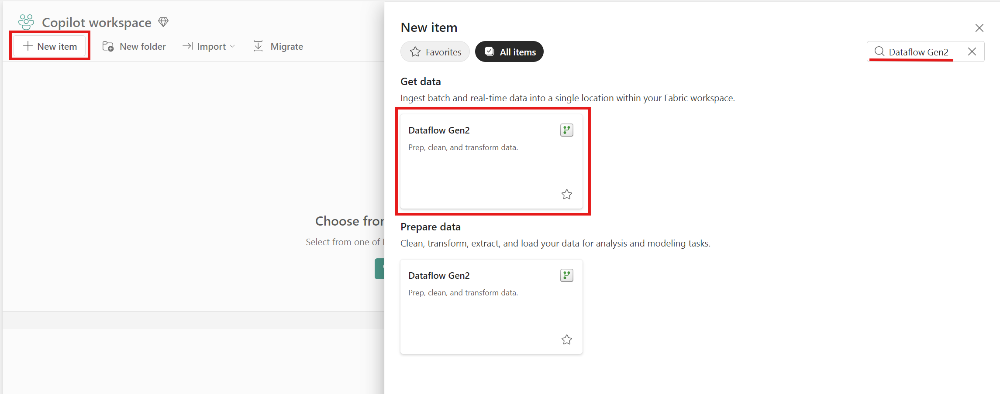
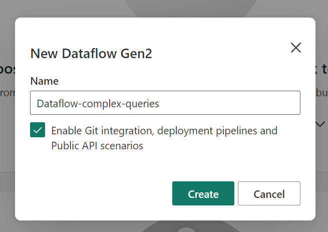
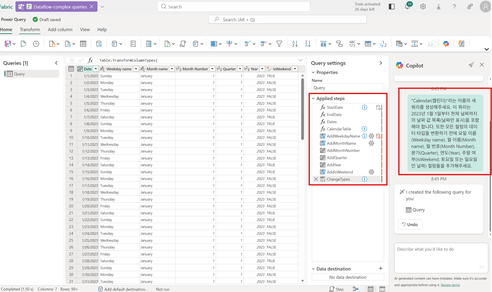

# Data Factory 워크로드의 Copilot 기능 (Dataflow Gen2) - 복잡한 쿼리 생성

Dataflow Gen2에서는 Copilot은 다음과 같은 작업을 수행할 수 있습니다.

- 기존 쿼리에 대한 새 변환 단계 생성
- 쿼리 및 적용된 단계에 대한 요약 제공
- 샘플 데이터 또는 기존 쿼리에 대한 참조를 포함할 수 있는 새 쿼리 생성

이번 lab에서는 **프롬프트를 이용하여 복잡한 쿼리를 작성**하는 기능에 대해서 살펴보도록 하겠습니다.

## 필수 조건
Microsoft Fabric에서 Copilot을 사용하기 위해서는 Fabric의 테넌트 설정에서 Copilot 옵션을 활성화해주어야 합니다.

설정과 관련된 자세한 내용은 다음의 링크를 참고하시기 바랍니다.

[https://learn.microsoft.com/ko-kr/fabric/admin/service-admin-portal-copilot](https://learn.microsoft.com/ko-kr/fabric/admin/service-admin-portal-copilot)

## Dataflow Gen2 만들기

새로운 Dataflow Gen2를 생성합니다.



- Workspace 좌측 상단의 `+ New item` 버튼을 클릭하고
- 검색창에서 'Dataflow Gen2'를 입력하여 검색된 `Dataflow Gen2`를 클릭합니다.



- 'Name'에 적당한 명칭을 입력하고,
- `Create` 버튼을 클릭하여 생성합니다.

## 캘린더 쿼리 만들기
Dataflow Gen2의 Power Query가 열리면, 우측에 있는 Copilot 창에 다음의 prompt를 입력하고 실행합니다.

```
"Calendar(캘린더)"라는 이름의 새 쿼리를 생성해주세요. 이 쿼리는 2023년 1월 1일부터 현재 날짜까지의 날짜 값 목록(날짜만 표시)을 포함해야 합니다. 또한 모든 컬럼의 데이터 타입을 변환하기 전에 요일 이름(Weekday name), 월 이름(Month name), 월 번호(Month Number), 분기(Quarter), 연도(Year), 주말 여부(IsWeekend, 토요일 또는 일요일인 날짜) 컬럼들을 추가해주세요.
```

실행이 완료되면, 데이터가 보여지게 됩니다.



- Copilot은 prompt에 입력된 내용을 작업 단계(화면 중앙)를 생성하여 줍니다.

✍️ 2026년 2월 16일 씀.