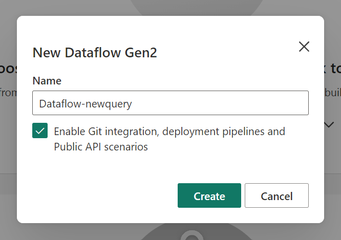
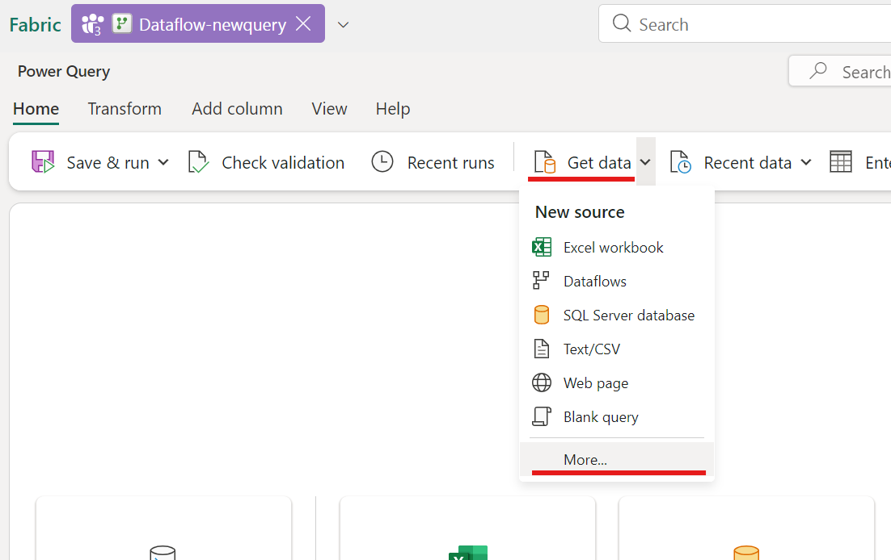
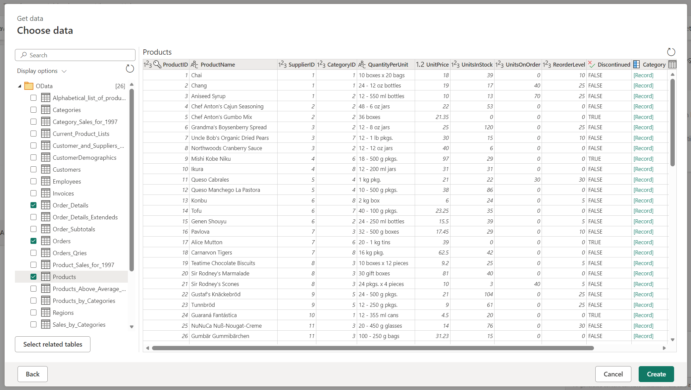
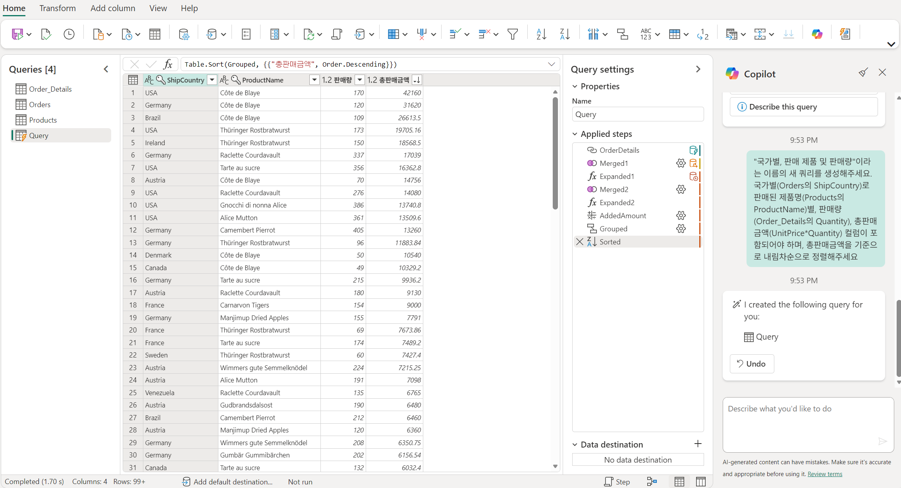

# Data Factory 워크로드의 Copilot 기능 (Dataflow Gen2) - New Query 생성 및 요약

Dataflow Gen2에서는 Copilot은 다음과 같은 작업을 수행할 수 있습니다.

- 기존 쿼리에 대한 새 변환 단계 생성
- 쿼리 및 적용된 단계에 대한 요약 제공
- 샘플 데이터 또는 기존 쿼리에 대한 참조를 포함할 수 있는 새 쿼리 생성

이번 lab에서는 **기존 쿼리에 대한 참조를 포함할 수 있는 새 쿼리 생성**하는 기능에 대해서 살펴보도록 하겠습니다.

## Dataflow Gen2 만들기

새로운 Dataflow Gen2를 생성합니다.


- Workspace 좌측 상단의 `+ New item` 버튼을 클릭하고
- 검색창에서 'Dataflow Gen2'를 입력하여 검색된 `Dataflow Gen2`를 클릭합니다.



- 'Name'에 적당한 명칭을 입력하고,
- `Create` 버튼을 클릭하여 생성합니다.

## Data 가져오기

- Dataflow가 생성되면, 좌측 상단의 `Get data`를 클릭하고,
- `More` 항목을 클릭합니다.


- 검색창이 나타나면, 'oData'라고 검색하고,
- 하단의 결과창에서 `oData`를 클릭합니다.


- URL에 'https://services.OData.org/V4/Northwind/Northwind.svc' 을 입력하고
- `Next` 버튼을 클릭합니다.



- 좌측 탐색창에서 'Order_Details', 'Orders', 'Products'를 선택하고,
- `Create` 버튼을 클릭합니다.

## 새 쿼리 생성
Dataflow Gen2의 Power Query가 열리면, 우측에 있는 Copilot 창에 다음의 prompt를 입력하고 실행합니다.

```
"국가별, 판매 제품 및 판매량"이라는 이름의 새 쿼리를 생성해주세요.
국가별(Orders의 ShipCountry)로 판매된 제품명(Products의 ProductName)별, 판매량(Order_Details의 Quantity), 총판매금액(UnitPrice*Quantity) 컬럼이 포함되어야 하며, 총판매금액을 기준으로 내림차순으로 정렬해주세요.
```

실행이 완료되면, 프롬프트에서 기술한 형식에 맞춰서 새로운 데이터가 보여지게 됩니다.



- Copilot은 prompt에 입력된 내용을 작업 단계(화면 중앙)를 생성하여 줍니다.

✍️ 2026년 2월 17일 씀.