# Data Factory 워크로드의 Copilot 기능 (Dataflow Gen2)
MSFT Fabric의 Data Facitory의 Dataflow Gen2에서 Copilot은 다음과 같은 작업을 수행할 수 있습니다.

- 기존 쿼리에 대한 새 변환 단계 생성
- 쿼리 및 적용된 단계에 대한 요약 제공
- 샘플 데이터 또는 기존 쿼리에 대한 참조를 포함할 수 있는 새 쿼리 생성

이번 lab에서는 **기존 쿼리에 대한 새로운 변환 단계 생성** 및 **요약을 생성**하는 기능에 대해서 살펴보도록 하겠습니다.

해당 lab은 다음의 공식 문서에서 사용하는 단계 중에서 일부를 Copilot으로 작업하는 과정을 살펴봅니다.

[Dataflow Gen2를 사용하여 데이터를 증분 방식으로 축적하는 패턴](https://learn.microsoft.com/ko-kr/fabric/data-factory/tutorial-setup-incremental-refresh-with-dataflows-gen2)

## Lakehouse 만들기
[링크](https://learn.microsoft.com/ko-kr/fabric/data-factory/tutorial-setup-incremental-refresh-with-dataflows-gen2#create-a-dataflow-to-load-data-from-an-odata-source-into-a-lakehouse)에서 설명하는 것과 같이, Workspace에 새로운 lakehouse를 생성합니다.

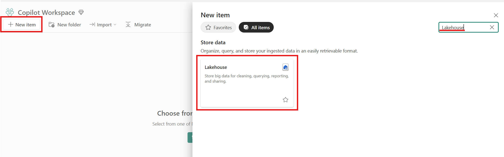

- Workspace 좌측 상단의 `+ New item` 버튼을 클릭하고, 
- 우측 검색 창에서 'lakehouse'를 검색한 결과로 보여지는
- `Lakehouse` 항목을 클릭합니다.


- Name에 적당한 이름을 부여하고,
- `Create` 버튼을 클릭하여 새로운 lakehouse를 생성합니다.

## Dataflow Gen2 만들기

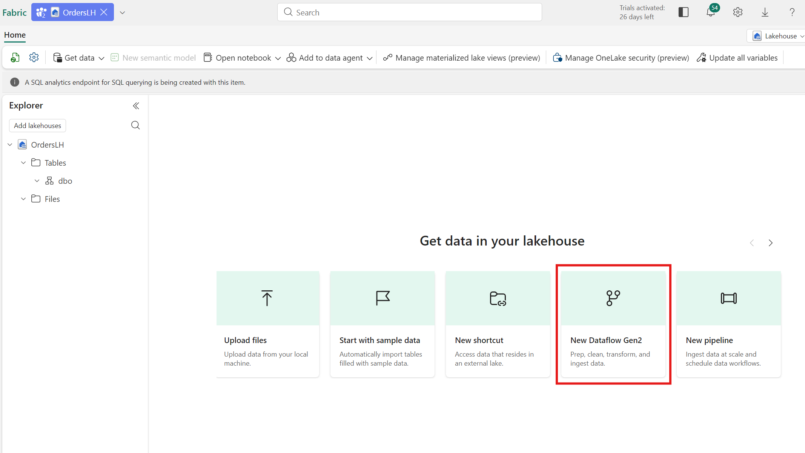

- 새로운 lakehouse가 생성되면, 우측 pane에서 `New Dataflow Gen2`를 클릭합니다.

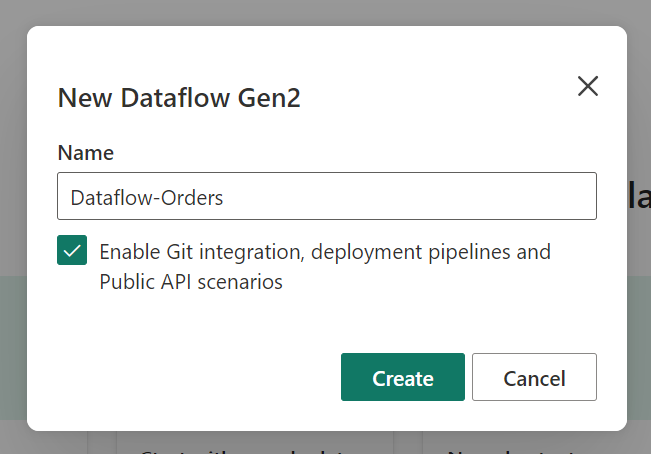

- Name에 'Dataflow-Orders'라고 입력하고, `Create` 버튼을 클릭합니다.

## 데이터 가져오기

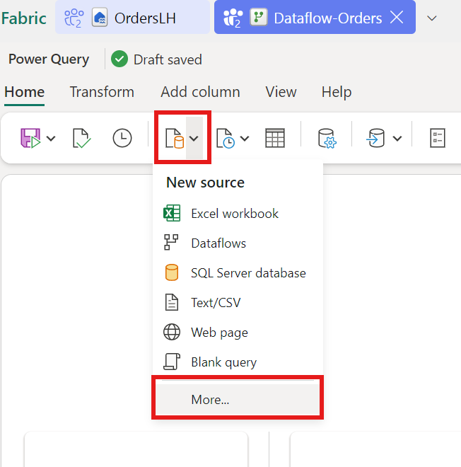

- Dataflow가 생성되면, 좌측 상단의 `New source`를 클릭하고,
- `More` 항목을 클릭합니다.

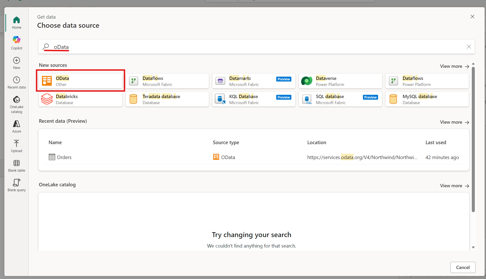

- 검색창이 나타나면, 'oData'라고 검색하고,
- 하단의 결과창에서 `oData`를 클릭합니다.

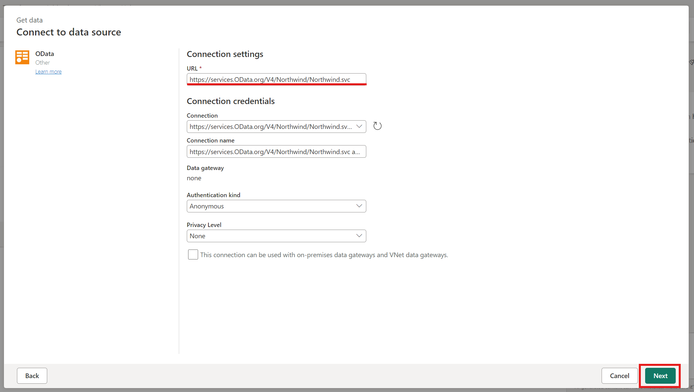

- URL에 'https://services.OData.org/V4/Northwind/Northwind.svc'을 입력하고
- `Next` 버튼을 클릭합니다.

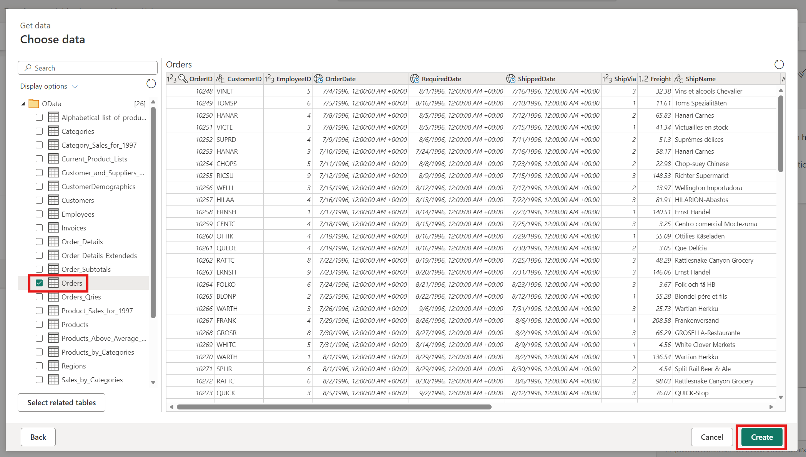

- 좌측 트리 메뉴에서 'Orders' 항목을 선택하고
- `Create` 버튼을 클릭합니다.

## Copilot을 이용한 작업
이제 Copilot을 이용한 작업을 수행해보도록 하겠습니다.

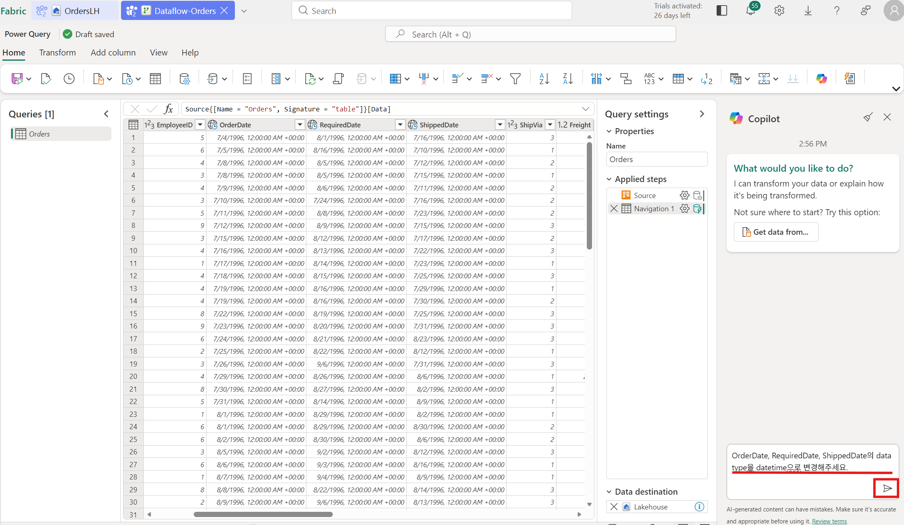

- 생성이 완료되면, 화면 우측에 Copilot pane도 같이 보여지게 됩니다.
- 다음의 prompt를 복사해 붙여넣고, 실행 버튼을 클릭합니다.

```
OrderDate, RequiredDate, ShippedDate의 data type을 datetime으로 변경해주세요.
```

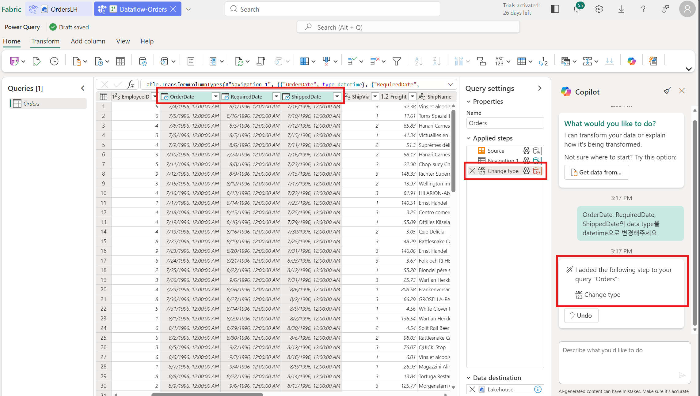

- 실행이 완료되면, OrderDate, RequiredDate, ShippedDate 컬럼들의 데이터 유형이 datetime으로 변경된 것을 확인할 수 있습니다.

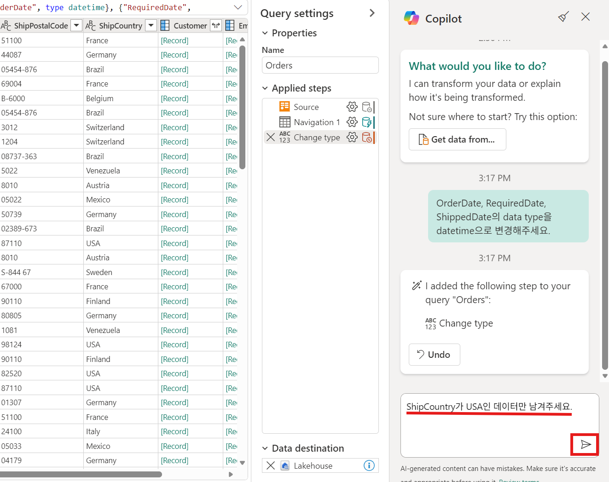

- 아래의 prompt를 입력하고, 실행 버튼을 클릭합니다.

```
ShipCountry가 USA인 데이터만 남겨주세요.
```

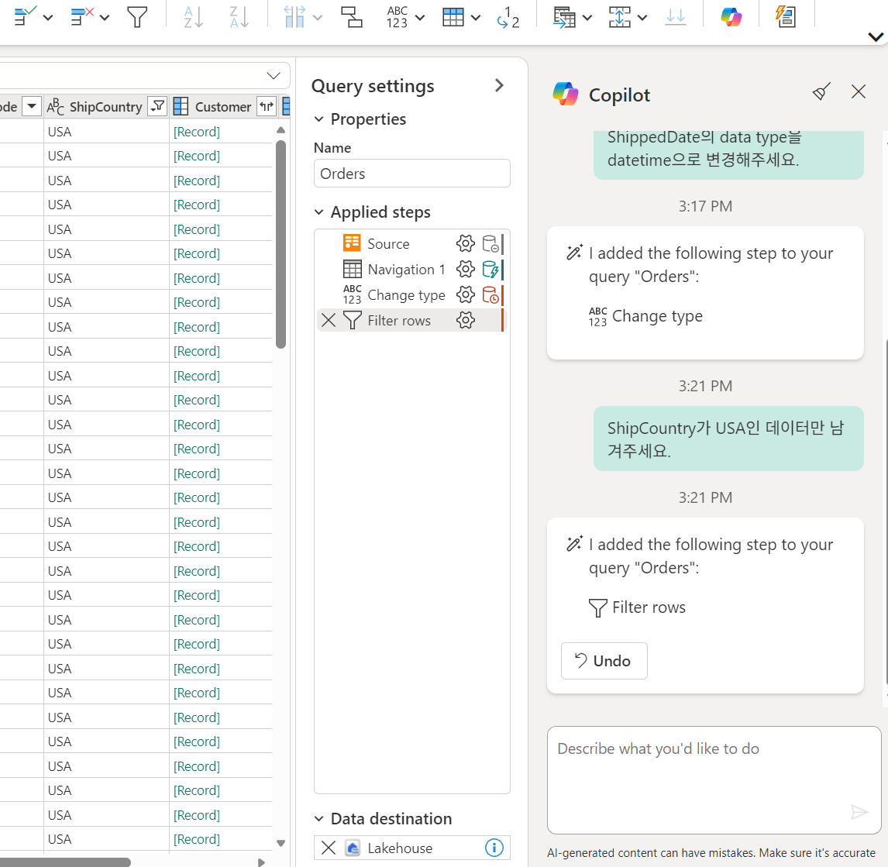

- 작업이 완료되면, ShipCountry가 'USA'인 데이터만 남게 됩니다.
- 마지막으로 다음의 prompt를 입력하고 실행합니다.

```
쿼리 및 적용된 단계에 대해서 요약해주세요.
```

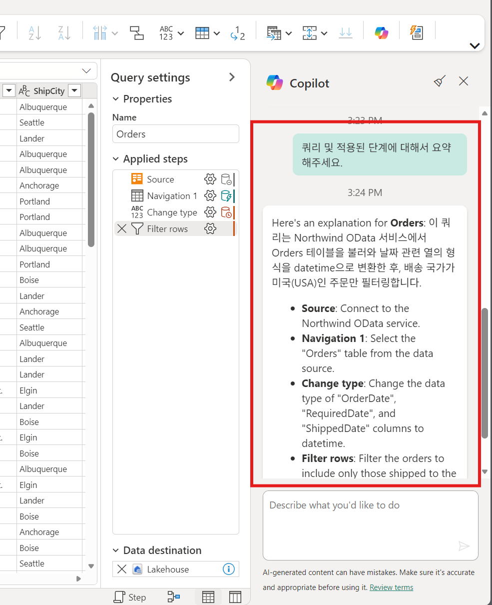

## 저장하기

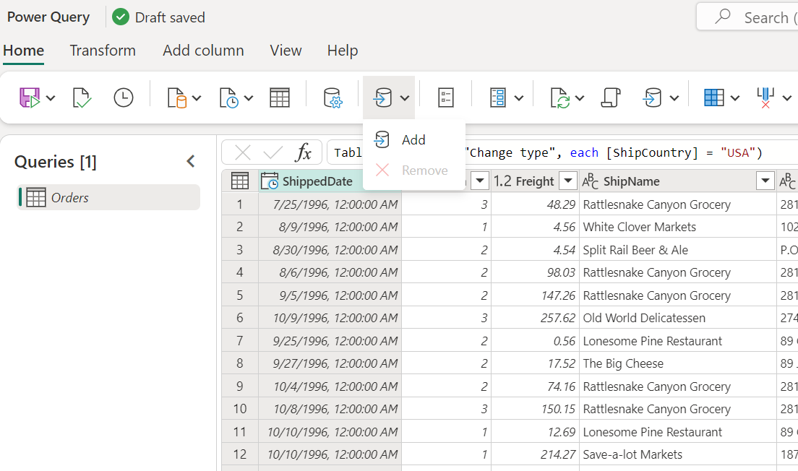

- 데이터를 저장할 대상을 지정하기 위해, 대상 버튼을 클릭하고, `Add` 버튼을 클릭합니다.

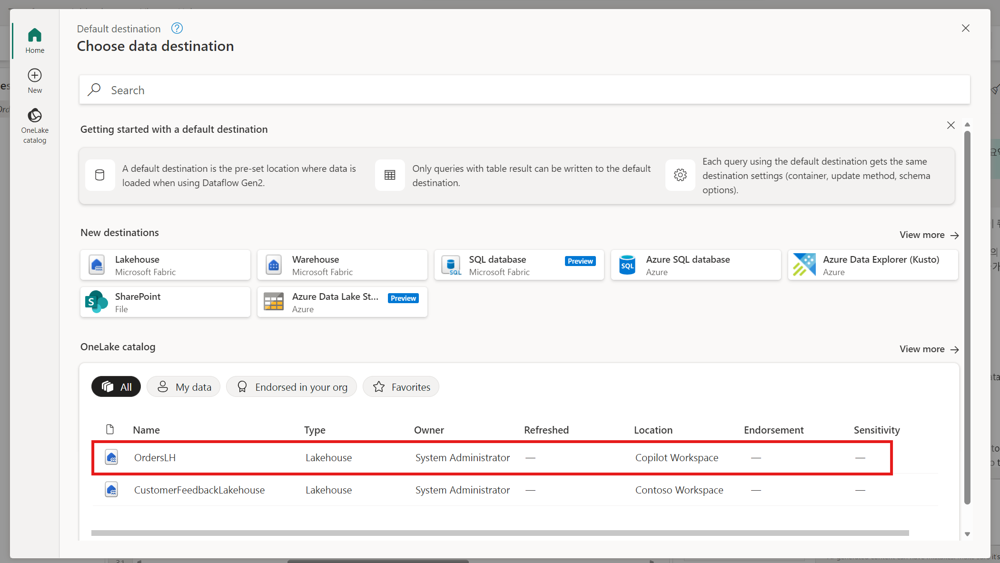

- 화면이 보여지면, 앞서 생성하였던 'OrdersLH'를 클릭합니다.

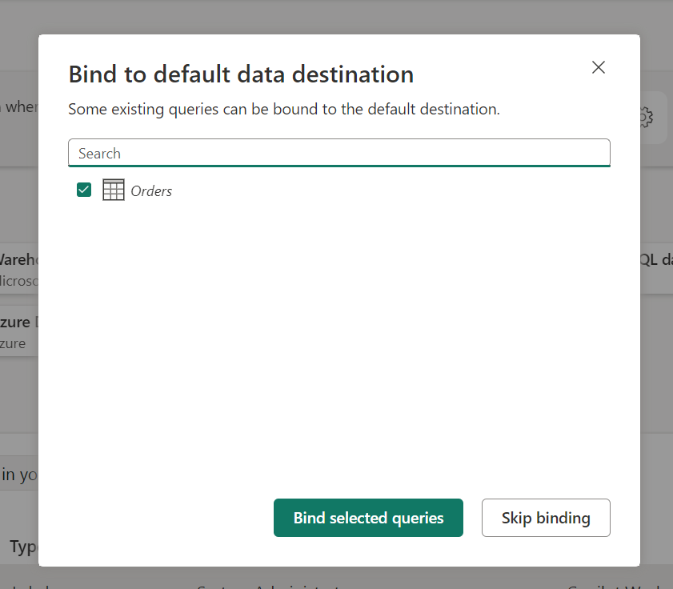

- 'Orders' 항목이 체크되어 있는지 확인하고
- `Bind selected queries`를 클릭합니다.

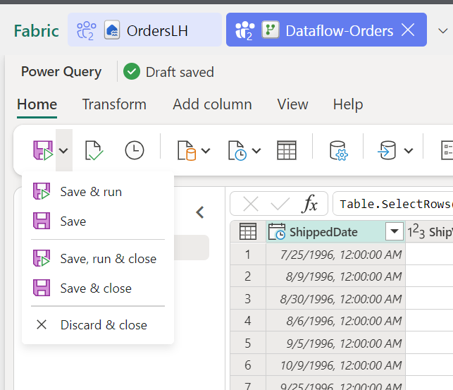

- `Save, run & close` 버튼을 클릭합니다.
- 작업에 소요되는 시간은 Fabric Capacity의 SKU 따라 다르며, 다소간의 시간을 필요로 합니다.


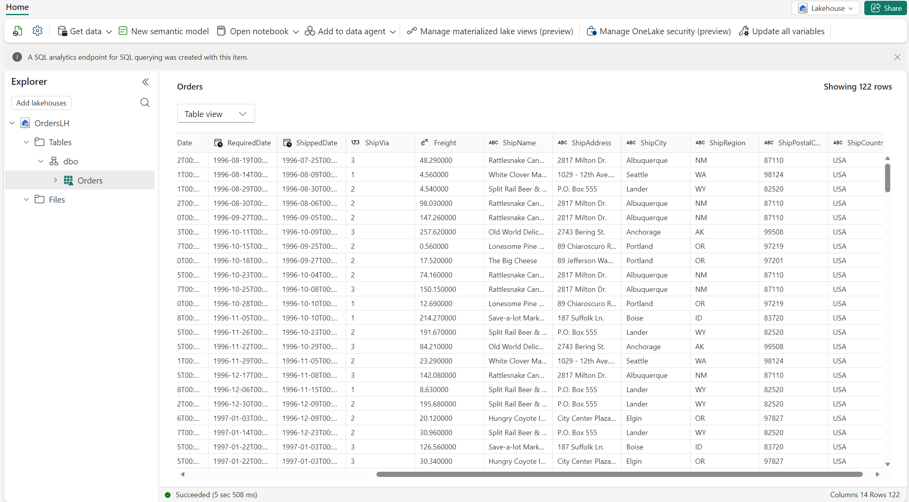

- lakehouse로 돌아오면, 위의 그림과 같이 테이블이 생성되어 데이터가 입력된 것을 확인할 수 있습니다.

## 마무리
Microsoft Fabric Copilot은 Dataflow Gen2의 데이터 변환을 위한 작업을 자연어로 쉽게 처리할 수 있는 기능을 제공합니다.

✍️ 2026년 2월 15일 씀.