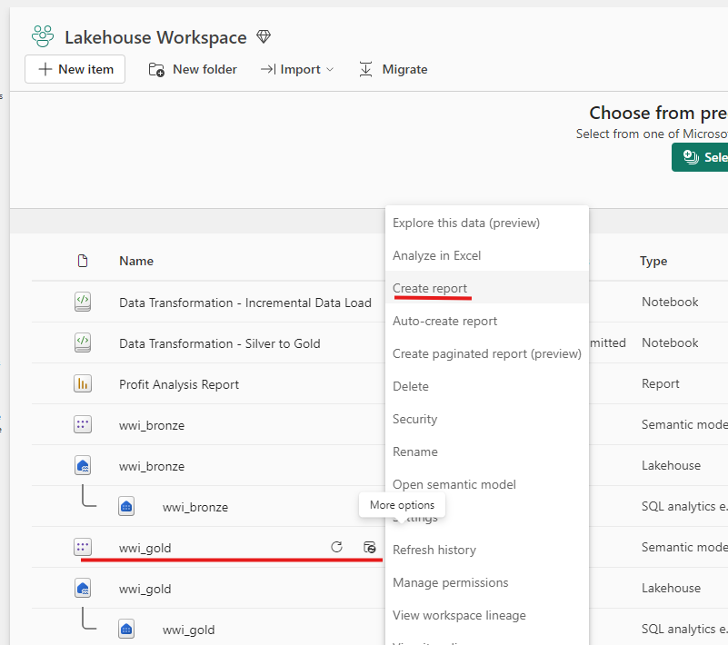
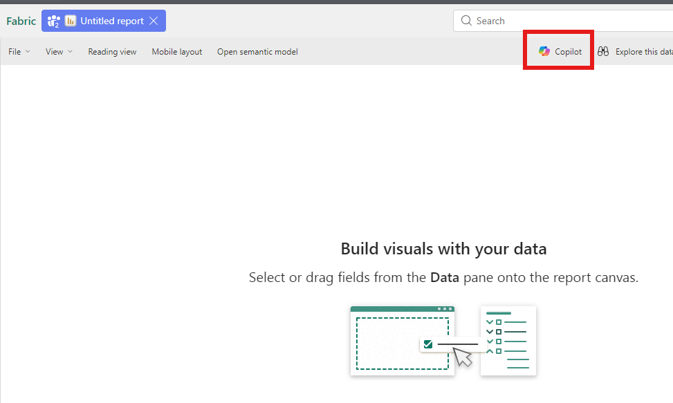
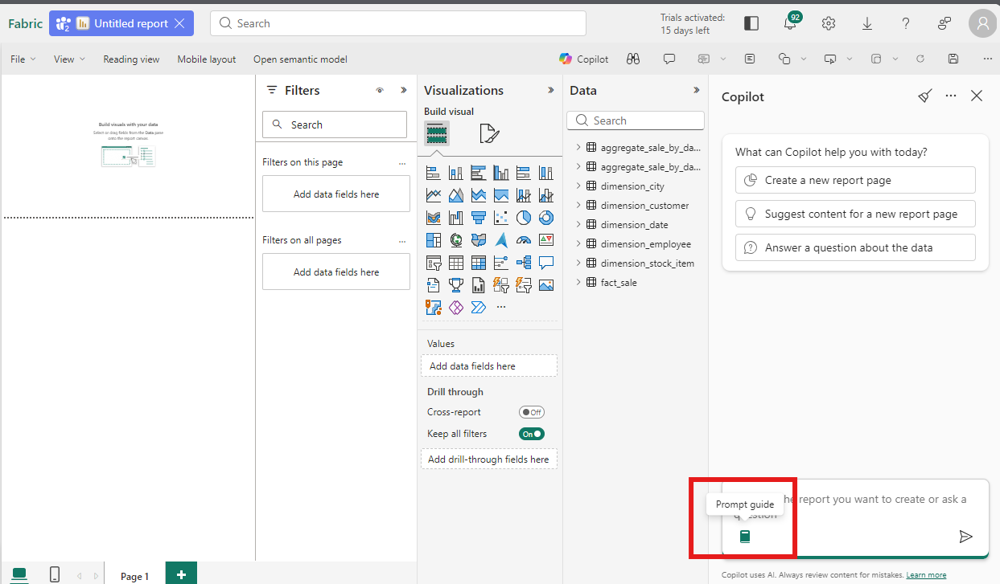
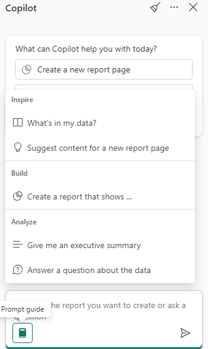

# Power BI의 Copilot 기능 - hands-on

## 필수 조건
해당 hands-on은 [Lab2 Lakehouse 환경](/microsoft-fabric-in-a-day/Lab2%20Microsoft%20Fabric%20Lakehouse/Lab2%20Microsoft%20Fabric%20Lakehouse1.md)의 샘플 데이터를 활용하고 있습니다. 반드시 Lab2 Lakehouse 환경이 생성되어 있어야 합니다.

## Copilot 열기
Lab 2에서 생성한 Lakehouse workspace로 이동합니다.

wwi_gold semantic model에서 ... 메뉴를 클릭하면, 다음과 같은 팝업 메뉴가 보여지게 됩니다.

`Create report` 메뉴를 클릭합니다.



새로운 보고서 화면이 보여지면, 화면 중앙 상단에 있는 `Copilot` 버튼을 클릭합니다.



## 자연어로 보고서 생성하기
Copilot의 가장 핵심적인 기능 중 하나는 사용자가 원하는 보고서를 자연어로 기술하면 자동으로 보고서 페이지를 만들어주는 것입니다. 복잡한 차트 작성이나 DAX 식 작성에 익숙하지 않은 초보자라도, 말로 설명하기만 하면 Copilot이 알맞은 시각화 요소를 선택해 보고서를 생성해 줍니다. 

예를 들어, 판매 실적 데이터가 있다고 가정해 봅시다. 월별 매출 추이를 보고 싶다면 Copilot에게 다음과 같이 요청할 수 있습니다:

"이번 분기 월별 매출 추이와 세부 내역을 보여주는 보고서를 만들어줘."

위와 같이 한글 (또는 영어)로 문장을 입력하면, Copilot은 해당 데이터셋의 필드와 관계를 파악해 가장 적절한 차트와 표를 조합한 보고서를 자동으로 작성합니다. 예를 들어, Lab2 Lakehouse에서 준비된 판매 데이터에 대해 위와 같은 프롬프트를 실행하면, Copilot이 다음과 같은 리포트 페이지를 만들어줄 수 있습니다:

* 전체 추세 차트: 월별 총 판매량 추이를 보여주는 라인 차트 (예: 월별 총매출의 증감 추세)
* 세부 분석 시각화: 제품 카테고리별 매출 구성비를 나타낸 막대 그래프 또는 파이 차트, 주요 지역별 매출 비교 지도 차트 등
* 요약 카드: 전체 기간의 총매출, 총이익 등의 주요 지표를 한눈에 보여주는 카드 시각화

Copilot은 이러한 요소들을 일관된 테마로 배치하여 하나의 대시보드 형태로 구성합니다. 사용자는 생성된 보고서를 확인하고, 필요하다면 직접 세부 설정(예: 시각화 타입 변경, 필터 추가)을 수동으로 수정할 수 있습니다.

### Prompt guide
Microsoft Fabric Power BI Copilot에는 Prompt Guide라는 유용한 기능이 있습니다. 이는 Copilot이 미리 정의된 프롬프트 항목들을 제공하여, 사용자가 원하는 작업을 빠르게 수행할 수 있도록 돕는 안내서입니다. Copilot을 처음 접하는 초보 기술자라면, 이 Prompt Guide를 통해 자연어로 어떤 질문이나 요청을 할 수 있는지 쉽게 파악할 수 있습니다.

화면 우측에 Copilot이 창이 열리면, 아래의 그림과 같이 `Prompt guide` 버튼을 클릭합니다.



### Inspire -  What's in my data? : 데이터의 주요 내용 파악
"What’s in my data?" 프롬프트는 Copilot이 현재 사용 중인 데이터셋의 전반적인 내용을 요약해 주도록 요청하는 것입니다. 

Copilot은 데이터 모델(시맨틱 모델)을 스캔하여 어떤 테이블과 필드가 있고, 데이터 범위와 특성이 어떤지 등의 정보를 간략히 정리해 알려줍니다. 이를 통해 사용자는 새로운 데이터셋을 접했을 때도 구성과 핵심 포인트를 빠르게 파악할 수 있습니다. 

예를 들어, 레이크하우스에 업로드된 판매 데이터라면, Copilot은 "이 데이터에는 2020년부터 2023년까지 4개년도의 매출 기록이 있으며, 제품, 고객, 지역, 시간 테이블로 구성됩니다. 총 50만 건 이상의 판매 행이 있고, 제품 카테고리는 전자제품, 가전, 의류 등으로 분류됩니다. 올해 현재까지 전자제품 부문의 매출이 가장 높습니다." 와 같은 요약을 제공할 수 있습니다.

메뉴 상단에 있는 `What's in my data?` 메뉴를 클릭하여 프롬프트를 실행합니다.



다음과 같은 결과가 보여지게 됩니다.

https://github.com/user-attachments/assets/8f33c5d9-2590-4ab6-8a92-808dfa5d8f33

이 프롬프트는 새로운 데이터셋을 처음 분석할 때 특히 유용합니다. 초보자라도 데이터의 구조를 한눈에 이해하고, 이후 진행할 분석이나 시각화의 방향성을 잡는 데 도움을 받을 수 있습니다. 또한 데이터의 **품질(누락된 값, 이상치 존재 여부)** 에 대한 첫 인상을 얻는 데에도 활용할 수 있습니다.

### Inspire - Suggest content for a new report page : 보고서 페이지 자동 제안받기
"Suggest content for a new report page" 프롬프트는 Copilot이 데이터셋을 분석하여 적합한 보고서 페이지 주제와 시각화를 자동으로 제안하도록 합니다. 

이 기능은 보고서 작성 초기에 막연함을 느낄 때 유용합니다. Copilot은 데이터 모델의 내용을 이해하고, 어떤 내용을 보여주면 좋을지 여러 후보 페이지를 주제별로 추천해 줍니다. 예를 들어, Lab2의 판매 레이크하우스 데이터를 처음 불러온 경우, Copilot은 다음과 같은 페이지 주제를 제안할 수 있습니다:

1. 고객 특성 분석 페이지 : 고객 연령대, 성별, 지역 등 인구통계별 매출 분포
2. 제품별 판매 실적 페이지 : 카테고리·제품군별 매출 합계 및 추이 비교
3. 프로모션 효과 분석 페이지 : 판촉 캠페인 전후의 매출 증감 및 ROI 평가

Prompt guide 버튼을 클릭하고, `Suggest content for a new report page` 메뉴를 클릭합니다.

https://github.com/user-attachments/assets/73c6dd56-d1f4-413d-b8c5-eb8d697e52af

제안된 보고서 중에서 하나를 클릭하여 보고서를 생성하도록 합니다. `Edit` 버튼을 클릭하여 제안된 프롬프트를 수정하여 실행할 수도 있습니다.

https://github.com/user-attachments/assets/f0a44cc5-fece-483e-b188-8434bed5a7c2

### Build - Create a report that shows … : 원하는 맞춤 보고서 생성 지시
"Create a report that shows …" 프롬프트는 사용자가 원하는 보고서 페이지를 직접 지시하여 생성하는 기능입니다. 위의 Suggest content가 Copilot의 추천에 따라 페이지를 만드는 방식이라면, *Create a report that shows…* 는 사용자가 생각한 주제나 지표를 구체적으로 명시하여 그에 맞는 보고서를 맞춤 생성하는 프롬프트입니다. Copilot은 자연어로 기술된 요청을 해석하여 해당 데이터를 가장 잘 표현할 수 있는 시각화 요소들과 레이아웃을 알아서 배치합니다.

prompt guide 메뉴를 누르고, `Create a report that show` 버튼을 클릭하고, 다음의 내용을 덧붙이고 실행합니다.

```
top 5 제품의 월별 판매 추이와 지역별 총 매출 기여도
```

https://github.com/user-attachments/assets/8d295ca3-e29c-4e02-bfdd-b41e1f95a1a7

### Analyze - Give me an executive summary : 경영진 레벨 요약본 받기
"Give me an executive summary" 프롬프트는 현재 보고서의 핵심 인사이트를 경영진이 보기에 적합한 요약 형식으로 제공하도록 Copilot에 요청하는 기능입니다. Copilot은 보고서 전체에 걸쳐 시각화된 데이터의 추세와 KPI를 파악하여, 사람이 쓴 것 같은 자연어 형태의 요약 리포트를 생성합니다. 이 기능은 경영진이나 이해관계자에게 보고할 때 유용하며, 방대한 데이터를 몇 문장으로 압축해 핵심 메시지를 전달할 수 있습니다.

https://github.com/user-attachments/assets/4a5b06b5-c80a-4827-9ba6-d03c2a9994da

### Analyze - Answer a question about the data : 자연어 데이터 질의 응답
"Answer a question about the data" 프롬프트는 사용자가 데이터와 직접 대화하듯 질문을 던져 답변을 얻고자 할 때 활용합니다. Copilot은 사용자의 자연어 질문을 이해하고, 시맨틱 모델을 질의하여 적절한 시각화 및 설명을 제공합니다. 

Power BI의 기존 Q&A 기능을 Copilot이 한층 강화한 것으로, 사용자는 일상적인 언어로 궁금증을 물어보고, Copilot은 데이터에 근거한 답을 그림이나 글로 알려주는 형태입니다.

https://github.com/user-attachments/assets/95e0521b-b0ac-4da8-836a-b6e2b5f6c6e3

## Copilot으로 보고서 요약 및 내러티브 받아보기
다음 기능은 보고서 요약(summarization), 즉 내러티브(narrative) 생성입니다. Copilot은 보고서 전체 페이지나 개별 시각화에서 핵심적인 통찰을 텍스트 형태로 요약해줄 수 있습니다. 이를 통해 사용자는 복잡한 차트들을 일일이 해석하지 않고도 보고서의 핵심 내용을 빠르게 파악할 수 있습니다.

Copilot의 요약 기능은 두 가지 방식으로 제공됩니다:

1. Copilot 패널 요약: 보고서 페이지를 보고 있는 상태에서 Copilot 패널에 “이 보고서를 요약해줘” 혹은 “주요 인사이트를 알려줘” 등의 프롬프트를 입력하면, Copilot이 해당 페이지의 주요 지표와 추세를 몇 문장으로 요약해줍니다. 이 기능은 읽기 전용 권한만 있는 사용자도 사용할 수 있어, 보고서를 편집하지 않고도 핵심 내용을 이해할 수 있습니다. 
2. 내러티브 시각화 추가: 보고서 편집 권한이 있는 경우, **내러티브 시각화(Narrative visual)** 를 보고서 페이지에 추가할 수 있습니다. 이 시각화를 선택하고 Copilot 모드로 전환한 후 원하는 요약 형태를 프롬프트로 지정하면, 현재 페이지 또는 특정 차트의 내용을 분석하여 자동 생성된 설명 문장들을 시각화로 보여줍니다. 내러티브는 보고서의 필터나 슬라이서와 연동되어 동적으로 업데이트되므로, 보고서에 새로운 데이터가 반영되거나 필터 조건이 바뀌면 요약 내용도 함께 변경됩니다.

### 내러티브 시각화 추가
보고서를 편집할 수 있는 권한을 가지고 있다면, 비주얼 삽입 메뉴에서 내러티브(또는 스마트 내러티브) 시각화를 추가하고, Copilot을 통해 원하는 요약 방향을 프롬프트 할 수 있습니다. 예를 들어 *“페이지의 판매 및 이익 지표를 간략히 요약하라”* 라는 프롬프트를 사용하면, 그 페이지에 있는 차트들을 분석해 매출과 이익의 추세 및 상관관계를 설명하는 문단을 생성해주는 식입니다. 생성된 요약 문장은 보고서에 텍스트 상자로 표시되어, 프레젠테이션이나 리포트 공유 시 해당 페이지의 이야기를 전달하는 데 활용할 수 있습니다.

https://github.com/user-attachments/assets/0f458746-1213-450f-88c4-454338069032

✍️ 2026년 2월 27일 씀.