# Azure SQL Database의 CDC를 이용하여 Real time intelligence 환경 구축하기

## 배경

일반적으로 Azure SQL Database와 같은 관계형 데이터베이스의 데이터를 클라우드 레이크하우스로 가져오는 방법은 **과거 지향적 접근 방법**을 사용하곤 합니다.

간단하게 설명하면, 주기적으로 정해진 시간에 쿼리를 하여 변경된 데이터들을 가져오는 방법을 의미합니다.

예를 들면, Data Factory를 이용하여 변경된 데이터의 내용을 읽어와서 레이크하우스로 복사하는 것이 이에 해당 합니다.


이 작업은 매일, 또는 6시간마다, 혹은 3시간마다 수행되도록 할 수 있지만, 데이터가 원본(source)에서 생성되는 순간부터 레이크하우스에 도달하기까지 많은 시간을 필요로 하게 됩니다.

데이터로부터 좀 더 의미있는 정보와 인사이트를 이끌어내기 위해서는, 가장 최신의 데이터가 유지되는 것이 필요합니다.

따라서, 데이터를 주기적으로 **가져오기(pull)** 보다는, 원본(source)에서 **실시간**으로, **upstream(여기서는 Microsoft Fabric)** 으로 **올려(push)** 주어야 합니다.

## 아키텍처
이번 hands-on lab에서는 Azure SQL Database의 CDC 기능을 이용하여 변경된 데이터를 Microsoft Fabric으로 실시간으로 가져오는 방법에 대해서 살펴보게 됩니다.

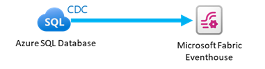

## 순서
1. Azure SQL Database 생성
2. Azure SQL Database 구성
    - SQL Database 서버 설정
    - 데이터베이스 사용자 생성
    - 테이블 생성
    - CDC 활성화
3. 워크스페이스 생성
4. 이벤트하우스 생성
5. 이벤트스트림 생성
6. 이벤트스트림 구성
    - Azure SQL Database 연결
    - 이벤트스트림과 이벤트하우스 연결
7. KQL을 이용한 데이터 확인

## 1. Azure SQL Database 생성
[Azure Portal](https://portal.azure.com/)에 로그인하고, Create a resource 버튼을 클릭합니다.

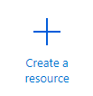

검색창에 'Azure SQL Database'를 입력하여 리소스를 검색합니다.

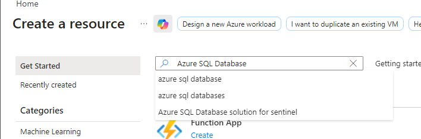

결과 화면에서 'SQL Database'의 `'Create' > 'SQL Database'` 버튼을 클릭합니다.

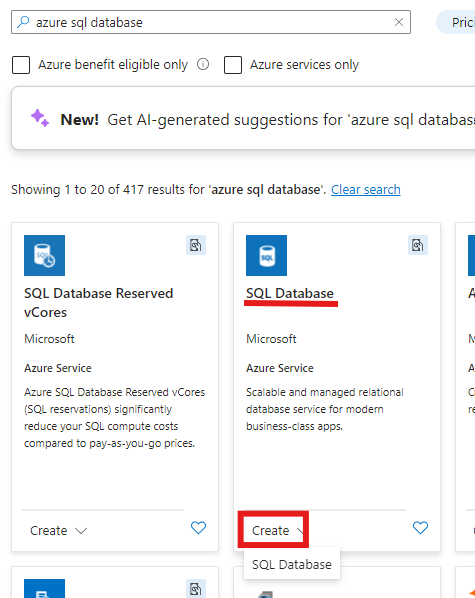

구독과 리소스 그룹을 선택합니다.
그 다음에는 데이터베이스 이름을 입력하고, 

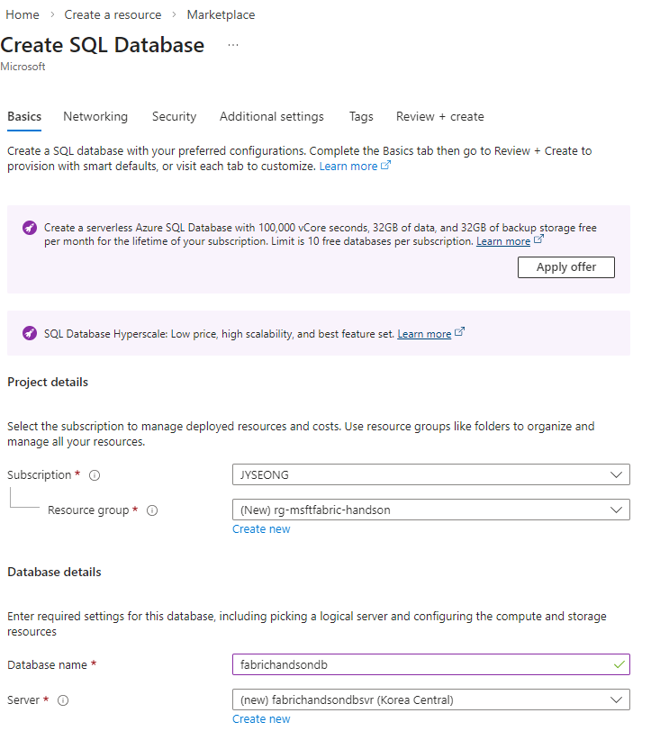

필요하면, Server의 `Create New` 버튼을 클릭하여 데이터베이스 서버를 생성합니다.

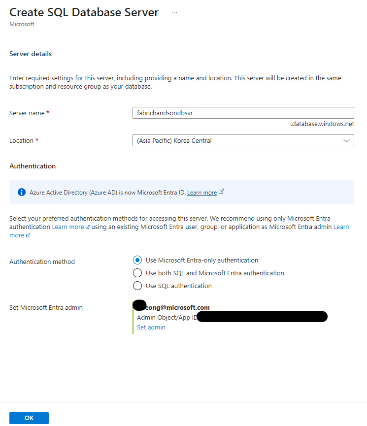

Workload environment는 `Development`로 설정하고, `Review + create` 버튼을 클릭하여 생성합니다.


## 2. Azure SQL Database 구성
생성이 완료되면, 서버 이름을 클릭하여 데이터베이스 서버로 이동합니다.

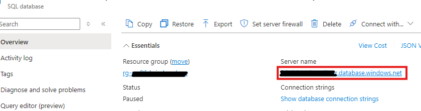

### SQL Database 서버 설정

좌측 메뉴에서 `Secuirty > Networking`으로 이동합니다.
다음의 이미지에서 보이는 것과 같이 설정합니다.

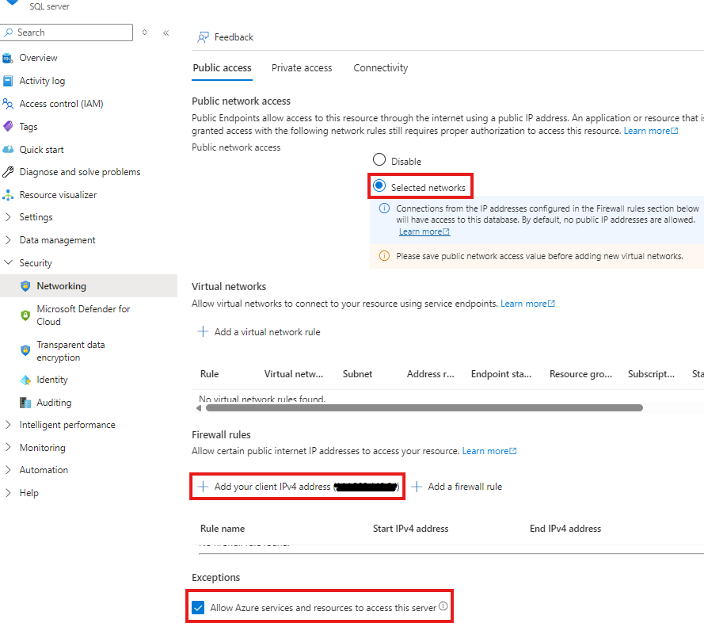

- Public access > Selected networks 선택
- Add your client IPv4 addess(여러 분의 IP)를 클릭하여, 현재 사용중인 IP 추가
- Exceptions > Allow Azure services and resources to access to this server 선택

설정이 완료되면, `Save` 버튼을 클릭합니다.


좌측 메뉴에서 `Settings > Microsoft Entra ID`로 이동합니다.

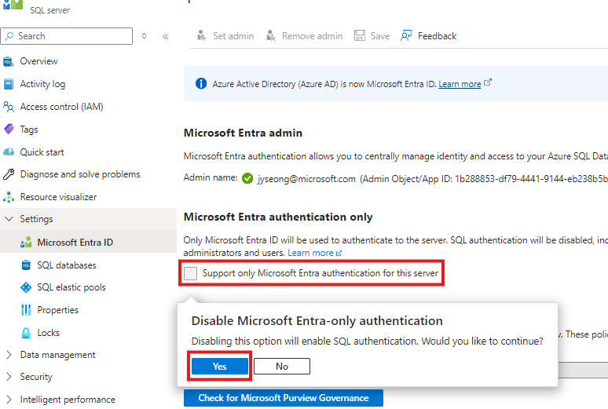

"Support only Microsoft Entra authentication for this server"가 check되어 있으며, 해제하여 mixed authentication을 사용하도록 합니다.
상단의 `Save` 버튼을 클릭하여 저장합니다.

좌측 메뉴에서 `Settings > SQL Databases`로 이동하고, 우측 화면에서 앞서 생성한 데이터베이스를 클릭하여 해당 데이터베이스로 이동합니다.

좌측 메뉴에서 `Query editor(preview)`를 클릭합니다.

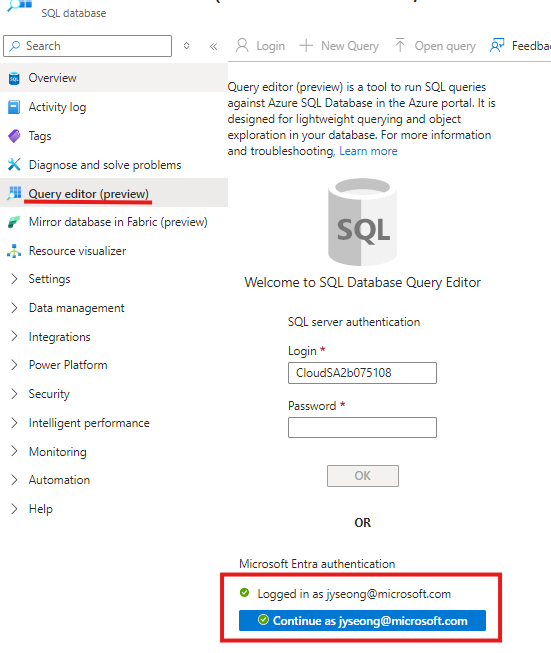

Microsoft Entra authentication 버튼을 눌러서 로그인 합니다.

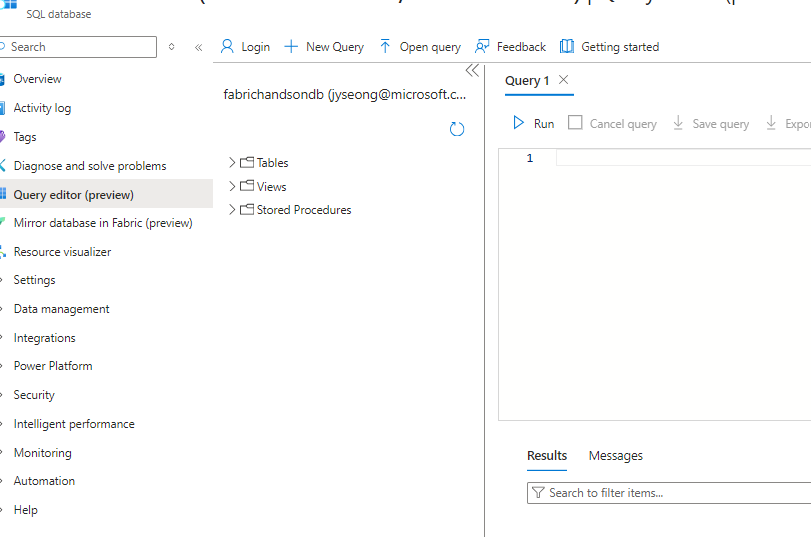

### 데이터베이스 사용자 생성
우측의 쿼리 창에 다음의 SQL 쿼리를 복사하여 붙여 넣고, 패스워드를 변경합니다.

```sql
CREATE USER cdcuser WITH password='여러분의 패스워드로 바꿔주세요';

EXEC sp_addrolemember 'db_owner', 'cdcuser';
```

상단의 `Run` 버튼을 클릭하여, 
- 사용자를 생성하고,
- 해당 사용자를 db_owner에 추가합니다.

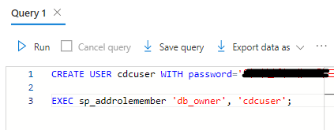

다음의 쿼리를 복사 + 실행하여, 사용자 생성을 확인합니다.

```sql
SELECT uid, [status], [name], hasdbaccess, islogin 
FROM sysusers
WHERE [name] = 'cdcuser';
```

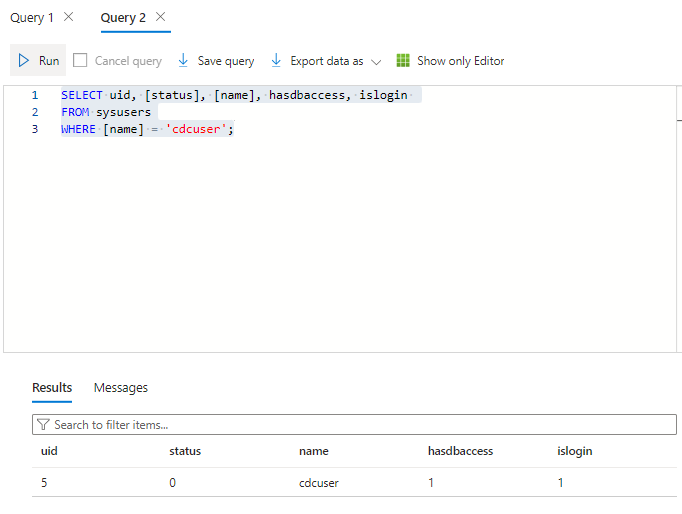

### 테이블 생성
새로운 쿼리 창을 열고, 다음의 쿼리를 복사 + 붙여넣기 + 실행합니다.

해당 쿼리는

- dbo 스키마에 Orders라는 테이블을 생성하고
- 해당 테이블에 임의의 데이터를 입력하고 업데이트

하는 작업을 수행합니다.

```sql
IF OBJECT_ID('dbo.Orders') IS NULL
BEGIN
  CREATE TABLE dbo.Orders (
    OrderID INT IDENTITY(1,1) PRIMARY KEY,
    Customer NVARCHAR(100),
    Amount DECIMAL(18,2),
    Status NVARCHAR(50),
    [Timestamp] DATETIME2 DEFAULT SYSUTCDATETIME()
  );
END;

INSERT INTO dbo.Orders (Customer, Amount, Status)
SELECT TOP (50) CONCAT('Customer-', ABS(CHECKSUM(NEWID())) % 1000),
       CAST(100 + (ABS(CHECKSUM(NEWID())) % 9900) AS DECIMAL(18,2)),
       CASE WHEN ABS(CHECKSUM(NEWID())) % 5 = 0 THEN 'New' ELSE 'Processed' END
FROM sys.objects s1 CROSS JOIN sys.objects s2;

UPDATE dbo.Orders SET Amount = Amount + 123.45 WHERE OrderID IN (SELECT TOP 5 OrderID FROM dbo.Orders ORDER BY NEWID());

```

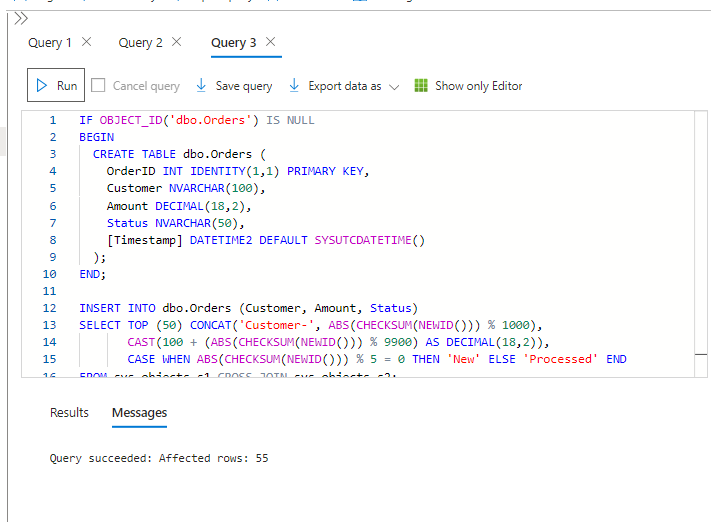

### CDC 활성화
새로운 쿼리 창을 열고, 다음의 쿼리를 복사 + 붙여넣기 + 실행합니다.

해당 쿼리는 dbo.Orders 테이블에 CDC를 활성화하게 됩니다.

```sql
EXEC sys.sp_cdc_enable_db;

EXEC sys.sp_cdc_enable_table
    @source_schema = 'dbo',
    @source_name   = 'Orders',
    @role_name     = NULL;
```

다음의 쿼리를 복사/붙여넣기 + 실행하여, 설정이 제대로 되었는지 확인합니다.

```sql
SELECT object_id, capture_instance, supports_net_changes, start_lsn
FROM cdc.change_tables;
```


## 3. 워크스페이스 생성
이제 [Microsoft Fabric 포털](https://app.fabric.microsoft.com/)로 이동합니다.

좌측 메뉴에서 `Workspaces > + New workspace`를 클릭합니다.

`Create a workspace` 화면에서는 적당한 이름을 부여하고

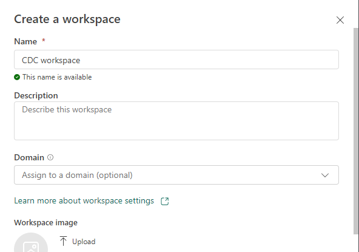

Workspace type을 "Fabric" 또는 "Fabric Trial"로 지정합니다.

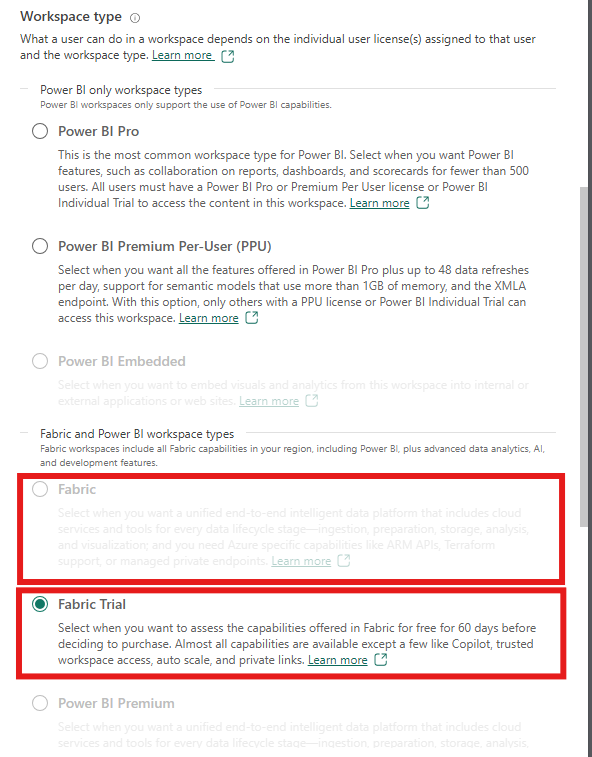

하단의 `Apply` 버튼을 클릭하여, workspace를 생성합니다.

생성이 완료되면, 다음과 같이 보여지게 됩니다.

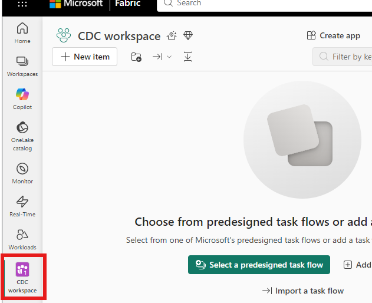

## 4. 이벤트하우스 생성
이제 real time으로 들어오는 데이터를 저장할 저장소(이벤트하우스)를 생성하도록 하겠습니다.

상단의 `+ New item` 버튼을 클릭합니다.

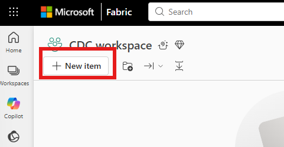

우측 상단 검색창에서 `eventhouse`를 입력하여 검색하고, 검색 결과에서 Eventhouse를 클릭합니다.

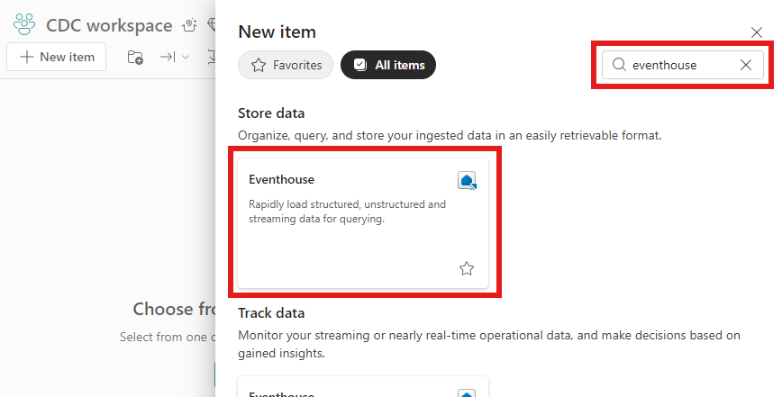

`New Eventhouse` 창에서는 적당한 이름을 입력하고 `Create` 버튼을 클릭하여 이벤트하우스를 생성합니다.

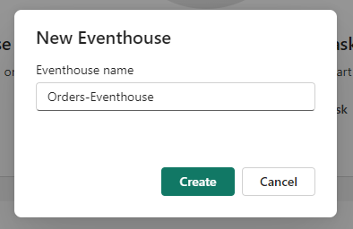

이벤트하우스 생성이 완료되면, 다음과 같은 화면이 보여지게 됩니다.

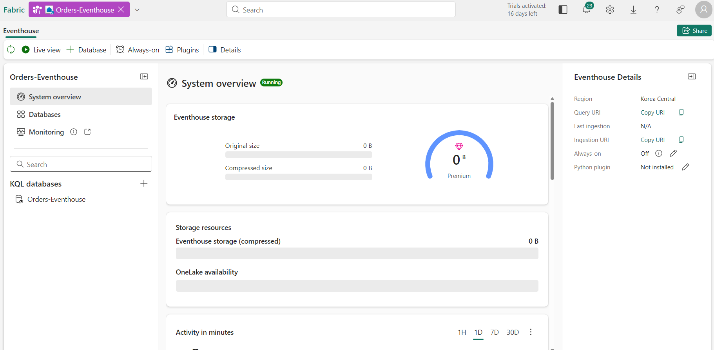

## 5. 이벤트스트림 생성
데이터 원본(Azure SQL Database)에서 CDC를 통해서 발생된 스트리밍을 저장할 저장소(Microsoft Fabric의 이벤트하우스)까지 생성하였으니, CDC를 통해서 발생된 스트리밍을 받아줄 이벤트스트림을 생성해보도록 하겠습니다.

다시 워크스페이스 화면에서, `+ New item` 버튼을 클릭합니다.
우측 상단의 검색 창에서 `eventstream`으로 검색하고, Eventstream 항목을 선택합니다. 

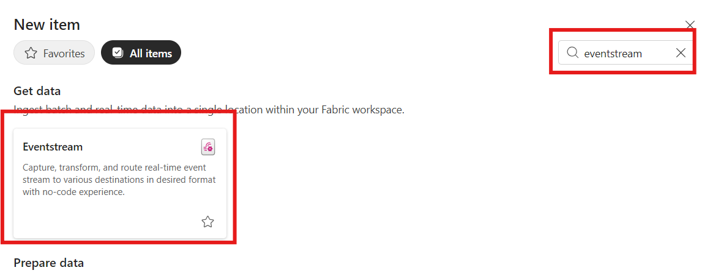

`New Eventstream` 화면에서 적당한 이름을 부여하고, `Create` 버튼을 클릭하여 이벤트스트림을 생성합니다.

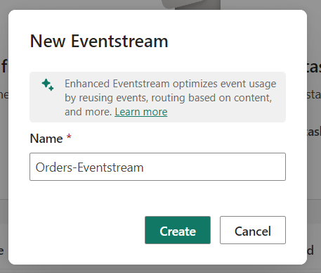

## 6. 이벤트스트림 구성

### Azure SQL Database 연결

생성이 완료되면 다음과 같은 화면이 보여지게 됩니다. 좌측 상단의 `Add source` > `Connect data sources` 메뉴를 클릭합니다.

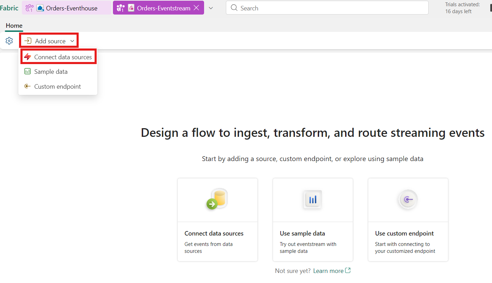

좌측의 `New` 버튼을 클릭합니다.

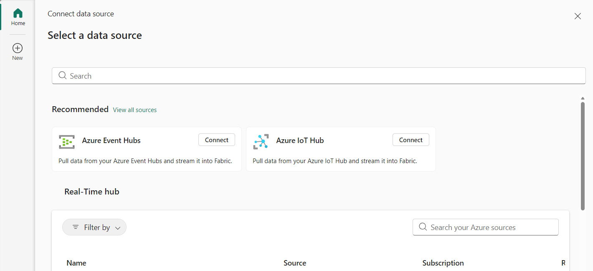

검색 창에서 "Azure SQL DB"로 검색을 하고, Azure SQL DB(CDC)의 `Connect` 버튼을 클릭합니다.

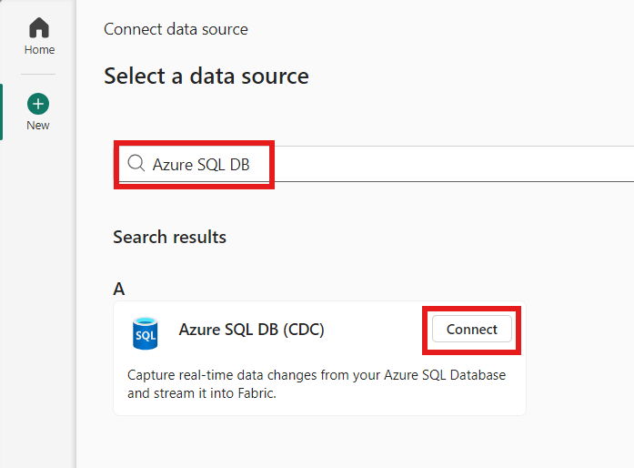

화면 중앙의 `New Connection` 링크를 클릭합니다.

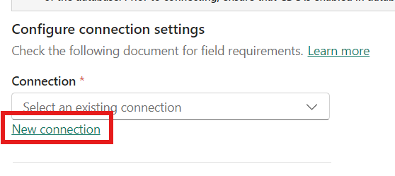

`Connection Settings`에서는 다음의 화면과 같이 **Server** 와 **Database** 항목에 해당 정보를 입력합니다.

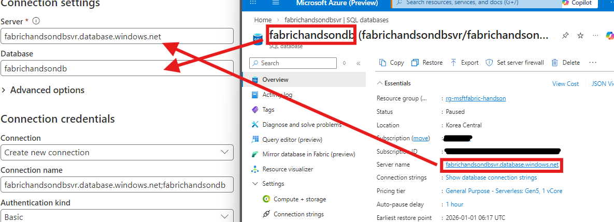

`Cnnection credentials`에서는 앞서 [데이터베이스 사용자 생성](./batch-2-rti-azure-sql-db.md#데이터베이스-사용자-생성)에서 생성하였던 사용자 이름(Username)과 비밀번호(Password)를 입력하고 `Connect` 버튼을 클릭합니다.

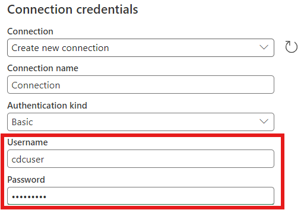

나머지 설정들은 다음과 같이 두고, `Next` 버튼을 클릭합니다.

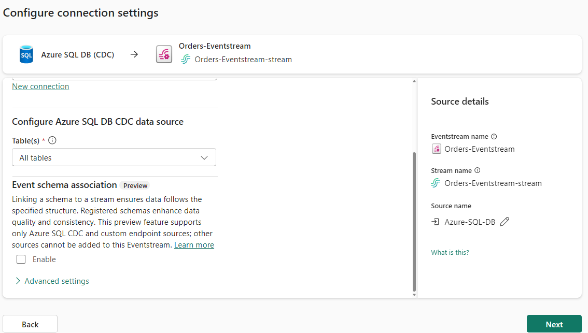

다음 화면에서도 `Next` 버튼을 클릭합니다.

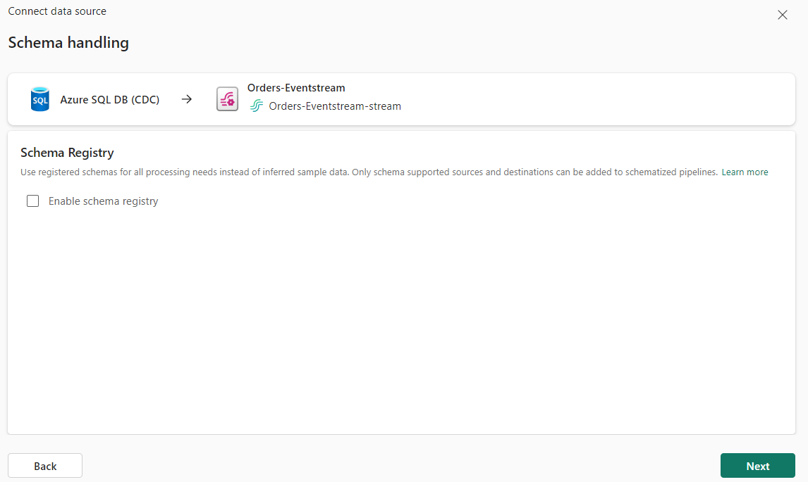

`Add` 버튼을 클릭하여 생성합니다.

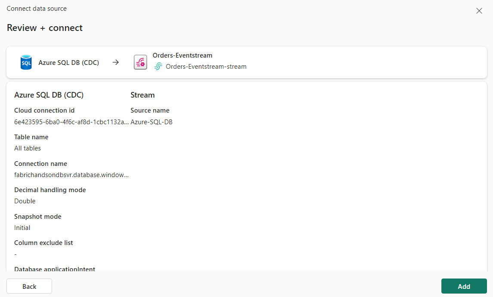

생성이 완료되면, 이벤트스트림 캔바스가 보여지게 됩니다.
스트림 원본을 클릭하면, 하단에 데이터 미리보기가 보여지게 됩니다.

미리보기 데이터를 보면, 앞서 생성한 Orders 테이블의 스키마 정보를 확인할 수 있습니다.

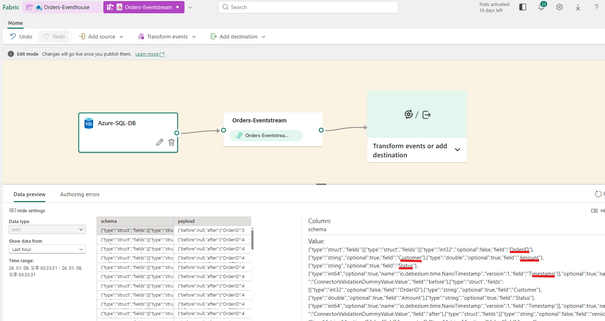

미리보기 항목의 Payload를 확인하면, 다음과 같이 입력된 데이터와 어떤 데이터 작업이 이루어졌는지 확인할 수 있습니다.

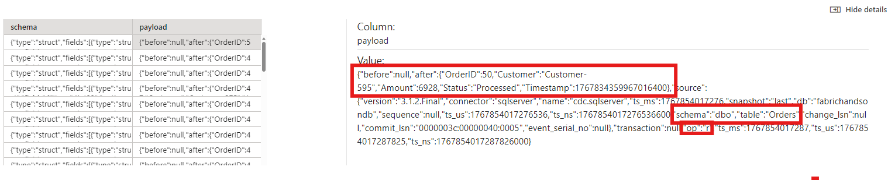

### 이벤트스트림과 이벤트하우스 연결
마지막으로 이벤트스트림으로 들어온 스트림 데이터를 앞서 생성한 이벤트하우스로 저장하도록 연결해보도록 하겠습니다.

이벤트스트림 캔바스에서 `Transform events or add destination`을 클릭하고, 메뉴 하단에서 `Eventhouse`를 클릭합니다.

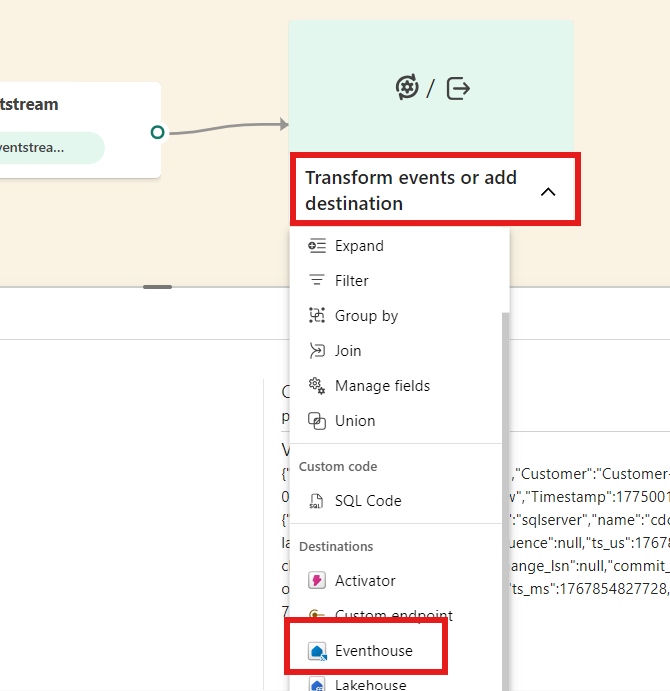

우측에 메뉴가 열리면, `Direct Ingestion`을 선택합니다.

앞서 생성한 워크스페이스, 이벤트하우스, KQL 데이트베이스 등을 선택하고 

`Save` 버튼을 클릭합니다.

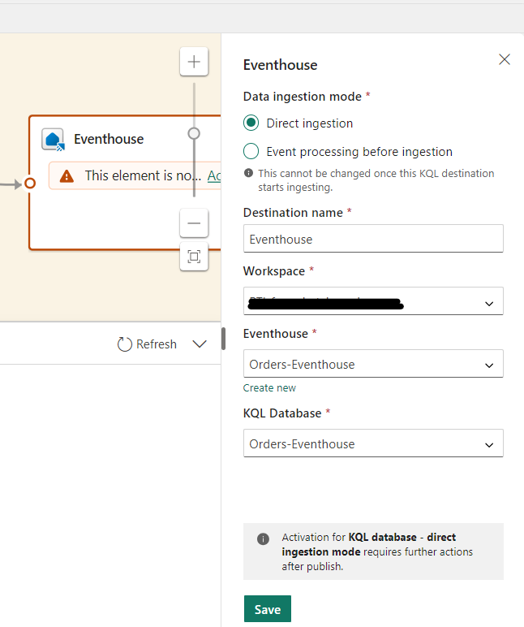

마지막으로 우측 상단에 있는 `Publish` 버튼을 클릭하여 배포합니다. (배포가 완료되기 까지 조금 시간이 소요됩니다.)

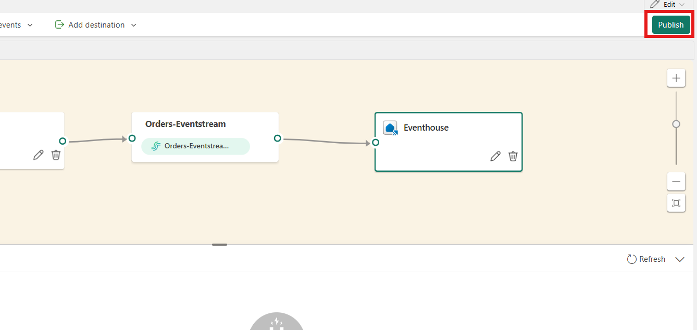

배포가 완료되면, Eventhouse에 `Configure`라는 버튼이 보여지게 됩니다. 해당 버튼을 클릭합니다.

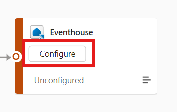

이벤트하우스의 구성 설정에서는 데이터 매핑 옵션을 선택할 수 있습니다. 기존 테이블에 매핑하거나, 데이터베이스 계층 구조에서 `+ 새 테이블` 옵션을 사용하여 새로운 테이블을 생성할 수 있습니다. 
해당 KQL 데이터베이스에는 기존 테이블이 없으므로,  새로운 테이블을 생성하는 옵션을 선택합니다.

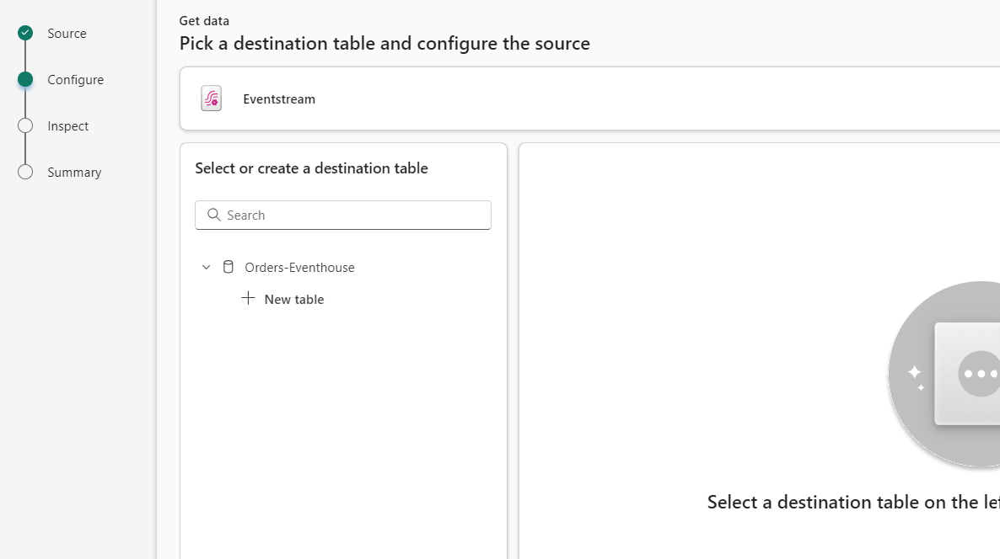

`+ 새 테이블`을 클릭하고, `Orders-CDC`라고 입력합니다.

`Next` 버튼을 클릭합니다.

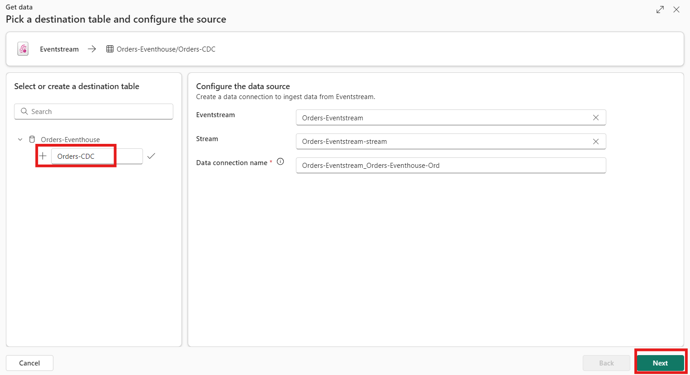

스트림의 데이터와 구조를 확인할 수 있습니다. 아무것도 변경하지 않고, `Finish` 버튼을 클릭합니다. 

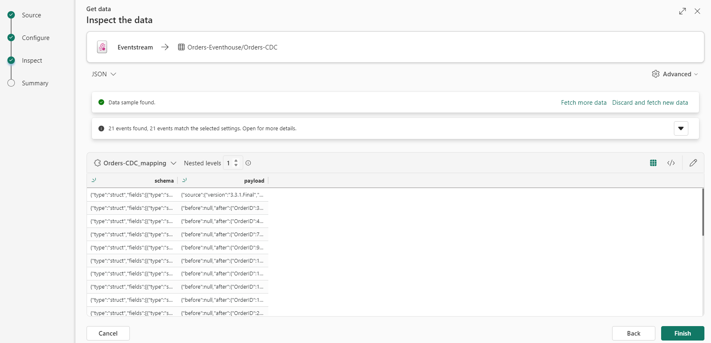

테이블, 매핑, 데이터 연결 등이 생성됩니다. `Close` 버튼을 클릭하여 종료합니다. 

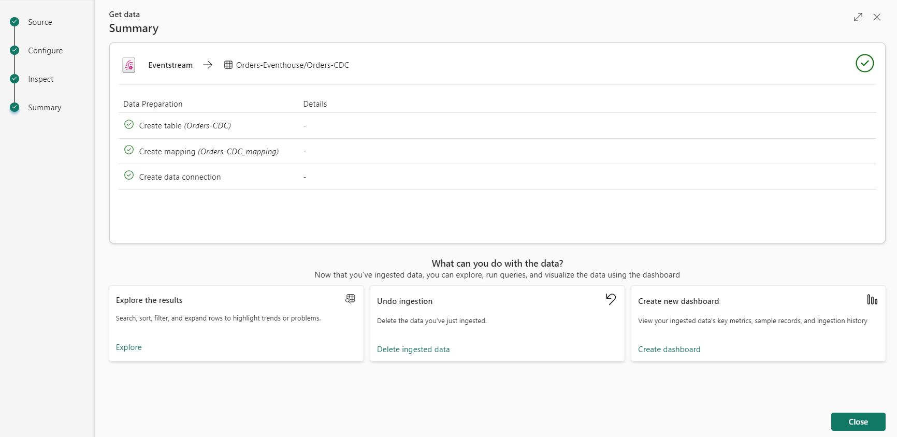

모든 과정이 정상적으로 완료되면, 캔바스의 항목들은 모두 녹색으로 표현됩니다.

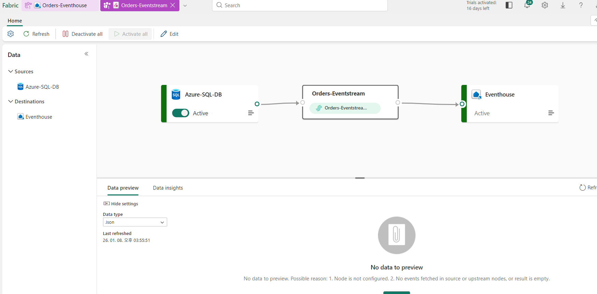

## 7. KQL을 이용한 데이터 확인

먼저 예제 데이터 입력을 위하여 아래의 쿼리를 이용하여 Azure SQL Database에 데이터를 입력(120건)/수정(15건)/삭제(5건)합니다.

```sql
DECLARE @Rows       int          = 120;
DECLARE @StartDate  datetime2(0) = DATEADD(DAY, -30, SYSDATETIME()); 
DECLARE @EndDate    datetime2(0) = SYSDATETIME();

DECLARE @Inserted TABLE (
    OrderID int PRIMARY KEY
);

;WITH N AS (
    SELECT 1 AS n
    UNION ALL
    SELECT n + 1 FROM N WHERE n < @Rows
)
INSERT INTO dbo.Orders (Customer, Amount, Status, [Timestamp])
OUTPUT inserted.OrderID INTO @Inserted
SELECT
    CONCAT(N'Customer-', RIGHT('000' + CONVERT(varchar(3), (ABS(CHECKSUM(NEWID())) % 999) + 1), 3)),

    CAST(ROUND( (ABS(CHECKSUM(NEWID())) % 499001) / 100.0 + 10.00, 2) AS decimal(18,2)),

    CASE (ABS(CHECKSUM(NEWID())) % 4)
        WHEN 0 THEN N'New'
        WHEN 1 THEN N'Processing'
        WHEN 2 THEN N'Completed'
        ELSE     N'Canceled'
    END,

    DATEADD(
        SECOND,
        ABS(CHECKSUM(NEWID())) % (DATEDIFF(SECOND, @StartDate, @EndDate) + 1),
        @StartDate
    )
FROM N
OPTION (MAXRECURSION 0);

DECLARE @ToUpdate TABLE (OrderID int PRIMARY KEY);

INSERT INTO @ToUpdate(OrderID)
SELECT TOP (15) OrderID
FROM @Inserted
ORDER BY NEWID();  

UPDATE o
SET
    o.Amount = o.Amount + CAST(ROUND( (ABS(CHECKSUM(NEWID())) % 20000) / 100.0, 2) AS decimal(18,2)), 
    o.Status = CASE o.Status
                   WHEN N'New'        THEN N'Processing'
                   WHEN N'Processing' THEN N'Completed'
                   ELSE                    N'Completed'
               END,
    o.[Timestamp] = DATEADD(SECOND, ABS(CHECKSUM(NEWID())) % 3600, o.[Timestamp]) 
FROM dbo.Orders AS o
JOIN @ToUpdate AS u ON u.OrderID = o.OrderID;

DECLARE @ToDelete TABLE (OrderID int PRIMARY KEY);

INSERT INTO @ToDelete(OrderID)
SELECT TOP (5) i.OrderID
FROM @Inserted AS i
LEFT JOIN @ToUpdate AS u ON u.OrderID = i.OrderID
WHERE u.OrderID IS NULL     
ORDER BY NEWID();           

DELETE o
FROM dbo.Orders AS o
JOIN @ToDelete AS d ON d.OrderID = o.OrderID;

```

상단의 `Run` 버튼을 클릭하여 실행합니다.


다시 Microsoft Fabric portal로 돌아와서, 이벤트하우스의 KQL Queryset 버튼을 클릭하여 KQL 쿼리 창을 만듭니다.

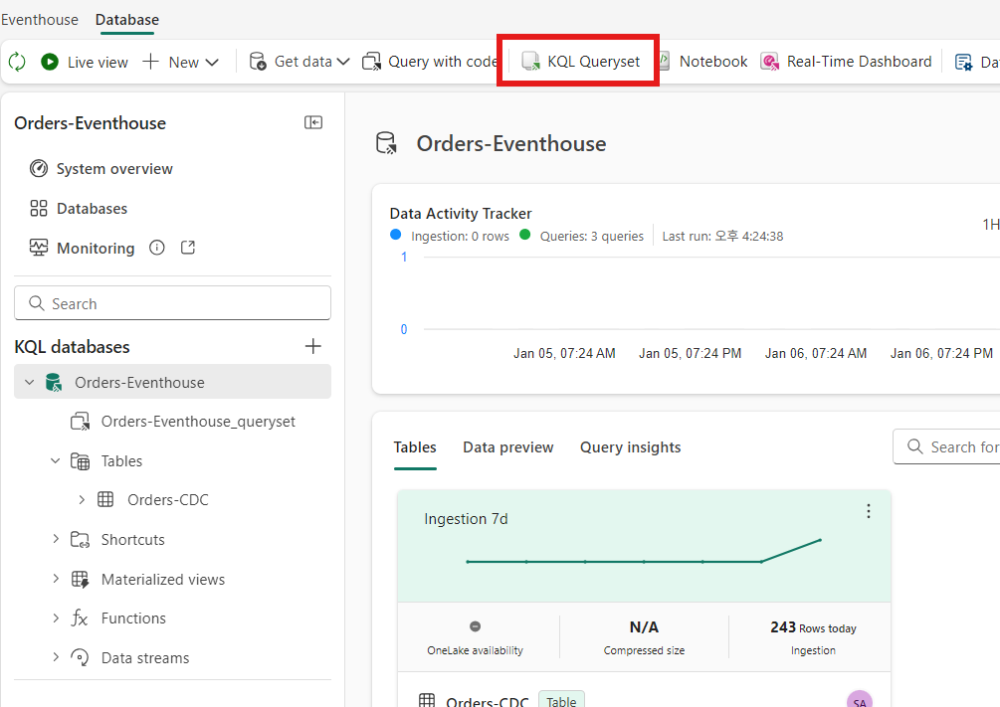

`New KQL Queryset` 창에서는 적절한 이름을 입력하고 `Create` 버튼을 클릭하여 생성합니다.
다음의 KQL 쿼리를 복사하여 붙여넣고, 실행합니다.

```kql
['Orders-CDC']
| project 
    operation = 
        case(
            payload.op == 'c', 'create'
            , payload.op == 'u', 'update'
            , payload.op == 'd', 'delete'
            , 'other'
        )
    , ts_ms = payload.ts_ms
    , content = payload.after
    , content_previous_versions =  payload.before
    , payload
    , schema
| take 1000
```
위 KQL 쿼리를 통해 각 작업에서 이전 값과 새로운 값을 확인할 수 있습니다. 이러한 원시 데이터를 이해하고 일부 패턴을 식별한 후, 이를 보다 사용자 친화적인 새로운 구조로 변환할 수 있습니다. 

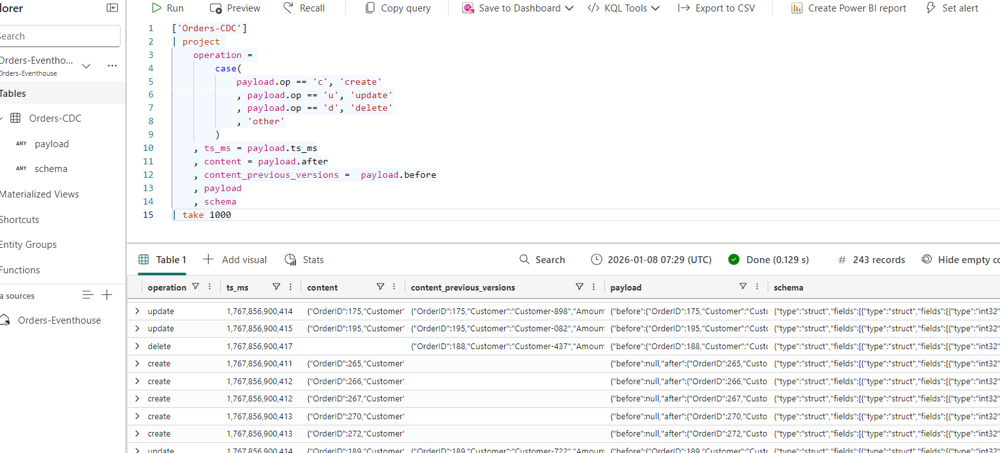

또한, KQL의 내장 함수인 `arg_max()`를 이용하면, 여러 번 업데이트가 발생했더라도 레코드(주문)의 최신 버전을 알아낼 수도 있습니다.
 
```kql
['Orders-CDC']
| project content = payload.after, ts_ms = payload.ts_ms
| summarize arg_max(tolong(ts_ms), *) by toint(content.OrderID)
| evaluate bag_unpack(content)
| take 100
```

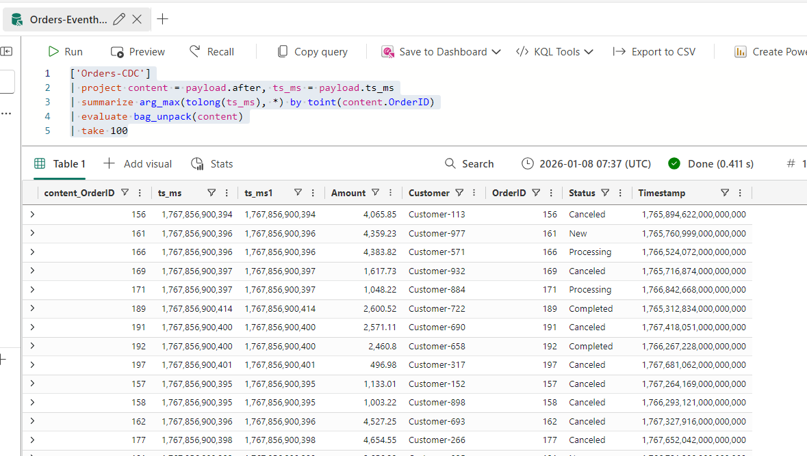

KQL과 관련된 자세한 내용은 다음의 링크를 참고하시기 바랍니다.

[Kusto 설명서](https://learn.microsoft.com/ko-kr/kusto/?view=microsoft-fabric)

## 결론

Azure SQL Databae의 CDC 기능과 Microsoft Fabric의 Eventstream, Eventhouse의 기능을 결합하면, 데이터의 변경을 실시간으로 분석하고 모니터링 할 수 있게 됩니다.

비즈니스 요구사항이 제시된 시점부터 이를 충족하는 보고서가 배포되기까지의 리드타임을 혁신적으로 줄일 수 있고, 
- 이상 탐지(anomaly detection)
- 동적 가격(dynamic pricing) (소매업 또는 전자상거래 사이트)
- 개인화 추천(personalized recommendations)

등의 시나리오가 가능해집니다.