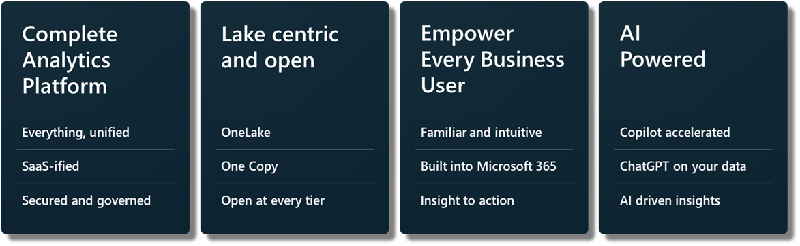
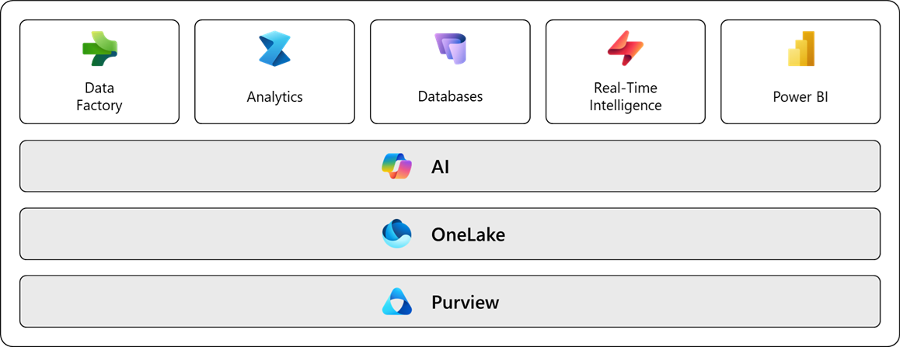
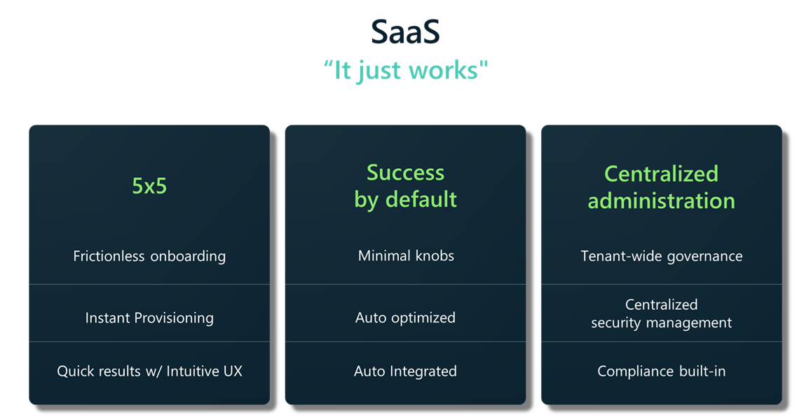
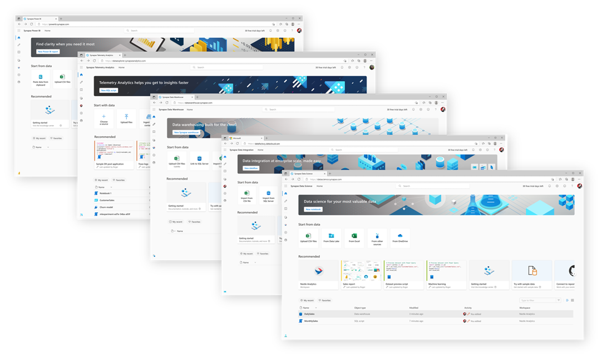
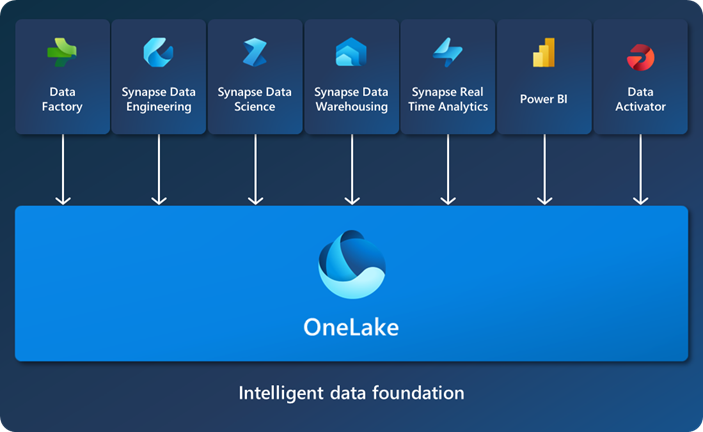
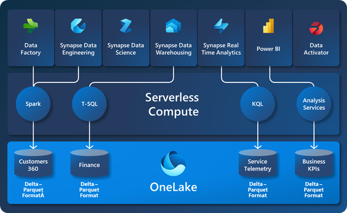
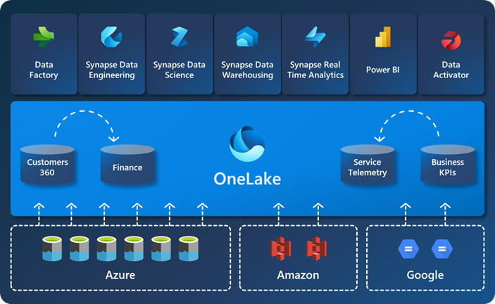

# 목차
Lab 0에서는 다음과 같은 내용들을 살펴봅니다.

- [0.0 Microsoft Fabric Overview](#00-microsoft-fabric-overview)
- [0.1 Complete Analytics Plaform](#01-complete-analytics-plaform)
    - [0.1.0 Everything, unified](#010-everything-unified)
    - [0.1.1 SaaS](#011-saas)
    - [0.1.2 Persona optimzed experiences](#012-persona-optimzed-experiences)
- [0.2 Lake centric and open](#02-lake-centric-and-open)
    - [0.2.0 1Onelake(The OneDrive for Data)](#020-onelakethe-onedrive-for-data)
    - [0.2.1 One Copy](#021-one-copy)
    - [0.2.2 Open format](#022-open-format)
    - [0.2.3 Shortcut](#023-shortcut)
    - [0.2.4 OneSecurity](#024-onesecurity)
- [0.3 Empower Every Business User](#03-empower-every-business-user)
- [0.4 AI Powered](#04-ai-powered)
- [0.5 Compute Capacity](#05-compute-capacity)

# 0.0 Microsoft Fabric Overview

Microsoft Fabric은 조직이 필요로 하는 모든 데이터 및 분석 도구를 하나로 통합한 분석 플랫폼으로, 통합된 제품이면서 통합된 사용자 경험을 제공합니다.

데이터 관리, 데이터레이크, 데이터 통합, 데이터 엔지니어링, 데이터 워어하우징, 실시간 분석, 비즈니스 인텔리전스를 위한 단일 통합 플랫폼으로,
AI 시대에 조직이 분석 워크로드를 단순화하고 비용을 절감하면서 인사이트 도출 시간을 줄일 수 있도록 설계 되었습니다.

더불어 MSFT Fabric은 Azure 기반으로 구축되었으며, 
Azure의 컴퓨팅, 스토리지, 안정성, 보안 및 거버넌스, 확장성, 성능, 네트워크 서비스의 강력한 기능을 활용합니다.

Fabric은 SaaS 제품으로, 제공하는 핵심 기능을 통상 4개로 나누어서 설명을 하곤 합니다.

## 0.1 Complete Analytics Plaform

Microsoft Fabric은 데이터 통합, 저장, 처리, 분석, 시각화까지 모든 분석 기능을 하나의 플랫폼에서 제공합니다.

이를 통해서 조직은 여러 도구들이나 서비스들을 연결할 필요 없이, 단일 환경에서 end to end 분석 시스템을 구축할 수 있습니다.

### 0.1.0 Everything, unified

Microsoft Fabric을 사용하면, 하나의 제품에서 업계 최고 수준의 엔진과 기능을 모두 활용할 수 있습니다.

- 다양한 데이터 소스(온프레미스 또는 클라우드)의 데이터를 통합하고, 
- 원하는 도구와 언어로 필요에 따른 변환을 적용하고,
- 인사이트를 도출해 비지니스 사용자에게 제공하는 데 필요한 모든 기능을 단일 아키텍처로 제공합니다.

### 0.1.1 SaaS

Microsoft Fabric은 AI 시대를 위해 설계된 단일 SaaS 제품으로 단순성과 통합성을 한 단계 더 끌어올릴 수 있습니다.

SaaS를 통한 얻을 수 있는 주요 장점은 다음과 같습니다.

- **간편한 시작** : 복잡한 구성 없이, 기본 설정만으로도 바로 동작
- **기본적으로 뛰어난 성능 제공** : 사용자는 기술적인 구성/조정보다는 비지니스 가치 창출에 집중할 수 있음
- **손쉬운 데이터 자산 검색** : 모든 워크로드에서 개발자들이 동일한 데이터 자산을 쉽게 탐색하고 공동 작업 할 수 있음
- **유연한 분석 환경** : 데이터 위치는 그대로 유지하면서, 개인의 경험과 선호에 따라서 원하는 분석 도구를 자유롭게 선택하여 사용 가능하며, 모두가 동일한 데이터를 기반으로 협업 가능

### 0.1.2 Persona optimzed experiences

Fabric의 워크로드는 사용자 유형을 중심으로 설계되어, 해당 역할에 최적화된 경험을 제공.

사용자 유형은 다음과 같습니다.
- 데이터 엔지니어
- 데이터 워에하우스 개발자
- 실시간 분석 개발자
- Power BI 개발자
- ETL 개발자

## 0.2 Lake centric and open 
오늘날 대부분의 분석 시스템에서는 데이터가 서로 다른 시스템과 저장소에 분산되어 존재하며, 이로 인해 데이터가 사일로 형태로 고립되어 있습니다.

이러한 구조는 여러 계층에서 데이터 중복을 초래할 뿐만 아니라, 시간이 지남에 따라 데이터를 최신 상태로 유지하는 데 시간, 비용, 자원 측면에서 상당한 복잡성을 더하게 됩니다.

### 0.2.0 Onelake(The OneDrive for Data)

Fabric은 이러한 문제를 OneLake를 통해서 해결하였습니다.
Fabric tenant를 생성하면, OneLake는 자동으로 프로비저닝 되어 구성됩니다.
OneLake는 조직 전체를 위한 단일의 통합된 데이터 레이크라고 할 수 있습니다.

M365에서는 OneDrive가 문서를 위한 저장소라면, Fabric에서는 OneLake가 데이터를 위한 단일 저장소 역할을 수행합니다.

### 0.2.1 One Copy

OneLake의 One Copy 개념은 Fabric의 모든 컴퓨팅 엔진이 동일한 데이터를 보고 상호 작용할 수 있도록 해준다는 것을 의미합니다.

즉, 
- 모든 개발자와 사용자가 단일의 통합된 스토리지 시스템을 공유하며, 
- 데이터 검색과 공유가 간편해지고
- 정책 및 보안 설정도 모든 엔진에 걸쳐 중앙에서 일관되게 적용할 수 있음을 의미합니다.

### 0.2.2 Open format
OneLake외에도 Microsoft Fabric의 강점 중 하나는 오픈 Delta Lake 포맷을 사용한다는 점입니다.

Microsoft Fabric의 모든 컴퓨팅 엔진은 기본적으로 Delta Lake 포맷을 사용하여 데이터를 읽고 쓰도록 설계 되어 있습니다.

이렇게 사실상의 산업 표준으로 사용되는 단일 오픈 포맷을 지원함으로써 데이터를 표준화하였고, 이를 통해서 서로 다른 컴퓨팅 엔진을 위해서 포맷을 변경하거나 데이터를 복사/이동할 필요를 없앨 수 있게 되었습니다.

### 0.2.3 Shortcut

OneLake의 **Shortcut(바로가기) 기능**은 다른 파일 위치에 저장된 데이터를 참조하는 방식으로 동작합니다.

Shortcut을 이용하면 데이터를 복제할 필요 없이, OneDrive에서 파일을 공유하듯 간편하게 데이터를 공유할 수 있습니다.

위의 그림에서 볼 수 있는 것처럼, Azure의 Blob이나 ADLS Gen2는 물론이고, 다른 클라우드(AWS, GCP)에 존재하는 데이터를 복사하거나 이동하지 않고 연결하여 사용할 수 있습니다.

### 0.2.4 OneSecurity
Microsoft Fabric은 OneSecurity 기능을 통해 모든 엔진에 걸쳐 일관되게 적용되는 **공통 보안 모델**을 제공합니다.

관리자는 레이크하우스에서 보안 정책을 적용하면, Fabric의 다른 엔진(Spark, SQL, Power BI)에도 동일하게 적용됩니다.

## 0.3 Empower Every Business User
전 세계적으로 가장 널리 사용되는 애플리케이션 중 하나인 Microsoft 365는 Microsoft Fabric과 깊이 통합되어 있습니다.

Microsoft Fabric을 이용하면, Microsoft 365 애플리케이션을 인사이트를 발견하고 적용하는 중심 허브로 활용할 수 있습니다.

## 0.4 AI Powered
Microsoft Fabric은 Azure OpenAI 서비스와의 **네이티브 통합**을 통해, 모든 사용자가 AI의 잠재력을 최대한 활용할 수 있도록 지원합니다.

이를 통하여, 개발자 뿐만 아니라 비지니스 사용자들도 **데이터를 기반으로 생성형 AI의 강력한 기능을 활용**하여 빠르게 인사이트를 도출할 수 있습니다.

사용자는 자연어 또는 대화형 언어를 활용해 다음과 같은 작업을 수행할 수 있습니다.

- 데이터 파이프라인(Data Pipeline) 및 데이터 흐름(Dataflow) 생성
- SQL, Spark 등 다양한 언어로 코드 및 함수 자동 생성
- 머신러닝 모델 구축
- 코드 문서화
- 자동 보고서 생성을 통한 시각화

# 0.5 Compute Capacity
오늘날 데이터 분석 시스템을 구축할 때는 여러 제품을 조합하여 하나의 분석 시스템 내에 다양한한 구성 요소를 구현하고 있습니다.

이로 인해서, 데이터 통합, 데이터 엔지니어링, 데이터 웨어하루징, 비지니스 인텔리전스 등 각 구성 요소에 대해 별도의 컴퓨팅 자원을 생성하여야 합니다.

이로 인하여
- 비용 발생 뿐만 아니라, 
- 관리의 부담도 발생하게 되며,
- 해당 용량을 다른 구성 요소가 활용할 수 없어 

**자원의 낭비와 TCO 증가**로 이어지게 됩니다.

Microsoft Fabric은 복잡한 컴퓨팅 자원의 구매/관리를 **컴퓨트 용량(Compute capapcity)**를 통하여 간편화합니다.

Microsoft Fabric은 **용량 단위(CU, capacity unit)**를 기반으로 모든 엔진에 필요한 컴퓨팅 자원을 제공합니다. 
따라서, Data Factory의 데이터 수집 및 변환부터 Data Engineering, Data Sceience, Data Warehouse, RTA(Real-time analysis), PBI(Power BI)를 통한 시각화까지, 하나의 CU로 구동이 가능합니다.

이러한 **All-in-one** 방식은 사용자가 비용이나 경험에 제약 없이 모든 엔진을 자유롭게 활용할 수 있도록 제공하며, **통합된 비지니스 모델**을 통해 비용을 크게 절감할 수 있습니다.

# 자료
[Microsoft Fabric Overview FY26 JYSEONG](/microsoft-fabric-in-a-day/Lab0%20Microsoft%20Fabric%20Overview/resources/Microsoft%20Fabric%20Overview%20FY26%20JYSEONG.pdf)

--------------
 

Lab0 Microsoft Fabric Overview >> [Lab1 Microsoft Fabric Getting Started](/microsoft-fabric-in-a-day/Lab1%20Microsoft%20Fabric%20Getting%20Started/Lab1%20Microsoft%20Fabric%20Getting%20Started.md)