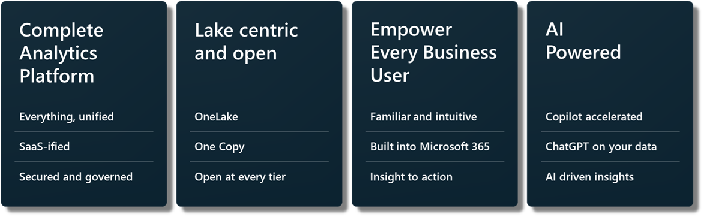
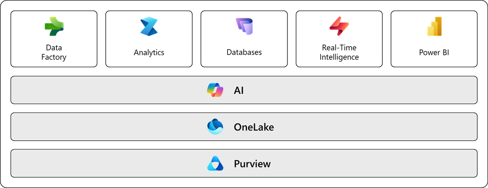
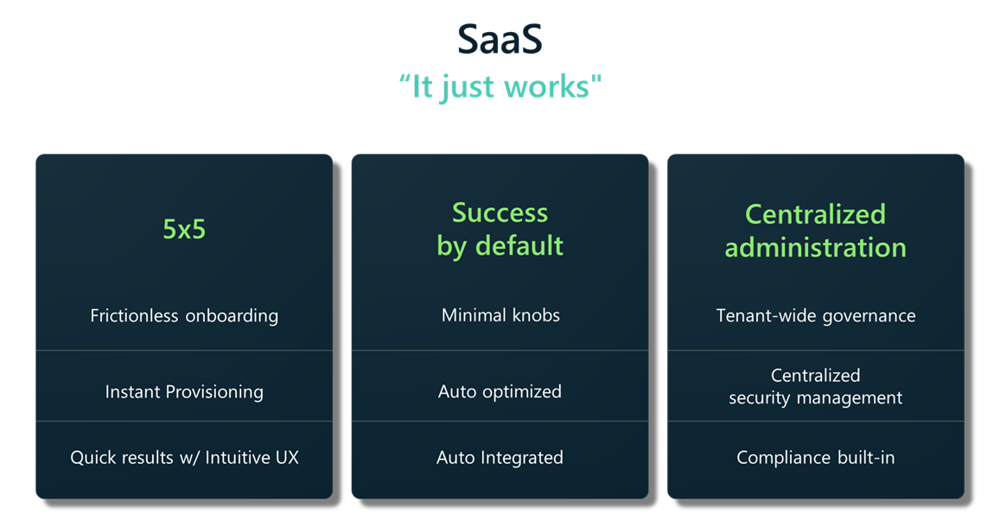
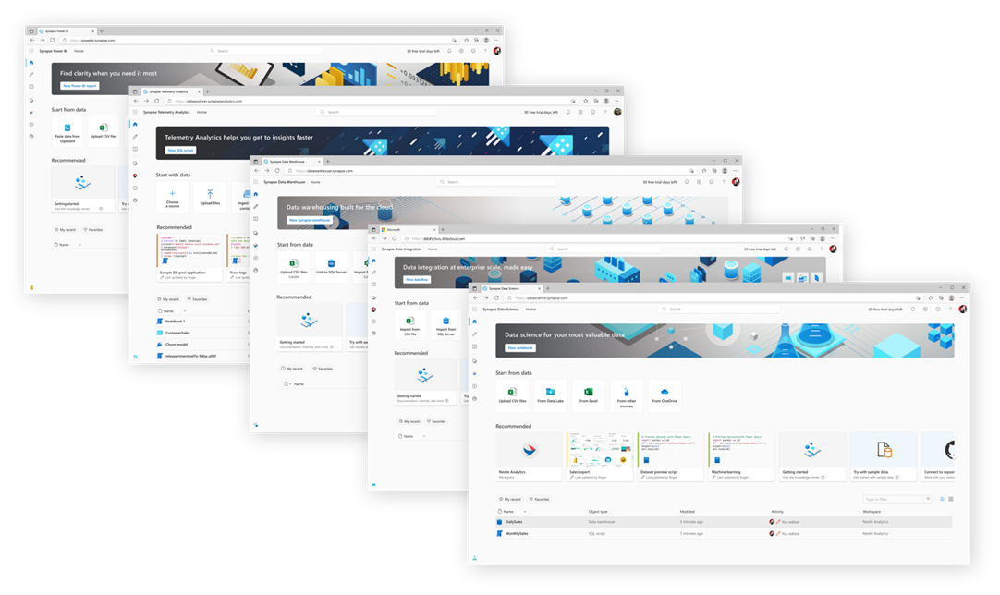
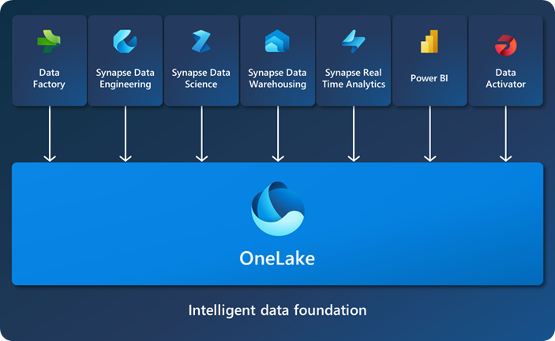
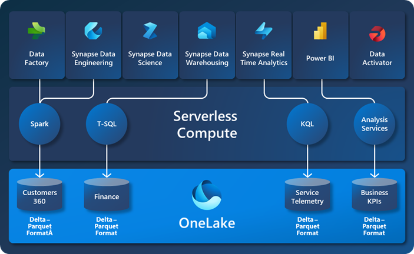
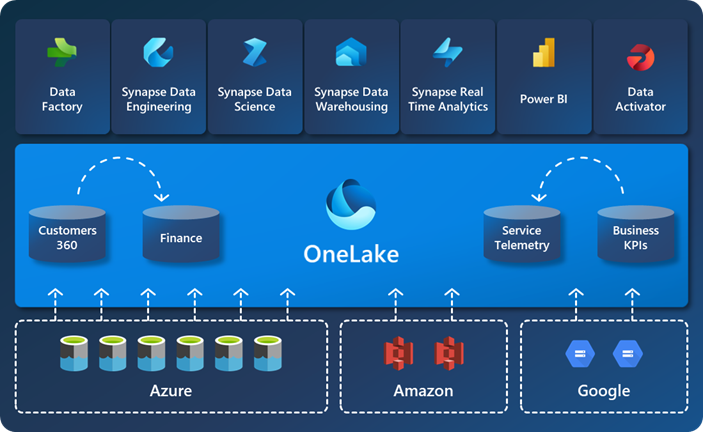

# 목차
Lab 0에서는 다음과 같은 내용들을 살펴봅니다.

- [0.0 Microsoft Fabric Overview](#00-microsoft-fabric-overview)
- [0.1 Complete Analytics Platform](#01-complete-analytics-plaform)
    - [0.1.0 Everything, unified](#010-everything-unified)
    - [0.1.1 SaaS](#011-saas)
    - [0.1.2 Persona optimzed experiences](#012-persona-optimzed-experiences)
- [0.2 Lake centric and open](#02-lake-centric-and-open)
    - [0.2.0 1Onelake(The OneDrive for Data)](#020-onelakethe-onedrive-for-data)
    - [0.2.1 One Copy](#021-one-copy)
    - [0.2.2 Open format](#022-open-format)
    - [0.2.3 Shortcut](#023-shortcut)
    - [0.2.4 OneSecurity](#024-onesecurity)
- [0.3 Empower Every Business User](#03-empower-every-business-user)
- [0.4 AI Powered](#04-ai-powered)
- [0.5 Compute Capacity](#05-compute-capacity)
- [0.6 End-to-End Data Lifecycle](#06-end-to-end-data-lifecycle)
    - [0.6.0 데이터 가져오기(Get data)](#060-데이터-가져오기get-data)
    - [0.6.1 데이터 저장(Store data)](#061-데이터-저장store-data)
    - [0.6.2 데이터 준비 및 변환(Prepare & transform)](#062-데이터-준비-및-변환prepare--transform)
    - [0.6.3 데이터 분석 및 모델 학습(Analyze & train)](#063-데이터-분석-및-모델-학습analyze--train)
    - [0.6.4 데이터 추적 및 시각화(Track & visualize)](#064-데이터-추적-및-시각화track--visualize)
    - [0.6.5 외부 통합(External integration)](#065-외부-통합external-integration)
    - [0.6.6 자연어 및 AI 지원(Natural language & AI)](#066-자연어-및-ai-지원natural-language--ai)

# 0.0 Microsoft Fabric Overview

Microsoft Fabric은 조직이 필요로 하는 모든 데이터 및 분석 도구를 하나로 통합한 분석 플랫폼으로, 통합된 제품이면서 통합된 사용자 경험을 제공합니다.

데이터 관리, 데이터레이크, 데이터 통합, 데이터 엔지니어링, 데이터 워어하우징, 실시간 분석, 비즈니스 인텔리전스를 위한 단일 통합 플랫폼으로,
AI 시대에 조직이 분석 워크로드를 단순화하고 비용을 절감하면서 인사이트 도출 시간을 줄일 수 있도록 설계 되었습니다.

더불어 MSFT Fabric은 Azure 기반으로 구축되었으며, 
Azure의 컴퓨팅, 스토리지, 안정성, 보안 및 거버넌스, 확장성, 성능, 네트워크 서비스의 강력한 기능을 활용합니다.

Fabric은 SaaS 제품으로, 제공하는 핵심 기능을 통상 4개로 나누어서 설명을 하곤 합니다.

## 0.1 Complete Analytics Platform

Microsoft Fabric은 데이터 통합, 저장, 처리, 분석, 시각화까지 모든 분석 기능을 하나의 플랫폼에서 제공합니다.

이를 통해서 조직은 여러 도구들이나 서비스들을 연결할 필요 없이, 단일 환경에서 end to end 분석 시스템을 구축할 수 있습니다.

### 0.1.0 Everything, unified

Microsoft Fabric을 사용하면, 하나의 제품에서 업계 최고 수준의 엔진과 기능을 모두 활용할 수 있습니다.

- 다양한 데이터 소스(온프레미스 또는 클라우드)의 데이터를 통합하고, 
- 원하는 도구와 언어로 필요에 따른 변환을 적용하고,
- 인사이트를 도출해 비지니스 사용자에게 제공하는 데 필요한 모든 기능을 단일 아키텍처로 제공합니다.

### 0.1.1 SaaS

Microsoft Fabric은 AI 시대를 위해 설계된 단일 SaaS 제품으로 단순성과 통합성을 한 단계 더 끌어올릴 수 있습니다.

SaaS를 통한 얻을 수 있는 주요 장점은 다음과 같습니다.

- **간편한 시작** : 복잡한 구성 없이, 기본 설정만으로도 바로 동작
- **기본적으로 뛰어난 성능 제공** : 사용자는 기술적인 구성/조정보다는 비지니스 가치 창출에 집중할 수 있음
- **손쉬운 데이터 자산 검색** : 모든 워크로드에서 개발자들이 동일한 데이터 자산을 쉽게 탐색하고 공동 작업 할 수 있음
- **유연한 분석 환경** : 데이터 위치는 그대로 유지하면서, 개인의 경험과 선호에 따라서 원하는 분석 도구를 자유롭게 선택하여 사용 가능하며, 모두가 동일한 데이터를 기반으로 협업 가능

### 0.1.2 Persona optimzed experiences

Fabric의 워크로드는 사용자 유형을 중심으로 설계되어, 해당 역할에 최적화된 경험을 제공.

사용자 유형은 다음과 같습니다.
- 데이터 엔지니어
- 데이터 워에하우스 개발자
- 실시간 분석 개발자
- Power BI 개발자
- ETL 개발자

## 0.2 Lake centric and open 
오늘날 대부분의 분석 시스템에서는 데이터가 서로 다른 시스템과 저장소에 분산되어 존재하며, 이로 인해 데이터가 사일로 형태로 고립되어 있습니다.

이러한 구조는 여러 계층에서 데이터 중복을 초래할 뿐만 아니라, 시간이 지남에 따라 데이터를 최신 상태로 유지하는 데 시간, 비용, 자원 측면에서 상당한 복잡성을 더하게 됩니다.

### 0.2.0 Onelake(The OneDrive for Data)

Fabric은 이러한 문제를 OneLake를 통해서 해결하였습니다.
Fabric tenant를 생성하면, OneLake는 자동으로 프로비저닝 되어 구성됩니다.
OneLake는 조직 전체를 위한 단일의 통합된 데이터 레이크라고 할 수 있습니다.

M365에서는 OneDrive가 문서를 위한 저장소라면, Fabric에서는 OneLake가 데이터를 위한 단일 저장소 역할을 수행합니다.

### 0.2.1 One Copy

OneLake의 One Copy 개념은 Fabric의 모든 컴퓨팅 엔진이 동일한 데이터를 보고 상호 작용할 수 있도록 해준다는 것을 의미합니다.

즉, 
- 모든 개발자와 사용자가 단일의 통합된 스토리지 시스템을 공유하며, 
- 데이터 검색과 공유가 간편해지고
- 정책 및 보안 설정도 모든 엔진에 걸쳐 중앙에서 일관되게 적용할 수 있음을 의미합니다.

### 0.2.2 Open format
OneLake외에도 Microsoft Fabric의 강점 중 하나는 오픈 Delta Lake 포맷을 사용한다는 점입니다.

Microsoft Fabric의 모든 컴퓨팅 엔진은 기본적으로 Delta Lake 포맷을 사용하여 데이터를 읽고 쓰도록 설계 되어 있습니다.

이렇게 사실상의 산업 표준으로 사용되는 단일 오픈 포맷을 지원함으로써 데이터를 표준화하였고, 이를 통해서 서로 다른 컴퓨팅 엔진을 위해서 포맷을 변경하거나 데이터를 복사/이동할 필요를 없앨 수 있게 되었습니다.

### 0.2.3 Shortcut
OneLake의 **Shortcut(바로가기) 기능**은 다른 파일 위치에 저장된 데이터를 참조하는 방식으로 동작합니다.

Shortcut을 이용하면 데이터를 복제할 필요 없이, OneDrive에서 파일을 공유하듯 간편하게 데이터를 공유할 수 있습니다.

위의 그림에서 볼 수 있는 것처럼, Azure의 Blob이나 ADLS Gen2는 물론이고, 다른 클라우드(AWS, GCP)에 존재하는 데이터를 복사하거나 이동하지 않고 연결하여 사용할 수 있습니다.

### 0.2.4 OneSecurity
Microsoft Fabric은 OneSecurity 기능을 통해 모든 엔진에 걸쳐 일관되게 적용되는 **공통 보안 모델**을 제공합니다.

관리자는 레이크하우스에서 보안 정책을 적용하면, Fabric의 다른 엔진(Spark, SQL, Power BI)에도 동일하게 적용됩니다.

## 0.3 Empower Every Business User
전 세계적으로 가장 널리 사용되는 애플리케이션 중 하나인 Microsoft 365는 Microsoft Fabric과 깊이 통합되어 있습니다.

Microsoft Fabric을 이용하면, Microsoft 365 애플리케이션을 인사이트를 발견하고 적용하는 중심 허브로 활용할 수 있습니다.

## 0.4 AI Powered
Microsoft Fabric은 Azure OpenAI 서비스와의 **네이티브 통합**을 통해, 모든 사용자가 AI의 잠재력을 최대한 활용할 수 있도록 지원합니다.

이를 통하여, 개발자 뿐만 아니라 비지니스 사용자들도 **데이터를 기반으로 생성형 AI의 강력한 기능을 활용**하여 빠르게 인사이트를 도출할 수 있습니다.

사용자는 자연어 또는 대화형 언어를 활용해 다음과 같은 작업을 수행할 수 있습니다.

- 데이터 파이프라인(Data Pipeline) 및 데이터 흐름(Dataflow) 생성
- SQL, Spark 등 다양한 언어로 코드 및 함수 자동 생성
- 머신러닝 모델 구축
- 코드 문서화
- 자동 보고서 생성을 통한 시각화

## 0.5 Compute Capacity
오늘날 데이터 분석 시스템을 구축할 때는 여러 제품을 조합하여 하나의 분석 시스템 내에 다양한한 구성 요소를 구현하고 있습니다.

이로 인해서, 데이터 통합, 데이터 엔지니어링, 데이터 웨어하루징, 비지니스 인텔리전스 등 각 구성 요소에 대해 별도의 컴퓨팅 자원을 생성하여야 합니다.

이로 인하여
- 비용 발생 뿐만 아니라, 
- 관리의 부담도 발생하게 되며,
- 해당 용량을 다른 구성 요소가 활용할 수 없어 

**자원의 낭비와 TCO 증가**로 이어지게 됩니다.

Microsoft Fabric은 복잡한 컴퓨팅 자원의 구매/관리를 **컴퓨트 용량(Compute capapcity)** 를 통하여 간편화합니다.

Microsoft Fabric은 **용량 단위(CU, capacity unit)** 를 기반으로 모든 엔진에 필요한 컴퓨팅 자원을 제공합니다. 
따라서, Data Factory의 데이터 수집 및 변환부터 Data Engineering, Data Sceience, Data Warehouse, RTA(Real-time analysis), PBI(Power BI)를 통한 시각화까지, 하나의 CU로 구동이 가능합니다.

이러한 **All-in-one** 방식은 사용자가 비용이나 경험에 제약 없이 모든 엔진을 자유롭게 활용할 수 있도록 제공하며, **통합된 비지니스 모델**을 통해 비용을 크게 절감할 수 있습니다.

## 0.6 End-to-End Data Lifecycle

조직은 일반적으로 데이터를 수집, 저장, 변환, 분석, 시각화하기 위해 서로 분리된 여러 서비스를 사용합니다.
이러한 단절된 구조는 데이터 사일로를 만들고, 통합에 따른 오버헤드를 증가시키며, 인사이트 도출까지의 시간을 지연시킵니다.

Microsoft Fabric은 데이터 수명 주기의 모든 단계를 **OneLake라는 공유 기반 위의 단일 플랫폼**으로 통합하여 이 문제를 해결합니다.

이 아키텍처의 중심에는 모든 데이터를 오픈 Delta Parquet 포맷으로 저장하는 단일 조직 데이터 레이크인 OneLake가 있습니다.
모든 Fabric 워크로드가 OneLake에서 읽고 쓰기 때문에 데이터는 엔진 간에 이동하지 않습니다.
파이프라인으로 수집되고, Notebook에서 변환되고, Power BI 보고서로 시각화되는 데이터는 전 과정에서 한 곳에 유지됩니다.

데이터 수명 주기는 6단계로 구성되며, Fabric은 각 단계에 특화된 도구를 제공합니다.

### 0.6.0 데이터 가져오기(Get data)

데이터 복제, 외부 스토리지 참조, 일괄 처리 데이터 세트, 실시간 데이터 스트림 등 다양한 시나리오의 데이터를 여러 원본에서 수집하여 OneLake에 배치합니다.

- **Eventstream** : 실시간 이벤트 수집 및 라우팅
- **데이터 파이프라인(Data Pipeline)** : 200개 이상의 커넥터를 활용한 일괄 처리 및 예약된 데이터 이동
- **미러링(Mirroring)** : ETL 파이프라인 없이 운영 데이터베이스에서 연속 복제
- **Shortcut(바로가기)** : Azure Data Lake, Amazon S3, Google Cloud Storage 등 외부 스토리지를 복사하지 않고 가상화하여 사용 (다른 작업 영역/테넌트의 공유 데이터 참조도 가능)
- **OneLake 데이터 공유** : 데이터를 복사하지 않고 테넌트 간에 관리되는 데이터 세트에 실시간으로 액세스

### 0.6.1 데이터 저장(Store data)

수집된 모든 데이터는 오픈 Delta Parquet 포맷으로 OneLake에 저장됩니다. OneLake는 별도 프로비저닝 없이 조직 전체에 단일 데이터 레이크를 제공하며, 데이터의 단일 복사본을 유지합니다. Fabric은 워크로드별로 최적화된 여러 스토리지 항목을 제공합니다.

- **Lakehouse** : 파일과 관리형 Delta 테이블을 자동 SQL 엔드포인트와 결합한 유연한 빅데이터 스토리지
- **Data Warehouse** : 구조적 관계형 분석과 전체 T-SQL, 저장 프로시저, ACID 트랜잭션 지원
- **Eventhouse** : KQL(Kusto Query Language)을 사용한 스트리밍 및 원격 분석 데이터의 실시간 분석
- **SQL Database** : 트랜잭션 워크로드 및 운영 분석
- **의미 체계 모델(Semantic model)** : 보고서와 AI를 구동하는 큐레이팅된 비즈니스 논리, 측정값, 계층 구조

### 0.6.2 데이터 준비 및 변환(Prepare & transform)

OneLake에서 엔진 간 데이터 이동 없이, 코드 우선 엔진 또는 로우코드 도구로 데이터를 추가 변환할 수 있습니다.

- **Dataflow Gen2** : 데이터 정리·변환·보강을 위한 로우코드 Power Query 인터페이스
- **Notebook** : Python, T-SQL, Scala 기반 데이터 엔지니어링을 위한 Jupyter 유사 환경
- **사용자 데이터 함수(User data functions)** : 파이프라인, Notebook, Activator 규칙에서 호출 가능한 재사용 가능한 사용자 지정 Python 논리

### 0.6.3 데이터 분석 및 모델 학습(Analyze & train)

준비된 데이터로 ML 모델을 학습시키고 고급 분석을 수행합니다.

- **MLflow 실험** : 하이퍼파라미터·메트릭·항목 자동 로깅으로 모델 학습 실행 추적
- **ML 모델** : 버전 관리, 메타데이터 추적, 재현성을 위해 MLflow 기반 레지스트리에 등록
- **데이터 에이전트 / 운영 에이전트** : 자연어로 데이터와 상호 작용하고 조건·패턴에 따라 작업 수행
- **GraphQL API** : 단일 엔드포인트로 여러 Fabric 데이터 원본을 쿼리하는 유연한 데이터 액세스 계층
- **Power BI용 어시스턴트(Copilot)** : 생성형 AI 기반 즉석 분석, DAX 생성, 자연어 데이터 탐색

### 0.6.4 데이터 추적 및 시각화(Track & visualize)

준비·모델링된 데이터로 보고서, 대시보드, 실시간 경고를 만듭니다.

- **Power BI 보고서** : 의미 체계 모델 기반의 대화형 시각화 (Teams, SharePoint, PowerPoint, Excel 등 M365 앱에 배포)
- **Translytical 작업 흐름** : 사용자 데이터 함수를 호출하여 Power BI 보고서에서 직접 작업 수행
- **Real-Time Intelligence 대시보드** : KQL 쿼리로 초 미만 대기 시간의 스트리밍 데이터 모니터링
- **액티베이터(Activator)** : 스트리밍 데이터의 조건을 감지하고 Teams 경고, 이메일, Power Automate 플로우 등 자동 작업 실행
- **Fabric IQ** : 엔터프라이즈 데이터를 공유 비즈니스 온톨로지로 매핑하여 AI 에이전트가 전체 비즈니스 컨텍스트로 추론 가능

### 0.6.5 외부 통합(External integration)

Fabric은 데이터 수집과 인사이트 전달을 위해 외부 시스템과 통합됩니다.

- **Power Automate / Data Activator** : 데이터 조건 기반 실시간 워크플로 자동화
- **Microsoft 365** : Teams, SharePoint, PowerPoint, Excel에서 인사이트 제공
- **REST API / 클라이언트 라이브러리** : Fabric 리소스에 프로그래밍 방식 액세스
- **Microsoft Entra ID** : 인증, 조건부 액세스, 서비스 주체 지원
- **Git 통합** : Azure DevOps, GitHub와 연동한 Fabric 항목의 버전 제어 및 CI/CD
- **Microsoft Purview** : Fabric 데이터 자산 전체에 대한 통합 데이터 거버넌스, 카탈로그, 규정 준수

### 0.6.6 자연어 및 AI 지원(Natural language & AI)

자연어 지원은 Power BI Copilot, 데이터 에이전트, 운영 에이전트 형태로 제공되며, OneLake의 엔터프라이즈 데이터를 추론하여 사용자가 액세스할 수 있는 데이터 항목을 기반으로 답변을 생성합니다.
데이터 에이전트는 Microsoft 365 Copilot, Microsoft Foundry, Copilot Studio에 통합할 수 있어, 사용자가 여러 애플리케이션의 기존 워크플로 안에서 OneLake의 인사이트를 얻을 수 있습니다.

## 참고 자료
[Microsoft Fabric Overview FY26 JYSEONG](/microsoft-fabric-in-a-day/Lab0%20Microsoft%20Fabric%20Overview/resources/Microsoft%20Fabric%20Overview%20FY26%20JYSEONG.pdf)

✍️ 2026년 7월 23일 씀.

## 다음

Lab0 Microsoft Fabric Overview >> [Lab1 Microsoft Fabric Getting Started](/microsoft-fabric-in-a-day/Lab1%20Microsoft%20Fabric%20Getting%20Started/Lab1%20Microsoft%20Fabric%20Getting%20Started.md)
