# Microsoft Fabric 시작하기
Microsoft Fabric은 Power BI 테넌트와 같은 테넌트를 공유합니다.

사용할 수 있는 환경이 없다면, 다음의 URL을 통해서 **60일 Fabric 무료 평가판**을 사용해보시기 바랍니다.

[Microsoft Fabric 시작하기](https://www.microsoft.com/ko-kr/microsoft-fabric/getting-started)

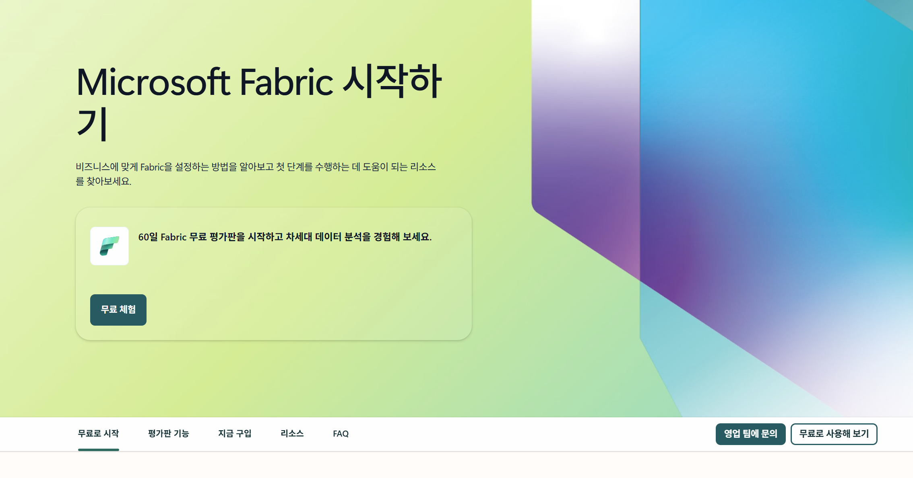

Microsft Fabric은 설정에 따라서, 테넌트의 모든 사용자가 사용할 수 있도록 하거나, 지정된 사용자/그룹만 사용하도록 설정할 수 있습니다.
Microsoft Fabric을 사용하기 위해서는 Fabric을 활성화 하여야 합니다.

# Microsoft Fabric 활성화 하기
Microsoft Fabric은 다음과 같이 두 가지 방법으로 활성화할 수 있습니다.

- **테넌트 설정**에서 활성화
- **용량 설정**에서 활성화

일반적으로 **테넌트 수준에서 활성화**하는 것이 권장되므로, 이번 lab에서는 테넌트에서 Fabric을 활성화 하는 방법에 대해서 살펴보겠습니다.

*해당 설정은 관리자 권한을 필요로 합니다*

**용량 설정**을 통한 활성화 방법에 대해서는 [공식 문서](https://learn.microsoft.com/ko-kr/fabric/admin/fabric-switch#enable-for-a-capacity)를 참고하시기 바랍니다.

## 테넌트 설정에서 활성화
먼저, [Fabric portal](https://app.fabric.microsoft.com/)로 접속합니다.

화면 우측 상단에 있는 **설정** 아이콘을 클릭합니다.

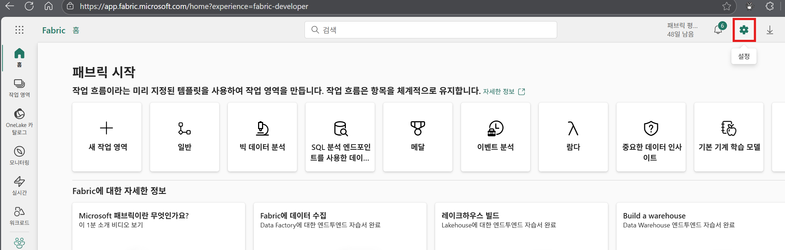

**설정 > 거버넌스 및 인사이트 > 관리 포털**을 클릭합니다.

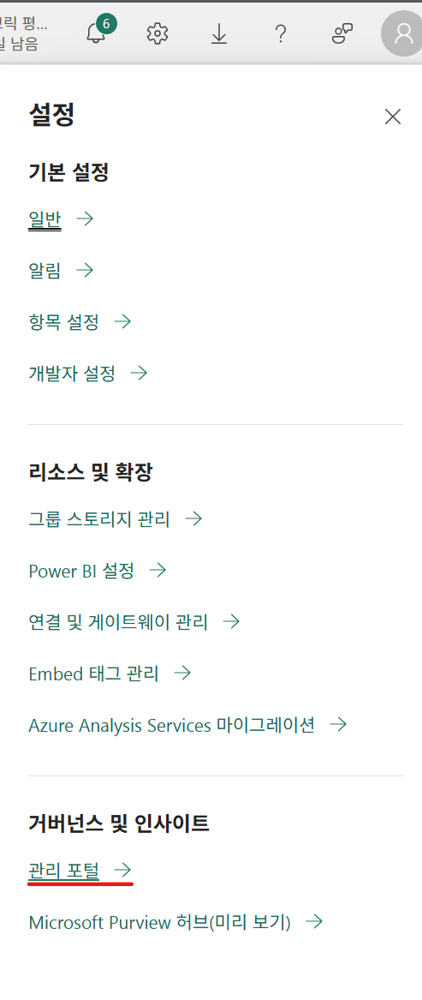

**테넌트 설정 > Microsoft Fabric > 사용자는 패브릭 항목을 생성할 수 있습니다.** 항목을 확장하면 다음과 같은 화면이 보여집니다.
**사용** 토글 스위치를 활성화 하면 Fabric을 사용할 수 있게 됩니다.
필요에 따라서, **적용 대상**을 전체 조직으로 설정하거나 필요 조직을 설정(특정 보안 그룹)하면 됩니다.

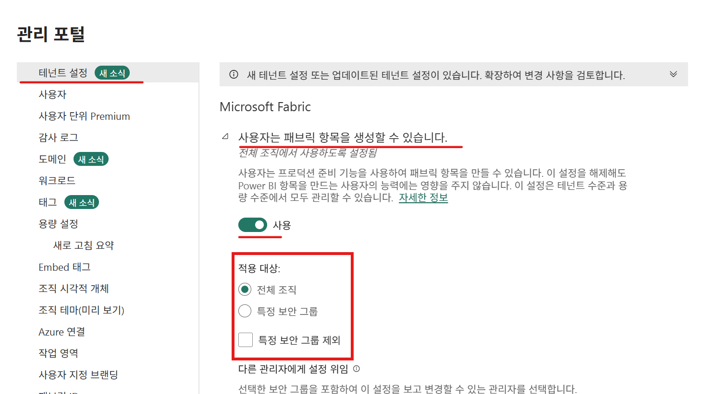

마지막으로, **적용** 버튼을 클릭하여 변경한 설정을 적용합니다.

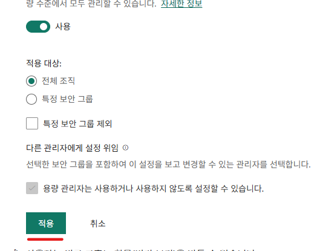

# Fabric Capacity 만들기
먼저, 컴퓨팅 엔진이 동작하기 위한 Fabric capacity를 생성합니다.

[Azure Portal](https://portal.azure.com/)로 이동합니다.

상단의 검색창에 "Microsoft Fabric"을 입력하고, 결과 창에서 Microsoft Fabric 서비스를 선택합니다.

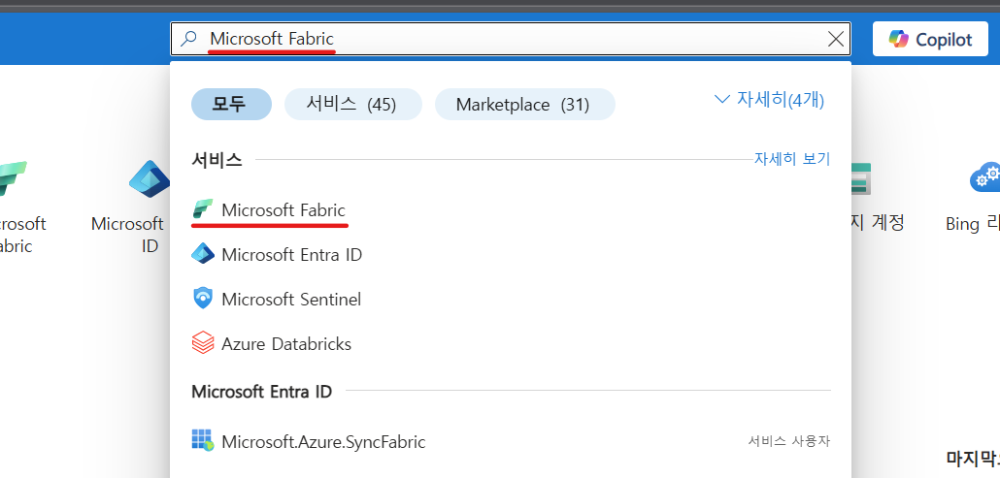

좌측 상단의 **+ 만들기** 버튼을 클릭합니다.

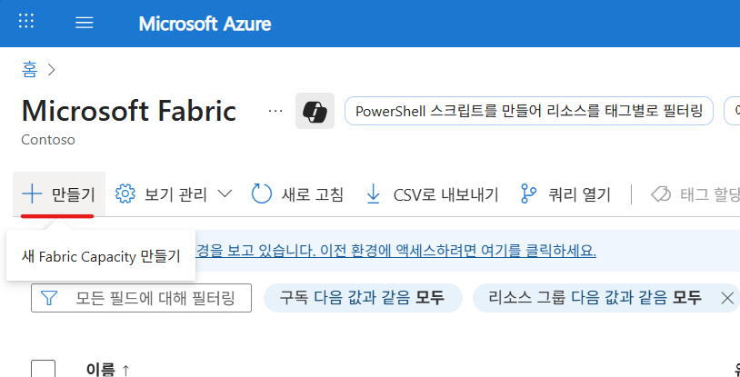

Fabric capacity 화면에서 다음의 정보를 입력합니다.

- 리소스 그룹 : Fabric capacity를 생성할 리소스 그룹을 지정하거나 새로 만듭니다.
- 용량 이름 : **fabrichandson**이라고 입력합니다.
- 지역 : **(Asia Pacific) Korea Central**을 선택합니다.
- 크기 : **크기 변경** 버튼을 클릭하고, **F2**를 선택하고 **선택** 버튼을 클릭합니다.
- 패브릭 용량 관리자 : **관리자 계정(또는 본인 계정)**을 선택합니다. 

**검토 + 만들기** 버튼을 클릭하고, **검토 + 만들기** 화면에서 **만들기** 버튼을 클릭하여 Fabric capacity를 생성합니다.(해당 작업은 수분 이내에 완료됩니다.)

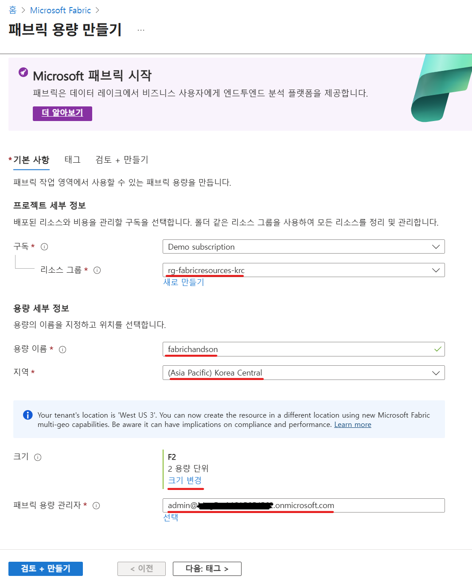

# 작업 영역(Workspace) 만들기
다음에는 작업 영역(workspace)을 생성합니다.

다시 [Microsoft Fabric 포털](https://app.fabric.microsoft.com/)로 이동합니다.

포털 좌측 메뉴에서 **작업 영역**을 선택하고, 작업 영역 메뉴의 하단에 있는 **+ 새 작업 영역** 버튼을 클릭합니다.
 
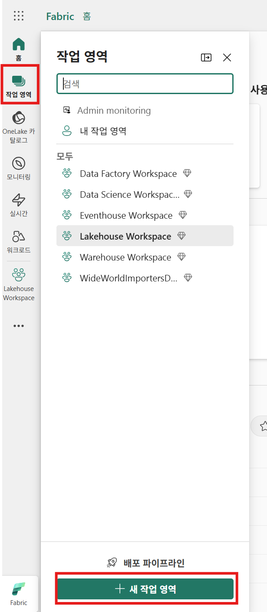

화면 우측에 **작업 영역 만들기**라는 화면이 보여지면, 다음의 내용을 입력합니다.

- 이름 : 이번 hands on lab에서 사용할 이름을 입력합니다. (예: Hands on workspace)
- 설명 : 해당 workspace에 대한 설명을 입력합니다. (예: "Microsoft Fabric hands on workshop을 위한 workspace입니다.")  

화면 중간에 있는 **고급** 버튼을 눌러서 메뉴를 확장 합니다.

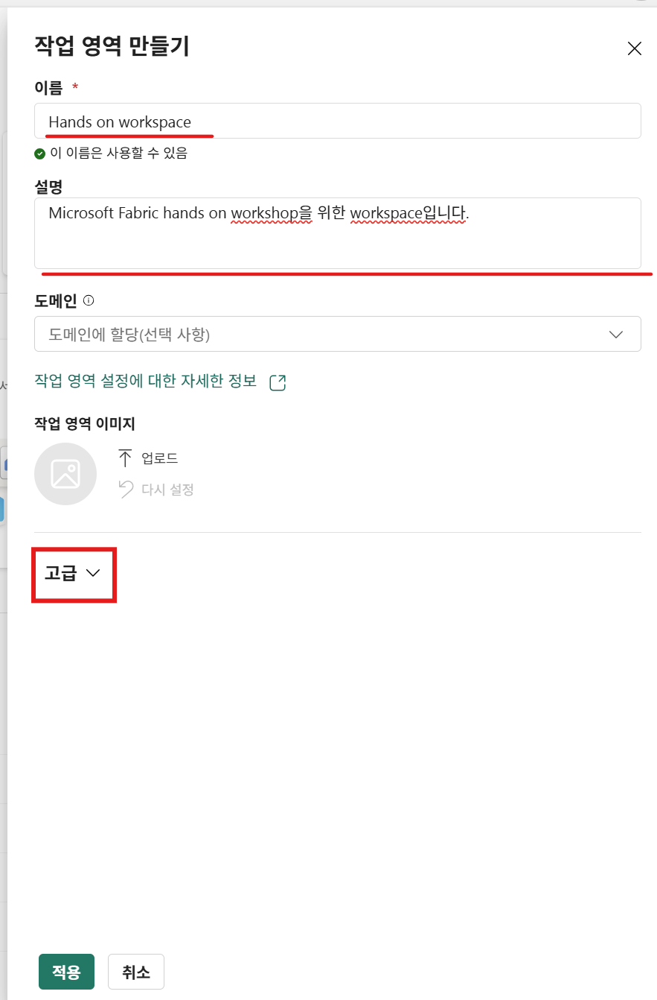

**라이선스 모드**는 **패브릭 용량**을 선택합니다.

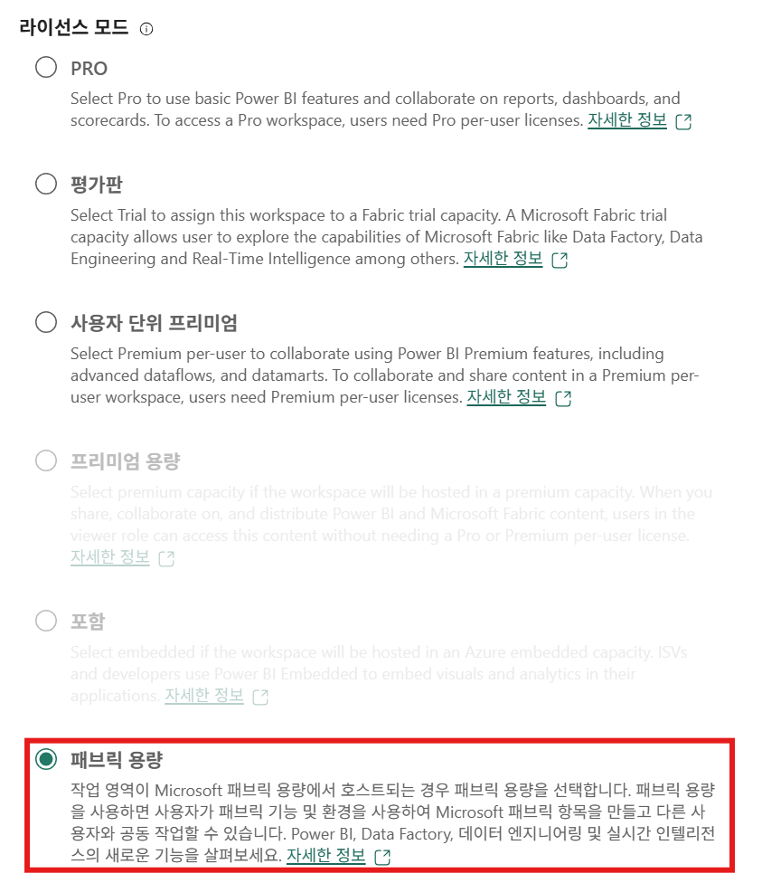

**수용작업량**에서는 드롭다운 메뉴를 클릭하여, 앞서 생성하였던 Fabric capacity를 선택하고,
**적용** 버튼을 클릭하여 작업 영역을 생성합니다.

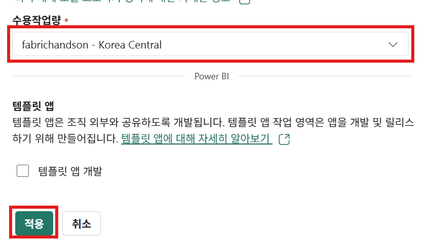

생성이 완료되면, 해당 작업 영역이 화면에 보여지게 됩니다.

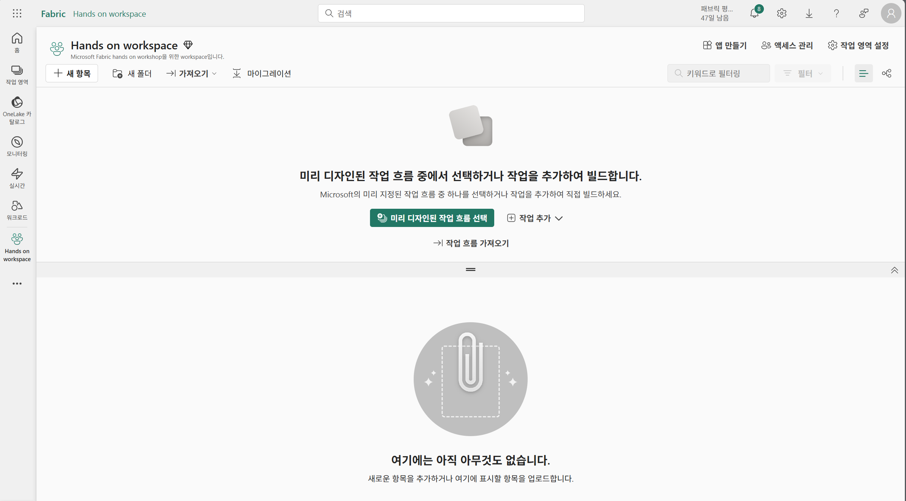

Lab 2는 여기까지!