# 목차
Lab 2에서는 다음과 같은 내용들을 살펴봅니다.

# 2.0 Microsoft Fabric의 Lakehouse란?
Microsoft Fabric의 레이크하우스(lakehouse)는 조직이 정형 데이터(structured data), 반정형 데이터(semi-structured data), 비정형 데이터(unstructured data) 등 사실상 모든 유형의 데이터를 단일 위치에 저장하고 관리할 수 있도록 하는 데이터 저장 계층(data storage layer)입니다.

이를 통해 다양한 도구와 프레임워크가 조직의 요구 사항 또는 개인의 선호에 따라 이러한 데이터를 처리하고 분석할 수 있습니다.

레이크하우스(lakehouse)는 데이터 레이크(data lake)와 데이터 웨어하우스(data warehouse)의 장점을 결합하여, 기업 데이터의 중복성(duplicity)과 데이터 수집(ingesting), 변환(transforming), 공유(sharing) 과정에서 발생하는 문제를 제거할 수 있습니다.

수집된 데이터는 기본적으로 델타 레이크(Delta Lake) 형식(https://delta.io/)으로 레이크하우스에 저장되며, 테이블은 사용자 대신 메타스토어(metastore)에 자동으로 검색 및 등록되어 Microsoft Fabric 내 모든 엔진에서 원활하게 작업할 수 있도록 제공합니다.

# 2.1 메달리온 아키텍처

레이크하우스 기반의 데이터 분석 시스템(data analytics system)은 일반적으로 메달리온 아키텍처(Medallion architecture)(https://learn.microsoft.com/en-us/azure/databricks/lakehouse/medallion)를 따릅니다. 

이 아키텍처는 브론즈(Bronze), 실버(Silver), 골드(Gold)라는 일련의 데이터 영역(data zones)을 정의하여, 각 단계에서 레이크하우스에 저장된 데이터의 품질을 나타내며, 엔터프라이즈 데이터 제품을 위한 단일 진실 공급원(single source of truth)을 구축하기 위해 다계층 접근 방식을 권장합니다.

예를 들어, 브론즈(Bronze), 실버(Silver), 골드(Gold)라는 용어는 각각 원시(raw), 검증(validated), 강화(enriched) 데이터로 불리기도 하며, 각 계층에서 데이터의 품질을 설명합니다.

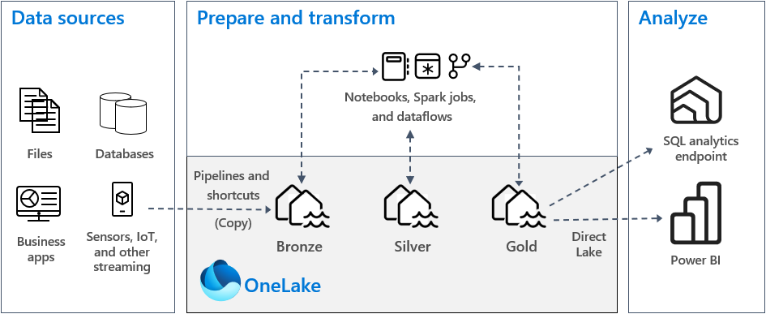
*이미지 소스 : [https://learn.microsoft.com/ko-kr/fabric/onelake/onelake-medallion-lakehouse-architecture#medallion-architecture-in-fabric](https://learn.microsoft.com/ko-kr/fabric/onelake/onelake-medallion-lakehouse-architecture#medallion-architecture-in-fabric)*

브론즈 레이크하우스를 생성하여 데이터를 적재하는 작업부터 시작해보겠습니다.

# 2.2 예제 데이터
Microsoft Fabric in a Day hands-on labs에서는 Microsoft에서 제공하는 Wide World Importers(WWI) 예제 데이터베이스를 사용하게 됩니다.

예제 데이터에 대한 자세한 내용은 다음의 링크를 참고하시기 바랍니다.

[Wide World Importers sample databases for Microsoft SQL](https://learn.microsoft.com/en-us/sql/samples/wide-world-importers-what-is?view=sql-server-ver17)

예제 데이터베이스은 여러 개의 팩트 테이블(fact tables)과 관련된 차원 테이블(dimension tables)이 포함되어 있습니다.

이번 hands-on lab에서는 다음과 같이 단순화된 스타 스키마(Star schema)를 사용하게 됩니다.

- 팩트(Fact): Sale
- 차원(Dimension): Customer
- 차원(Dimension): Employee
- 차원(Dimension): City
- 차원(Dimension): Date
- 차원(Dimension): Stock Item

원본 데이터는 쉼표로 구분된 값(CSV, comma-separated values) 파일 형식으로, 파티션 되지 않은(un-partitioned) 구조를 가지고 있습니다.

# 2.3 브론즈(Bronze) 단계
브론즈 단계에서는 브론즈 레이크하루스를 생성하고, 원본 데이터를 있는 그대로 복사해오도록 하겠습니다.

전체 아키텍처에서 다음에 해당하는 작업을 수행합니다.

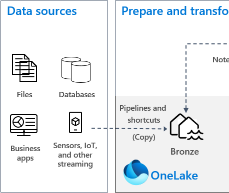

먼저 lab1에서 생성한 작업 영역으로 이동합니다.

Microsoft Fabric 포털에서 좌측 메뉴에서 **작업 영역**을 클릭하고, 화면에서 앞서 생성한 **Hands on workspace**를 선택합니다.

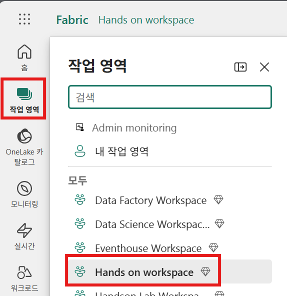

## 2.3.1 브론즈 레이크하우스 만들기

작업 영역 화면에서, 좌측 상단에 있는 **+ 새 항목** 버튼을 클릭하면, **새 항목 > 데이터 저장 > 레이크하우스**를 클릭합니다.

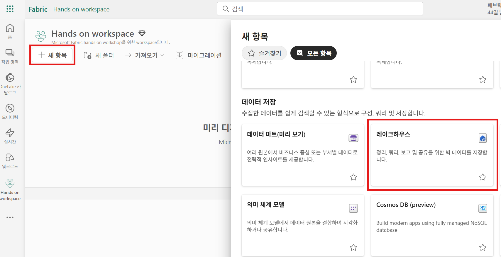

**새 lakehouse** 화면에서는 레이크하우스의 이름을 "bronze-lakehouse"를 입력하고, **만들기** 버튼을 클릭하여 새로운 레이크하우스를 생성합니다.

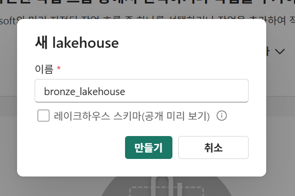

## 2.3.2 데이터 파이프 라인 만들기

생성이 완료되면, **레이크하우스 탐색기** 화면으로 전환됩니다.
Mictosoft Fabric 포털 왼쪽 메뉴에서 **Hands on workspace"를 클릭하여 작업 영역으로 이동합니다.

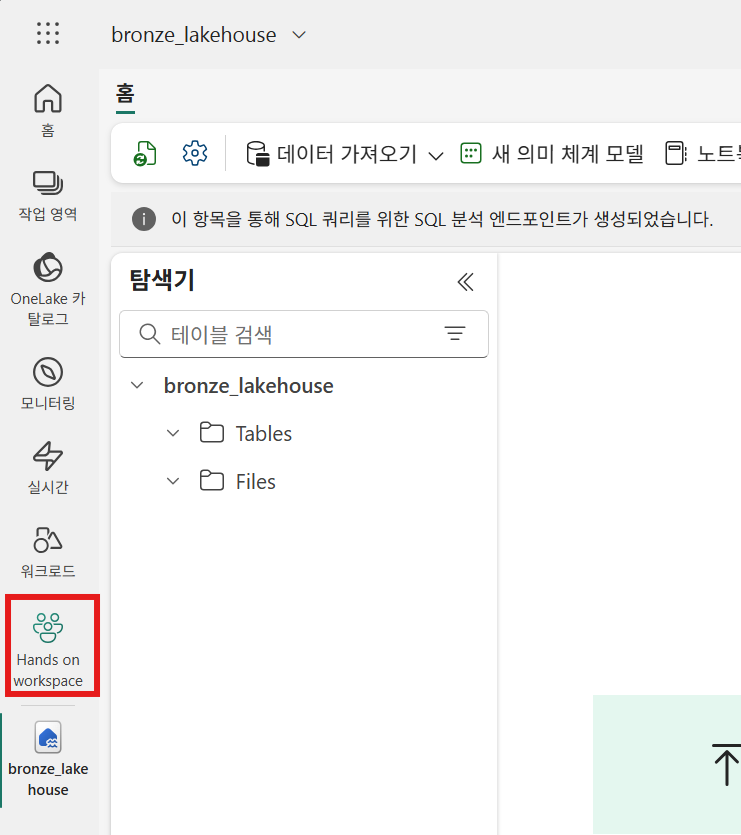

작업 영역 좌측 상단에서 **+ 새 항목 > 데이터 가져오기 > Data pipeline"을 클릭합니다.

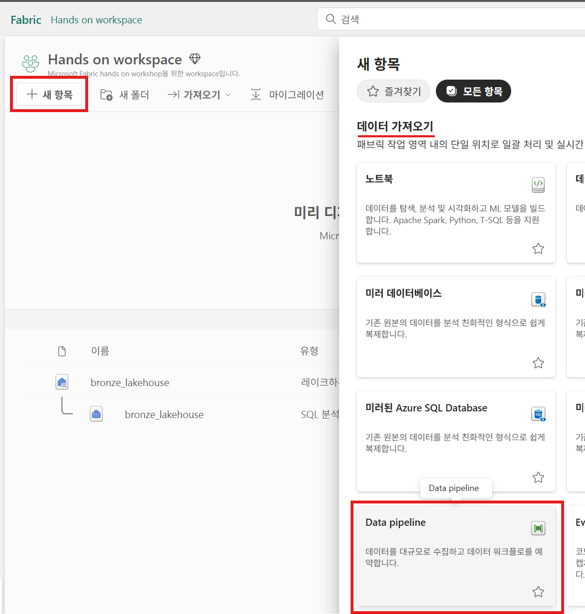

**새 파이프라인** 화면에서 이름("Ingest data from source to bronze")을 입력하고, **만들기** 버튼을 클릭하여 새로운 데이터 파이프라인을 생성합니다.

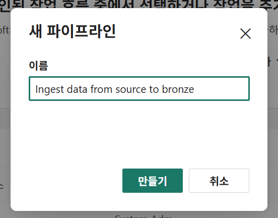

새로운 데이터 파이프라인이 생성되면, **빈 캔버스로 시작**의 **파일프라인 활동**을 클릭합니다.

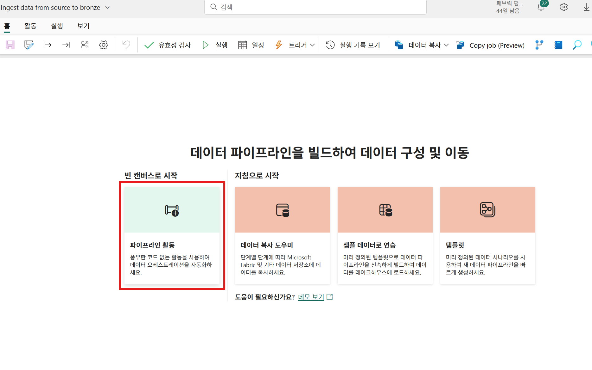

다음과 같이, 새로운 데이터 파이프라인 캔버스가 나타나게 됩니다.
먼저, 데이터 복사의 이름을 "Copy sample csv data to bronze"라고 입력합니다.

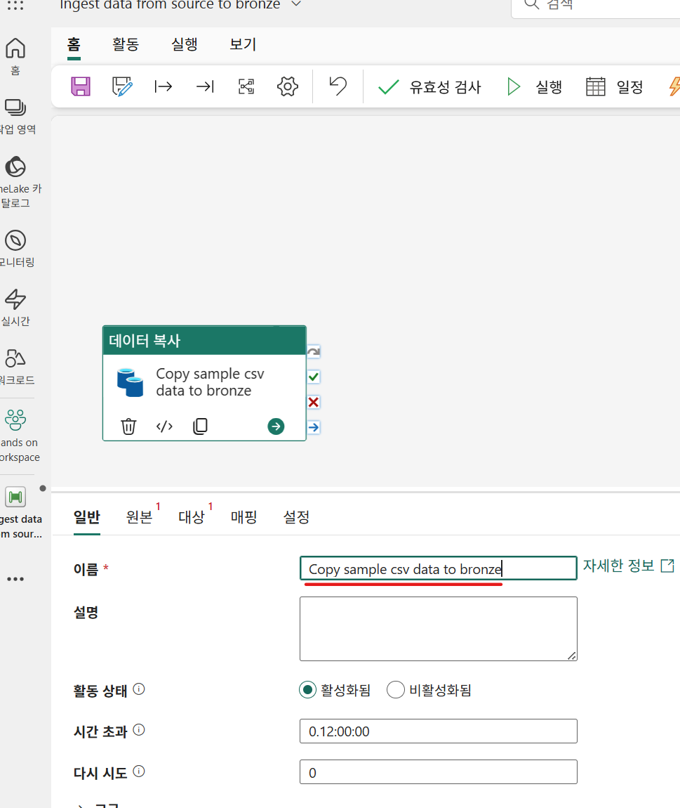

하단의 메뉴에서 **원본** 메뉴를 클릭하고, 연결 메뉴의 드롭다운을 클릭하여, **모두 찾아보기** 메뉴를 클릭합니다.

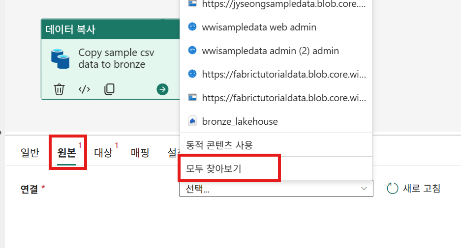

**시작할 데이터 원본 선택** 화면이 보여지면, 왼편의 메뉴에서 **새 소식**을 클릭하고, 오른쪽 화면에서 **Azure Blob**를 선택합니다.

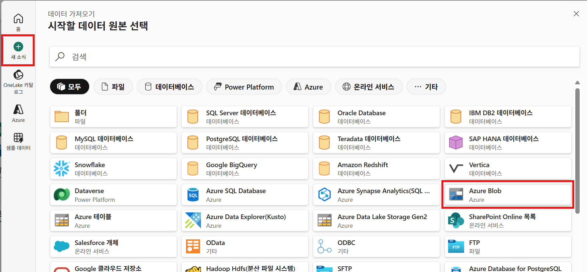

**데이터 원본 연결** 화면에서는 데이터 원본이 있는 Azure Blob 정보를 입력합니다. 필요한 정보는 아래와 같습니다.

- 계정 이름 또는 URL : *https://fabrictutorialdata.blob.core.windows.net/sampledata/*
- 연결 이름 : *wwisampledata*
- 인증 종류 : *익명*

입력이 완료되었으면, **연결** 버튼을 클릭합니다.

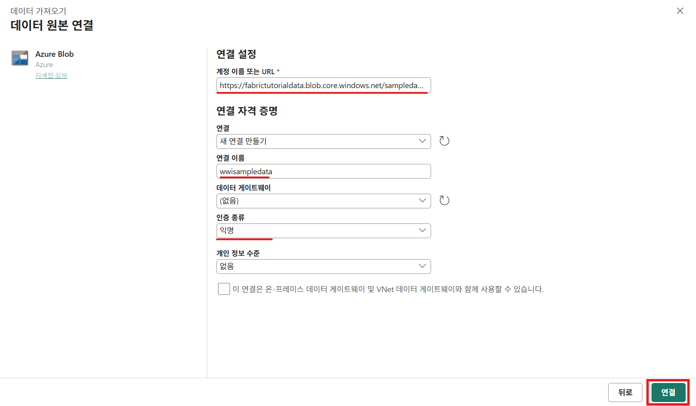

정상적으로 연결이 완료되면, 다시 데이터 파이프라인 캔버스로 돌아오게 됩니다. **원본** 화면에서 다음의 정보를 입력합니다.

- 파일 경로 : *sampledata*
- 디렉터리 : *WideWorldImportersDW/csv*
- Recursively : *체크*
- 파일 형식 : *Binary*

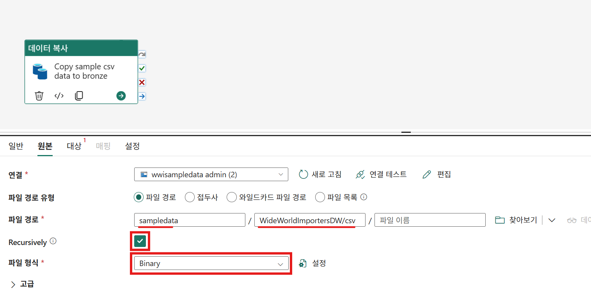

캔버스의 중간 메뉴에서 **대상**을 선택하고, **연결**의 드롭다운 메뉴를 클릭하고, **모두 찾아보기**를 클릭합니다.

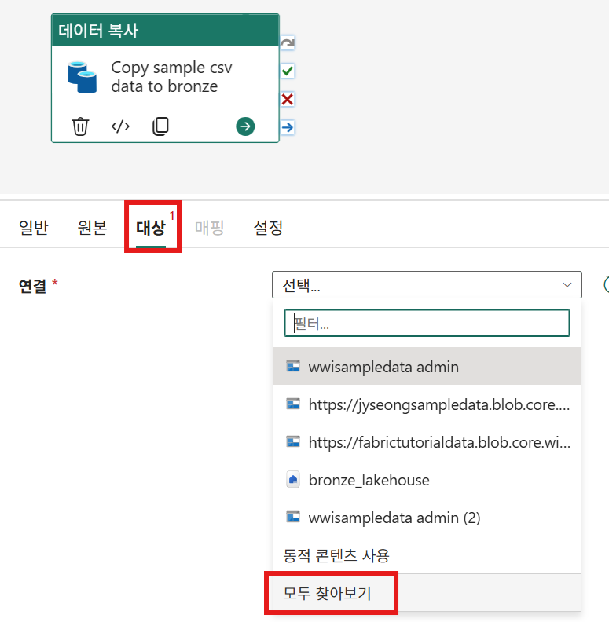

**대상 선택** 화면의 왼쪽 메뉴에서 **OneLake 카탈로그**를 선택하고, 오른쪽 pane에서 앞서 생성하였던 **bronze_lakehouse**를 선택합니다.

**대상** 화면에서는 다음과 같이 설정을 합니다.

- 루트 폴더 : *파일*
- 파일 경로 : "wwi-raw-data*

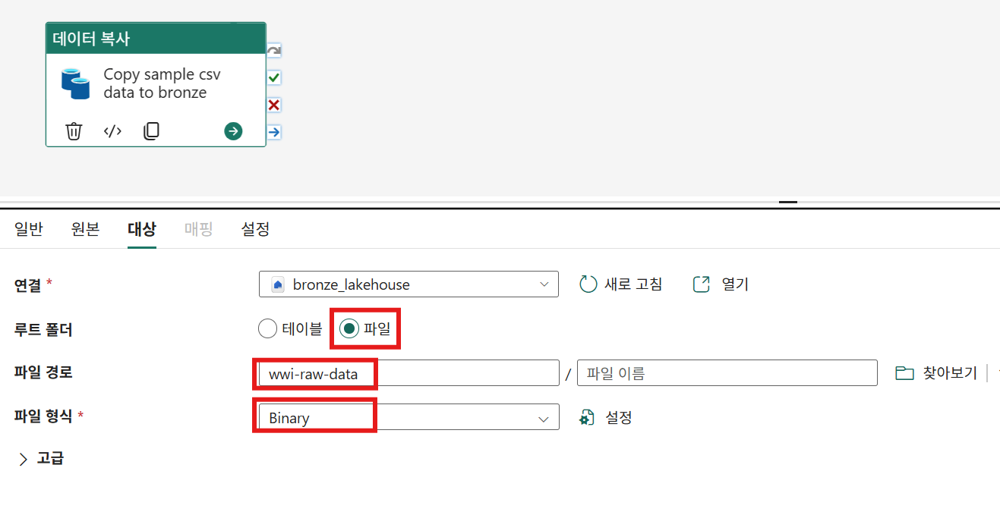

설정이 완료되면, 캔버스 우측 상단의 저장 버튼을 클릭하여 저장하고,
**실행** 버튼을 클릭하여 데이터 파이프라인을 실행합니다.

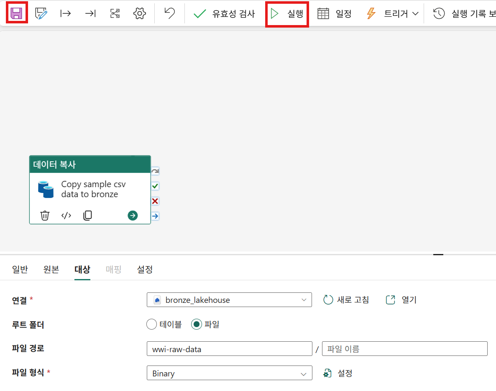

실행이 정상적으로 완료되면, 다음과 같이 **출력** 화면이 보여지게 됩니다.
좌측 메뉴에서 **Hands on workspace**를 클릭하여 작업 영역으로 이동합니다.

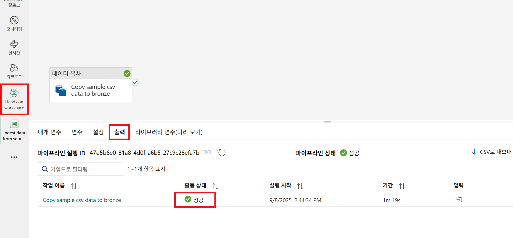

작업 영역에서 **bronze_lakehouse**를 클릭하여, 레이크하우스 탐색기로 이동합니다.

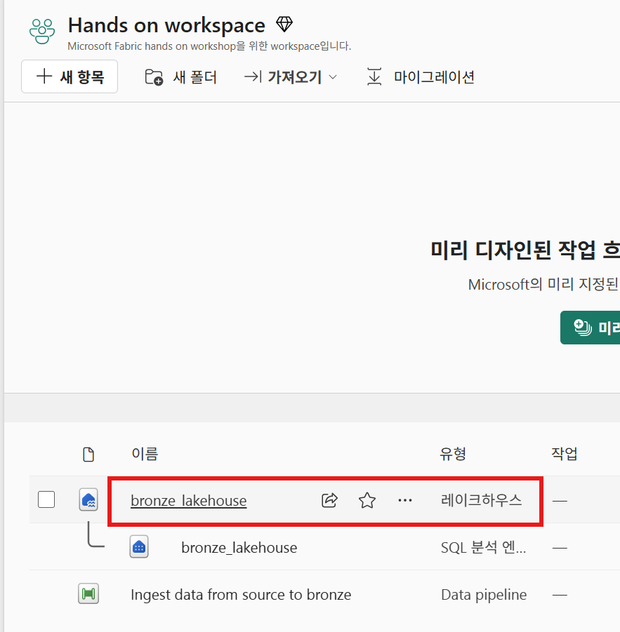

**bronze_lakehouse > Files > 점3개(...)**를 클릭하고, **새로 고침** 메뉴를 클릭합니다.

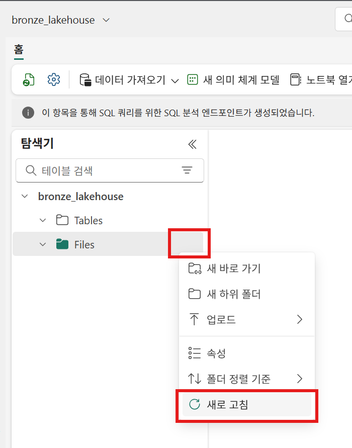

새로 고침이 완료되면, 다음과 같이 **wwi-raw-data** 폴더가 나타납니다.
폴더를 확장하여 보면, 테이블별로 폴더가 생성되어 있고, 폴더에는 데이터가 csv 파일 형태로 저장되어 있음을 확인할 수 있습니다.

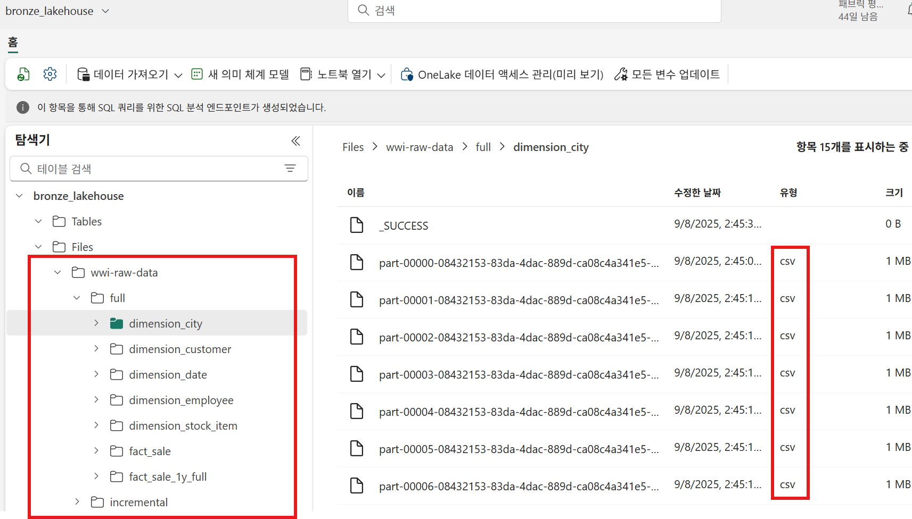

**wwi-raw-data/full/dimension_city** 폴더를 클릭하고, 오른쪽 pane에서 아무 csv나 클릭합니다.
다음과 같이, 데이터가 csv 형태로 저장되어 있음을 확인할 수 있습니다.

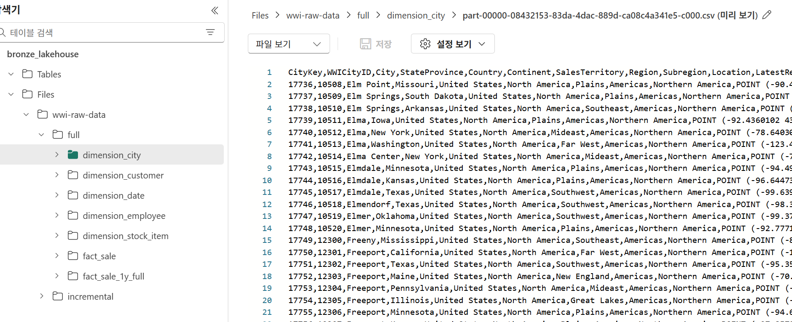

**소스(source)**에서 **메달리온 아키텍처(Medallion architecture)**의 **브론즈 영역(Bronze zone)**으로 원시 데이터를 적재(ingest)하였습니다. 다음 단계에서는 이를 변환(transform)하여 **실버 영역(Silver zone)**에 적재하는 작업을 수행해보도록 하겠습니다.

# 2.4 실버(Silver) 단계