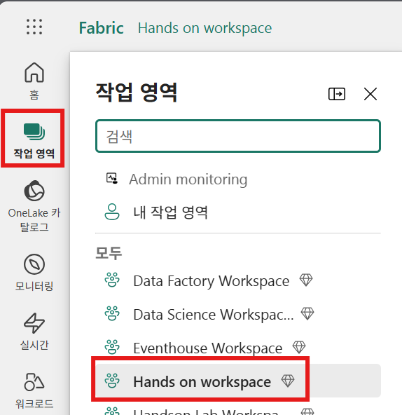
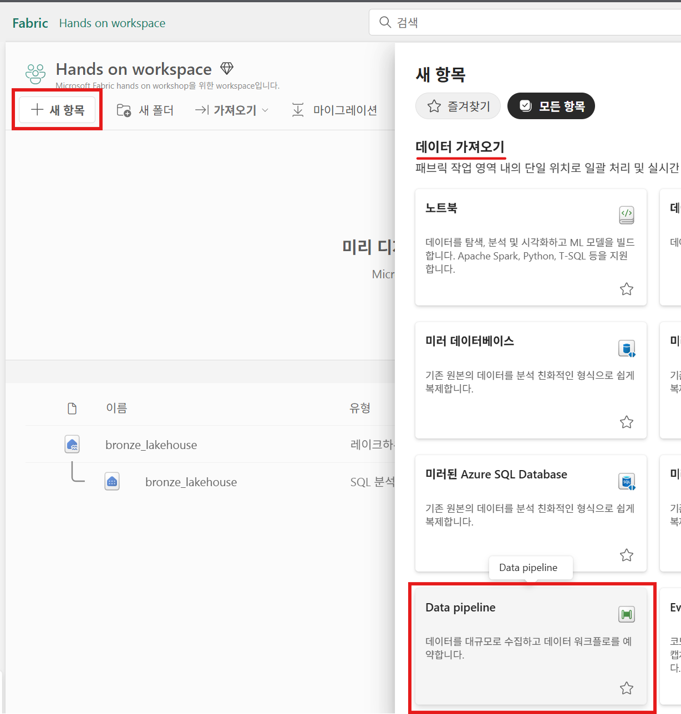
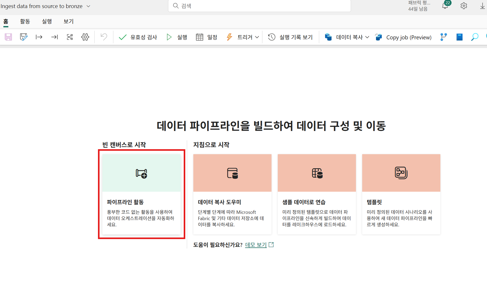
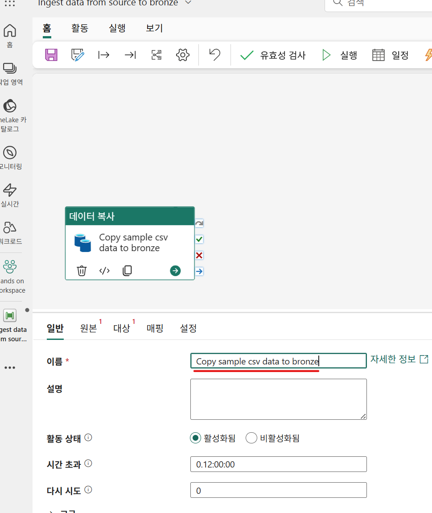
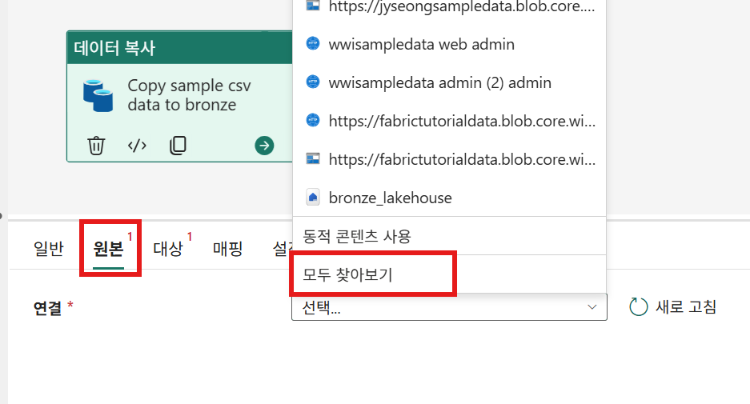
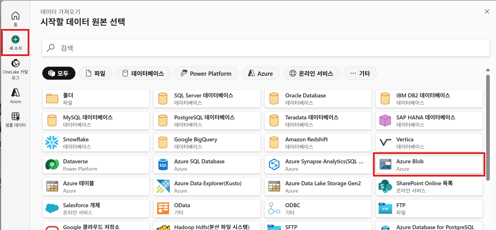
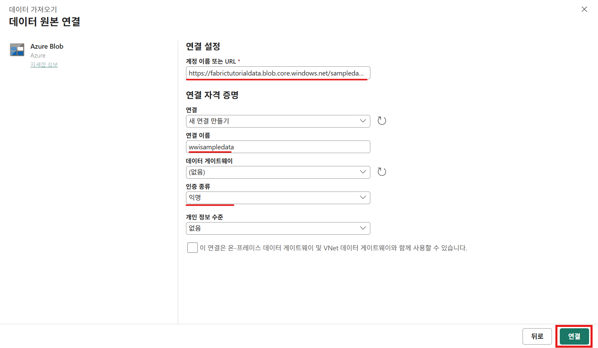
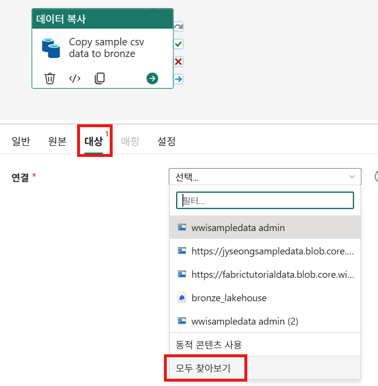
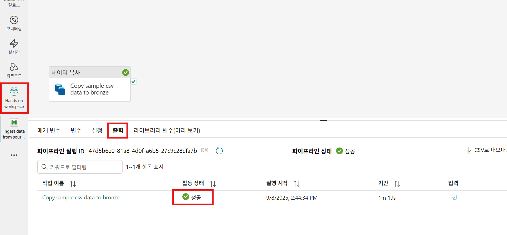
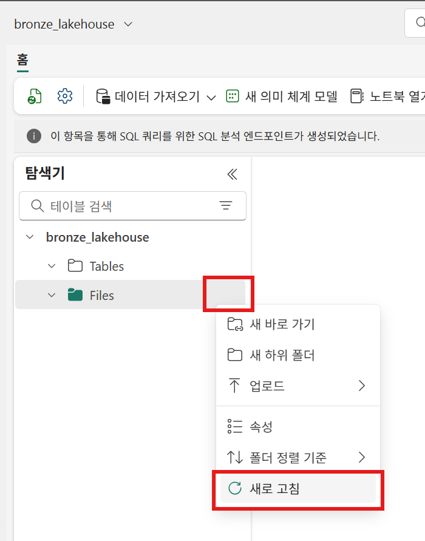

# 2.3 브론즈(Bronze) 단계
브론즈 단계에서는 브론즈 레이크하루스를 생성하고, 원본 데이터를 있는 그대로 복사해오도록 하겠습니다.

전체 아키텍처에서 다음에 해당하는 작업을 수행합니다.

먼저 lab1에서 생성한 작업 영역으로 이동합니다.

Microsoft Fabric 포털에서 좌측 메뉴에서 **작업 영역**을 클릭하고, 화면에서 앞서 생성한 **Hands on workspace**를 선택합니다.

## 2.3.1 브론즈 레이크하우스 만들기

작업 영역 화면에서, 좌측 상단에 있는 **+ 새 항목** 버튼을 클릭하면, **새 항목 > 데이터 저장 > 레이크하우스**를 클릭합니다.

**새 lakehouse** 화면에서는 레이크하우스의 이름을 "bronze-lakehouse"를 입력하고, **만들기** 버튼을 클릭하여 새로운 레이크하우스를 생성합니다.

## 2.3.2 데이터 파이프 라인 만들기

생성이 완료되면, **레이크하우스 탐색기** 화면으로 전환됩니다.
Mictosoft Fabric 포털 왼쪽 메뉴에서 **Hands on workspace"를 클릭하여 작업 영역으로 이동합니다.

작업 영역 좌측 상단에서 **+ 새 항목 > 데이터 가져오기 > Data pipeline"을 클릭합니다.

**새 파이프라인** 화면에서 이름("Ingest data from source to bronze")을 입력하고, **만들기** 버튼을 클릭하여 새로운 데이터 파이프라인을 생성합니다.

새로운 데이터 파이프라인이 생성되면, **빈 캔버스로 시작**의 **파일프라인 활동**을 클릭합니다.

다음과 같이, 새로운 데이터 파이프라인 캔버스가 나타나게 됩니다.
먼저, 데이터 복사의 이름을 "Copy sample csv data to bronze"라고 입력합니다.

하단의 메뉴에서 **원본** 메뉴를 클릭하고, 연결 메뉴의 드롭다운을 클릭하여, **모두 찾아보기** 메뉴를 클릭합니다.

**시작할 데이터 원본 선택** 화면이 보여지면, 왼편의 메뉴에서 **새 소식**을 클릭하고, 오른쪽 화면에서 **Azure Blob**를 선택합니다.

**데이터 원본 연결** 화면에서는 데이터 원본이 있는 Azure Blob 정보를 입력합니다. 필요한 정보는 아래와 같습니다.

- 계정 이름 또는 URL : *https://fabrictutorialdata.blob.core.windows.net/sampledata/*
- 연결 이름 : *wwisampledata*
- 인증 종류 : *익명*

입력이 완료되었으면, **연결** 버튼을 클릭합니다.

정상적으로 연결이 완료되면, 다시 데이터 파이프라인 캔버스로 돌아오게 됩니다. **원본** 화면에서 다음의 정보를 입력합니다.

- 파일 경로 : *sampledata*
- 디렉터리 : *WideWorldImportersDW/csv*
- Recursively : *체크*
- 파일 형식 : *Binary*

캔버스의 중간 메뉴에서 **대상**을 선택하고, **연결**의 드롭다운 메뉴를 클릭하고, **모두 찾아보기**를 클릭합니다.

**대상 선택** 화면의 왼쪽 메뉴에서 **OneLake 카탈로그**를 선택하고, 오른쪽 pane에서 앞서 생성하였던 **bronze_lakehouse**를 선택합니다.

**대상** 화면에서는 다음과 같이 설정을 합니다.

- 루트 폴더 : *파일*
- 파일 경로 : "wwi-raw-data*

## 2.3.3 데이터 파이프 라인 실행하기

설정이 완료되면, 캔버스 우측 상단의 저장 버튼을 클릭하여 저장하고,
**실행** 버튼을 클릭하여 데이터 파이프라인을 실행합니다.

실행이 정상적으로 완료되면, 다음과 같이 **출력** 화면이 보여지게 됩니다.

좌측 메뉴에서 **Hands on workspace**를 클릭하여 작업 영역으로 이동합니다.

작업 영역에서 **bronze_lakehouse**를 클릭하여, 레이크하우스 탐색기로 이동합니다.

**bronze_lakehouse > Files > (...) 점3개**를 클릭하고, **새로 고침** 메뉴를 클릭합니다.

새로 고침이 완료되면, 다음과 같이 **wwi-raw-data** 폴더가 나타납니다.

폴더를 확장하여 보면, 테이블별로 폴더가 생성되어 있고, 폴더에는 데이터가 csv 파일 형태로 저장되어 있음을 확인할 수 있습니다.

**wwi-raw-data/full/dimension_city** 폴더를 클릭하고, 오른쪽 pane에서 아무 csv나 클릭합니다.

다음과 같이, 데이터가 csv 형태로 저장되어 있음을 확인할 수 있습니다.

**원본**에서 **메달리온 아키텍처**의 **브론즈 영역**으로 원시 데이터를 적재 하였습니다. 

다음 단계에서는 이를 변환하여 **실버 영역**에 적재하는 작업을 수행해보도록 하겠습니다.