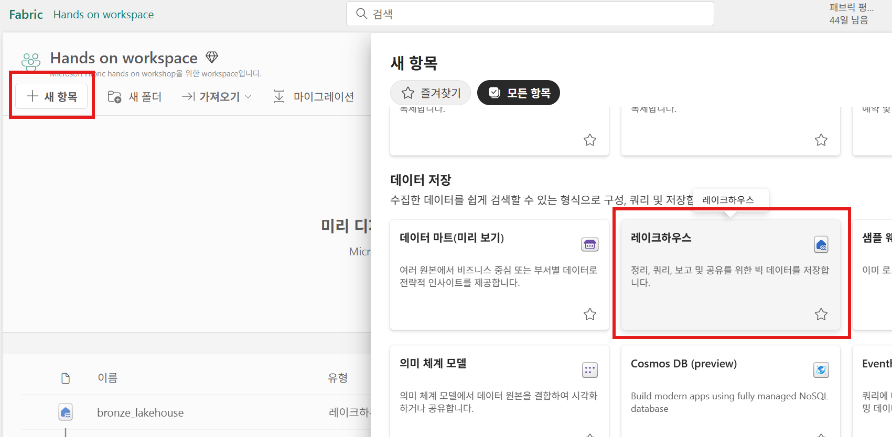

# 2.4 실버(Silver) 단계
이제 원본에서 **bronze_lakehouse 레이크하우스**의 파일 섹션으로 원본 데이터를 적재했으므로, 다음 단계에서는 해당 데이터를 변환하고 준비하여 **silver_lakehouse 레이크하우스**에 **델타 레이크 테이블**을 생성하도록 하겠습니다.

전체 아키텍처에서 다음에 해당하는 작업을 수행합니다.

## 2.4.1 실버 레이크하우스 만들기

먼저, 델타 레이크 테이블을 저장할 실버 레이크하우스를 생성하도록 하겠습니다.

Hands on workspace 화면으로 돌아가서, 상단의 **+새 항목** 버튼을 클릭하고, **레이크하우스**를 클릭합니다.

**새 lakehouse** 화면에서는 레이크하우스의 이름을 "silver-lakehouse"를 입력하고, **만들기** 버튼을 클릭하여 새로운 레이크하우스를 생성합니다.

.png)

## 2.4.2 바로 가기(Shortcut) 만들기
브론즈 레이크하우스에 있는 파일들을 실버 레이크하우스의 테이블로 저장하는 작업을 용이하게 하기 위해서 브론즈 레이크하우스에 있는 파일들에 대해서 **바로 가기**를 생성합니다.

silver_lakehouse 탐색기에서 **Files >  (...) 점3개**를 클릭하고, **새 바로 가기**를 클릭합니다.

**새 바로 가기** 화면에서 **내부 원본 > Microsoft OneLake**를 선택합니다.

**데이터 원본 유형 선택** 화면에서 앞서 생성한 **bronze_lakehouse**를 선택하고, **다음** 버튼을 클릭합니다.

**bronze_lakehouse > Files > wwi-raw-data** 경로를 열고, **full** 체크박스를 클릭하고, **다음** 버튼을 클릭합니다.

**만들기** 버튼을 클릭합니다.

만들기가 완료되면, 탐색기에 바로가기가 생성된 것을 확인할 수 있습니다.

**full** 폴더의 아이콘이 다른 폴더와 다른 것을 볼 수 있는데, 바로 이 표식이 바로 가기를 나타냅니다.

## 2.4.3 노트북(notebook) 만들기
레이크하우스 탐색기의 상단 메뉴에서 **노트북 열기 > 새 Notebook**을 선택하여, 새로운 노트북을 생성합니다.

새로운 노트북이 생성되면 화면은 다음과 같이 보여지게 됩니다.

