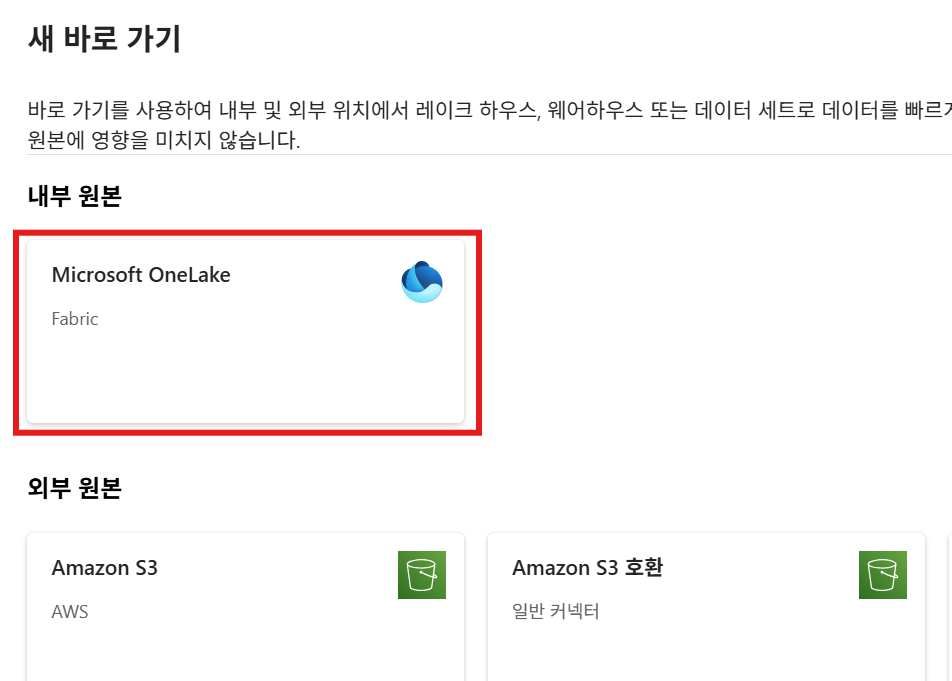

# 2.4 실버(Silver) 단계
이제 원본에서 **bronze_lakehouse 레이크하우스**의 파일 섹션으로 원본 데이터를 적재했으므로, 다음 단계에서는 해당 데이터를 변환하고 준비하여 **silver_lakehouse 레이크하우스**에 **델타 레이크 테이블**을 생성하도록 하겠습니다.

전체 아키텍처에서 다음에 해당하는 작업을 수행합니다.


## 2.4.1 실버 레이크하우스 만들기

먼저, 델타 레이크 테이블을 저장할 실버 레이크하우스를 생성하도록 하겠습니다.

Hands on workspace 화면으로 돌아가서, 상단의 **+새 항목** 버튼을 클릭하고, **레이크하우스**를 클릭합니다.


**새 lakehouse** 화면에서는 레이크하우스의 이름을 "silver_lakehouse"를 입력하고, **만들기** 버튼을 클릭하여 새로운 레이크하우스를 생성합니다.


## 2.4.2 바로 가기(Shortcut) 만들기
브론즈 레이크하우스에 있는 파일들을 실버 레이크하우스의 테이블로 저장하는 작업을 용이하게 하기 위해서 브론즈 레이크하우스에 있는 파일들에 대해서 **바로 가기**를 생성합니다.

silver_lakehouse 탐색기에서 **Files >  (...) 점3개**를 클릭하고, **새 바로 가기**를 클릭합니다.


**새 바로 가기** 화면에서 **내부 원본 > Microsoft OneLake**를 선택합니다.



**데이터 원본 유형 선택** 화면에서 앞서 생성한 **bronze_lakehouse**를 선택하고, **다음** 버튼을 클릭합니다.


**bronze_lakehouse > Files > wwi-raw-data** 경로를 열고, **full** 체크박스를 클릭하고, **다음** 버튼을 클릭합니다.


**만들기** 버튼을 클릭합니다.


만들기가 완료되면, 탐색기에 바로가기가 생성된 것을 확인할 수 있습니다.

**full** 폴더의 아이콘이 다른 폴더와 다른 것을 볼 수 있는데, 바로 이 표식이 바로 가기를 나타냅니다.


## 2.4.3 노트북(notebook) 만들기
silver_lakehouse 레이크하우스 탐색기의 상단 메뉴에서 **노트북 열기 > 새 Notebook**을 선택하여, 새로운 노트북을 생성합니다.


새로운 노트북이 생성되면 화면은 다음과 같이 보여지게 됩니다.


화면 좌측 상단에 있는 저장 버튼을 클릭하여 해당 노트북을 저장합니다.


새 노트북 이름에 "Migration from Bronze to Silver"라고 입력하고. **저장** 버튼을 클릭합니다.


미리 만들어둔 notebook 파일은 [여기](../Lab2%20Microosft%20Fabric%20Lakehouse/resources/Migration%20from%20Bronze%20to%20Silver.ipynb)에서 다운로드 할 수 있습니다.

## 2.4.4 데이터 변환 - 차원(dimension) 테이블

첫번째 셀에 다음의 코드를 복사하여 붙여넣기 합니다.
해당 코드는 브론즈 레이크하우스에 csv 형태로 저장되어 있는 파일들을 읽어와서 실버 레이크하우스에 **dimension_city**라는 이름의 테이블에 저장하게 됩니다.

```python
# Dimension table - City

from pyspark.sql.types import *

table_name = 'dimension_city'

dimension_city_schema = StructType([
    StructField('CityKey', IntegerType(), True), 
    StructField('WWICityID', IntegerType(), True), 
    StructField('City', StringType(), True), 
    StructField('StateProvince', StringType(), True), 
    StructField('Country', StringType(), True), 
    StructField('Continent', StringType(), True), 
    StructField('SalesTerritory', StringType(), True), 
    StructField('Region', StringType(), True), 
    StructField('Subregion', StringType(), True), 
    StructField('Location', StringType(), True), 
    StructField('LatestRecordedPopulation', LongType(), True), 
    StructField('ValidFrom', TimestampType(), True), 
    StructField('ValidTo', TimestampType(), True), 
    StructField('LineageKey', IntegerType(), True)])

df = spark.read.format("csv").schema(dimension_city_schema).option("header","true").load('Files/full/' + table_name)
df.write.mode("overwrite").format("delta").save("Tables/" + table_name)
```


셀 좌측에 있는 **셀 실행** 버튼을 클릭하여, 붙여넣기한 코드를 실행합니다.


실행이 완료되면, 셀 하단에 Spark 작업이 완료되었다는 메시지가 보여지게 됩니다.
좌측의 탐색기에서 **Tables > 점 3개(...) > 새로 고침** 메뉴를 클릭하고, **dimension_city** 테이블을 확장하여 테이블이 정상적으로 생성되었는지 확인합니다.


첫번째 셀 아래에 있는 **코드 셀 추가** 버튼을 클릭하여 새로운 코드 셀을 추가합니다.


추가된 셀에 다음의 코드를 복사하여 붙여넣기 합니다.
해당 코드는 새로 생성한 dimension_city 테이블로부터 데이터를 반환하여, 데이터가 저장되었는지 확인하게 됩니다.

```python
%%sql
SELECT *
FROM dimension_city;
```

셀 좌측에 있는 **셀 실행** 버튼을 클릭하여, 붙여넣기한 코드를 실행합니다.
앞선 코드가 정상적으로 실행되어 데이터 적재가 완료되었다면, 해당 코드의 실행 결과는 다음과 같이 보여지게 됩니다.


이제, 다음의 테이블들을 생성하는 작업을 동일한 절차에 걸쳐서 반복합니다.

- Dimension table - customer
- Dimension table - date
- Dimension table - employee
- Dimension table - stock item

### Dimension table - customer
새로운 코드 셀을 추가하고 다음의 코드를 복사하여 붙여넣기 하고 실행합니다.
해당 코드는 실버 레이크하우스에 **dimension_customer**라는 테이블을 만들고 데이터를 적재합니다.

```python
# Dimension table - customer

from pyspark.sql.types import *

table_name = 'dimension_customer'

dimension_customer_schema = StructType([
    StructField('CustomerKey', IntegerType(), True), 
    StructField('WWICustomerID', IntegerType(), True), 
    StructField('Customer', StringType(), True), 
    StructField('BillToCustomer', StringType(), True), 
    StructField('Category', StringType(), True), 
    StructField('BuyingGroup', StringType(), True), 
    StructField('PrimaryContact', StringType(), True), 
    StructField('PostalCode', StringType(), True), 
    StructField('ValidFrom', TimestampType(), True), 
    StructField('ValidTo', TimestampType(), True), 
    StructField('LineageKey', IntegerType(), True)])

df = spark.read.format("csv").schema(dimension_customer_schema).option("header","true").load('Files/full/' + table_name)
df.write.mode("overwrite").format("delta").save("Tables/" + table_name)
```

### Dimension table - date
다음은 **dimension_date** 테이블을 생성하고 데이터를 적재합니다.
앞서와 같은 절차에 따라서 코드를 실행합니다.

```python
# Dimension table - date

from pyspark.sql.types import *

table_name = 'dimension_date'

dimension_date_schema = StructType([
    StructField('Date', TimestampType(), True), 
    StructField('DayNumber', IntegerType(), True), 
    StructField('Day', StringType(), True), 
    StructField('Month', StringType(), True), 
    StructField('ShortMonth', StringType(), True), 
    StructField('CalendarMonthNumber', IntegerType(), True), 
    StructField('CalendarMonthLabel', StringType(), True), 
    StructField('CalendarYear', IntegerType(), True), 
    StructField('CalendarYearLabel', StringType(), True), 
    StructField('FiscalMonthNumber', IntegerType(), True), 
    StructField('FiscalMonthLabel', StringType(), True), 
    StructField('FiscalYear', IntegerType(), True), 
    StructField('FiscalYearLabel', StringType(), True), 
    StructField('ISOWeekNumber', IntegerType(), True)])

df = spark.read.format("csv").schema(dimension_date_schema).option("header","true").load('Files/full/' + table_name)
df.write.mode("overwrite").format("delta").save("Tables/" + table_name)
```

### Dimension table - employee
다음은 **dimension_employee** 테이블을 생성하고 데이터를 적재합니다.

```python
# Dimension table - employee 

from pyspark.sql.types import *

table_name = 'dimension_employee'

dimension_employee_schema = StructType([
    StructField('EmployeeKey', IntegerType(), True), 
    StructField('WWIEmployeeID', IntegerType(), True), 
    StructField('Employee', StringType(), True), 
    StructField('PreferredName', StringType(), True), 
    StructField('IsSalesperson', BooleanType(), True), 
    StructField('Photo', StringType(), True), 
    StructField('ValidFrom', TimestampType(), True), 
    StructField('ValidTo', TimestampType(), True), 
    StructField('LineageKey', IntegerType(), True)])

df = spark.read.format("csv").schema(dimension_employee_schema).option("header","true").load('Files/full/' + table_name)
df.write.mode("overwrite").format("delta").save("Tables/" + table_name)
```

### Dimension table - stock item
마지막으로 **dimension_stock_item** 테이블을 생성하고 데이터를 적재합니다.

```python
# Dimension table - stock item 

from pyspark.sql.types import *

table_name = 'dimension_stock_item'

dimension_stock_item_schema = StructType([
    StructField('StockItemKey', IntegerType(), True), 
    StructField('WWIStockItemID', IntegerType(), True), 
    StructField('StockItem', StringType(), True), 
    StructField('Color', StringType(), True), 
    StructField('SellingPackage', StringType(), True), 
    StructField('BuyingPackage', StringType(), True), 
    StructField('Brand', StringType(), True), 
    StructField('Size', StringType(), True), 
    StructField('LeadTimeDays', IntegerType(), True), 
    StructField('QuantityPerOuter', IntegerType(), True), 
    StructField('IsChillerStock', BooleanType(), True), 
    StructField('Barcode', StringType(), True), 
    StructField('TaxRate', DecimalType(18,3), True), 
    StructField('UnitPrice', DecimalType(18,2), True), 
    StructField('RecommendedRetailPrice', DecimalType(18,2), True), 
    StructField('TypicalWeightPerUnit', DecimalType(18,3), True), 
    StructField('Photo', StringType(), True), 
    StructField('ValidFrom', TimestampType(), True), 
    StructField('ValidTo', TimestampType(), True), 
    StructField('LineageKey', IntegerType(), True)])

df = spark.read.format("csv").schema(dimension_stock_item_schema).option("header","true").load('Files/full/' + table_name)
df.write.mode("overwrite").format("delta").save("Tables/" + table_name)
```

모든 작업이 완료하면, 레이크하우스 탐색기에서 **Tables > 점 3개(...) > 새로 고침** 메뉴를 클릭하여 차원 테이블들이 제대로 생성되었는지 확인합니다.


## 2.4.5 데이터 변환 - 팩트(fact) 테이블
마지막으로 다음의 코드를 이용하여 팩트 테이블을 생성하겠습니다.

과정은 앞서 차원 테이블을 만드는 과정과 동일합니다.
새로운 코드 셀을 추가하고, 다음의 코드를 복사하여 붙여넣기 합니다.

앞선 코드와는 달리, 테이블 스키마 정의 이외에도 연도(Year), 분기(Quarter), 월(Month)와 같은 **계산된 열, computed columns**들이 추가 됩니다.


준비가 되었다면, 해당 코드를 실행합니다.

해당 코드에서 처리해야 할 데이터가 비교적 많은 관계로 다른 코드에 비해서 좀 더 긴 실행시간을 필요로 합니다.

*F2 Fabric capacity에서는 4~5분 정도 소요되었습니다*

```python
# Fact table - fact_sale

from pyspark.sql.types import *
from pyspark.sql.functions import col, year, month, quarter

table_name = 'fact_sale'

fact_sale_schema = StructType([
    StructField('SaleKey', LongType(), True), 
    StructField('CityKey', IntegerType(), True), 
    StructField('CustomerKey', IntegerType(), True), 
    StructField('BillToCustomerKey', IntegerType(), True), 
    StructField('StockItemKey', IntegerType(), True), 
    StructField('InvoiceDateKey', TimestampType(), True), 
    StructField('DeliveryDateKey', TimestampType(), True), 
    StructField('SalespersonKey', IntegerType(), True), 
    StructField('WWIInvoiceID', IntegerType(), True), 
    StructField('Description', StringType(), True), 
    StructField('Package', StringType(), True), 
    StructField('Quantity', IntegerType(), True), 
    StructField('UnitPrice', DecimalType(18,2), True), 
    StructField('TaxRate', DecimalType(18,3), True), 
    StructField('TotalExcludingTax', DecimalType(29,2), True), 
    StructField('TaxAmount', DecimalType(38,6), True), 
    StructField('Profit', DecimalType(18,2), True), 
    StructField('TotalIncludingTax', DecimalType(38,6), True), 
    StructField('TotalDryItems', IntegerType(), True), 
    StructField('TotalChillerItems', IntegerType(), True), 
    StructField('LineageKey', IntegerType(), True)])

df = spark.read.format("csv").schema(fact_sale_schema).option("header","true").load('Files/full/' + table_name)

df = df.withColumn('Year', year(col("InvoiceDateKey")))
df = df.withColumn('Quarter', quarter(col("InvoiceDateKey")))
df = df.withColumn('Month', month(col("InvoiceDateKey")))

df.write.mode("overwrite").format("delta").partitionBy("Year","Quarter").save("Tables/" + table_name)
```

모든 실행이 정상적으로 수행되었다면, 레이크하우스 탐색기에서 다음과 같이 테이블들을 확인할 수 있습니다.


만약, 누락된 테이블이 있다면, **Tables > 점 3개(...) > 새로 고침** 메뉴를 클릭하여 목록을 새로고침 합니다.

마지막으로, 다음의 코드를 복사하여 붙여넣기 하고 실행하여 데이터 변환이 정상적으로 이루어졌는지 확인합니다.

```python
%%sql
SELECT Year, Quarter, Month, count(*)
FROM fact_sale 
GROUP BY Year, Quarter, Month
ORDER BY Year, Quarter, Month;
```


## 다음

[Lab2 Microosft Fabric Lakehouse - 브론즈(Bronze) 단계](Lab2%20Microosft%20Fabric%20Lakehouse2.md) << Lab2 Microosft Fabric Lakehouse - 실버(Silver) 단계 >> Lab2 Microosft Fabric Lakehouse - 골드(Gold) 단계