# 2.5 골드(Gold) 단계
이제 원시(raw) 데이터가 실버 레이크하우스에 **델타 레이크 테이블** 형태로 저장되었습니다.
마지막으로 실버 레이크하우스에 있는 **델타 레이크 테이블**들을 골드(Gold) 레이크하우스에 비지니스 집계 테이블로 변환하는 작업을 수행해보도록 하겠습니다.
이번에도 스파크 노트북을 이용하여 데이터 변환작업을 수행하게 됩니다.

전체 아키텍처에서 다음에 해당하는 작업을 수행합니다.

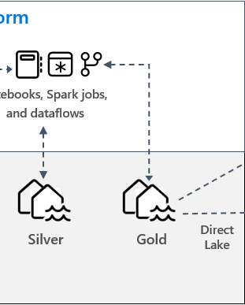

## 2.5.1 골드 레이크하우스 만들기

먼저, 비지니스 집계 델타 레이크 테이블을 저장할 골드 레이크하우스를 생성하도록 하겠습니다.

Hands on workspace 화면으로 돌아가서, 상단의 **+새 항목** 버튼을 클릭하고, **레이크하우스**를 클릭합니다.

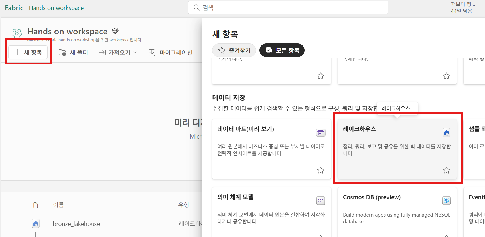


**새 lakehouse** 화면에서는 레이크하우스의 이름을 "gold_lakehouse"를 입력하고, **만들기** 버튼을 클릭하여 새로운 레이크하우스를 생성합니다.

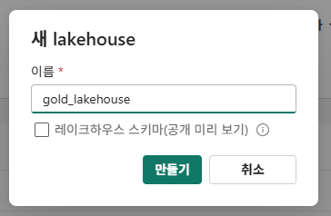

## 2.5.2 바로 가기(Shortcut) 만들기
실버 레이크하우스에 있는 테이블들을 골드 레이크하우스의 집계 테이블로 저장하는 작업을 용이하게 하기 위해서 실버 레이크하우스에 있는 테이블들에 대해서 **바로 가기**를 생성합니다.

gold_lakehouse 탐색기에서 **Tables >  (...) 점3개**를 클릭하고, **새 바로 가기**를 클릭합니다.

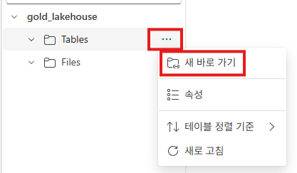

**새 바로 가기** 화면에서 **내부 원본 > Microsoft OneLake**를 선택합니다.

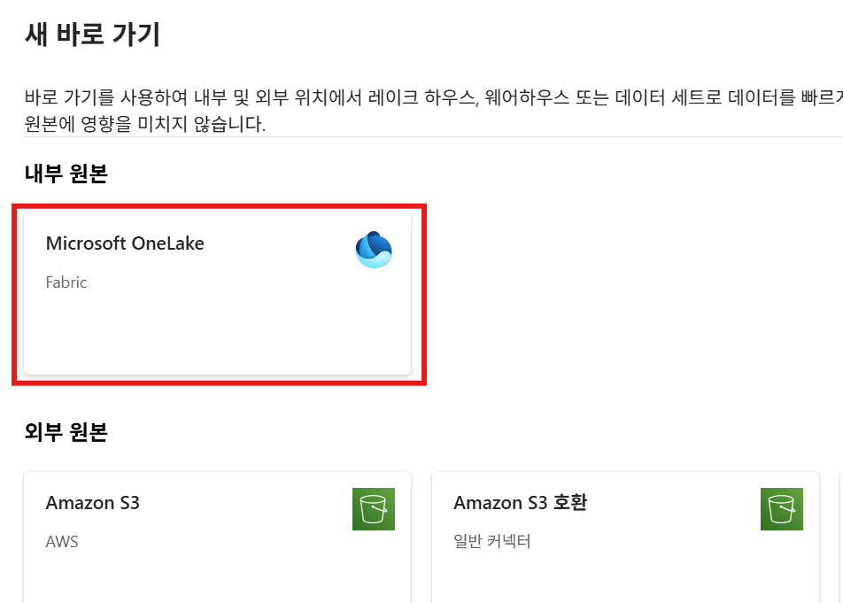

**데이터 원본 유형 선택** 화면에서 앞서 생성한 **silver_lakehouse**를 선택하고, **다음** 버튼을 클릭합니다.

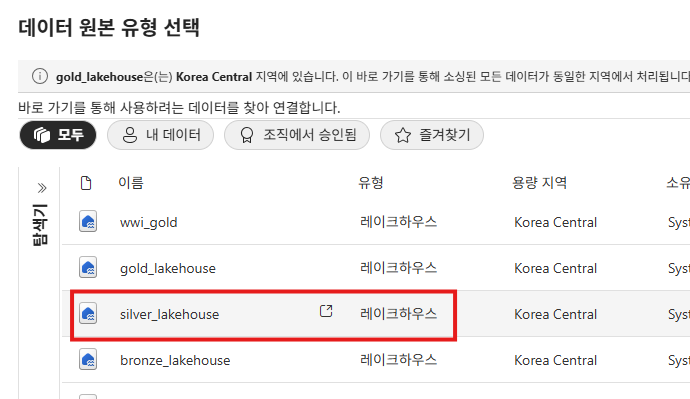

**새 바로가기** 화면에서, **silver_lakehouse > Tables** 경로를 열고, 모든 테이블의 체크박스를 클릭하고, **다음** 버튼을 클릭합니다.

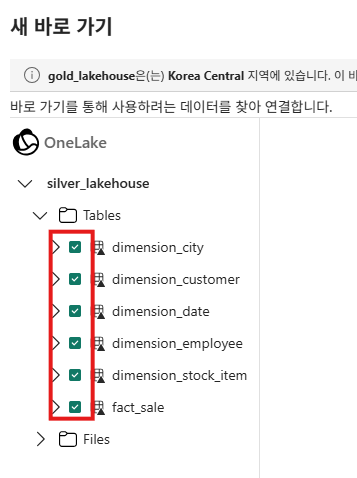

**만들기** 버튼을 클릭합니다.

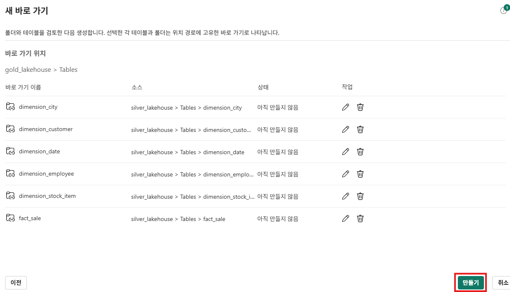

만들기가 완료되면, 탐색기에 바로가기가 생성된 것을 확인할 수 있습니다.

**Tables** 아래에 있는 테이블들의 아이콘이 다른 폴더와 다른 것을 볼 수 있는데, 바로 이 표식이 바로 가기를 나타냅니다.

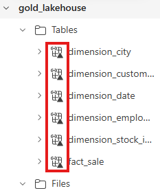

## 2.5.3 노트북(notebook) 만들기
gold_lakehouse 레이크하우스 탐색기의 상단 메뉴에서 **노트북 열기 > 새 Notebook**을 선택하여, 새로운 노트북을 생성합니다.

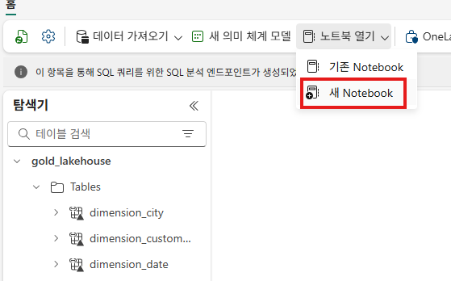

새로운 노트북이 생성되면, 화면 좌측 상단에 있는 저장 버튼을 클릭하여 해당 노트북을 저장합니다.

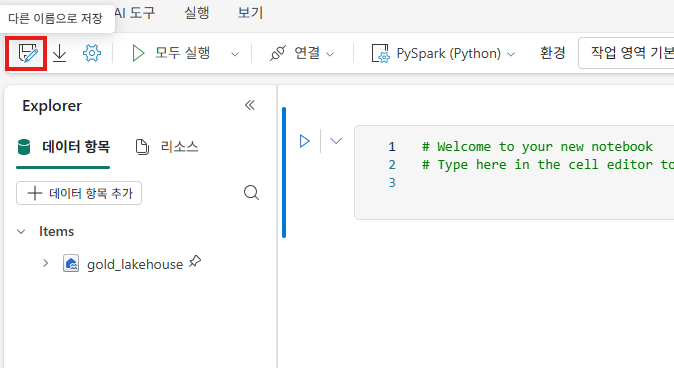

새 노트북 이름에 "Migration from Bronze to Silver"라고 입력하고. **저장** 버튼을 클릭합니다.

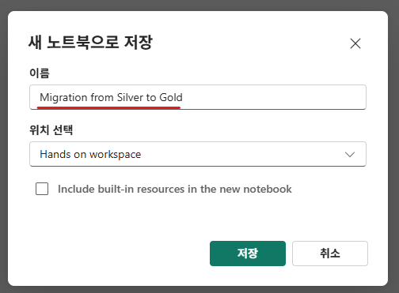

미리 만들어둔 notebook 파일은 [여기](../Lab2%20Microosft%20Fabric%20Lakehouse/resources/Migration%20from%20Silver%20to%20Gold.ipynb)에서 다운로드 할 수 있습니다.

## 2.5.4 비지니스 집계 테이블 생성
레이크하우스의 집계 작업은 PySpark 또는 Spark SQL을 이용하여 작업이 가능합니다.
이번 lab에서는 두 개의 집계 테이블을 생성하게 되는데, PySpark와 Spark SQL을 이용하여 각각의 집계 테이블을 생성해보도록 하겠습니다.

### 2.5.4.1 PySpark를 이용한 집계 테이블 생성
첫번째 셀에 다음의 코드를 복사하여 붙여넣기 합니다.

```python
#팩트 테이블(fact_sale), 차원 테이블(dimension_date, dimension_city)에 대한 참조를 생성

df_fact_sale = spark.read.table("gold_lakehouse.fact_sale") 
df_dimension_date = spark.read.table("gold_lakehouse.dimension_date")
df_dimension_city = spark.read.table("gold_lakehouse.dimension_city")
```

해당 코드는 팩트 테이블(fact_sale), 차원 테이블(dimension_date, dimension_city)에 대한 참조를 생성합니다.

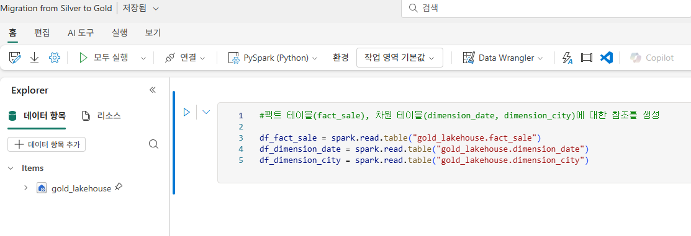

셀 좌측에 있는 **셀 실행** 버튼을 클릭하여, 붙여넣기한 코드를 실행합니다.

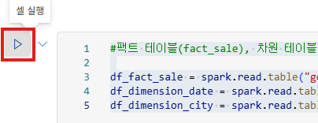

실행이 완료되면, 셀 하단에 Spark 작업이 완료되었다는 메시지가 보여지게 됩니다.
첫번째 셀 아래에 있는 **코드 셀 추가** 버튼을 클릭하여 새로운 코드 셀을 추가합니다.

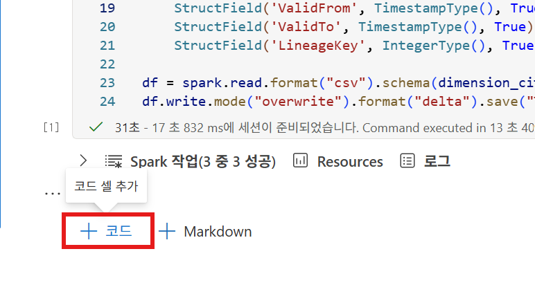

추가된 셀에 다음의 코드를 복사하여 붙여넣기 합니다.
해당 코드는 다음의 기준으로 집계 테이블을 생성하여

- 집계 컬럼(SUM) : TotalExcludingTax, TaxAmount, TotalIncludingTax, Profit
- 집계 기준 컬럼(GROUP BY) : date.Date, date.CalendarMonthLabel, date.Day, date.ShortMonth, date.CalendarYear, city.City, city.StateProvince, city.SalesTerritory
- 정렬 기준 : date.Date, city.StateProvince, city.City

**aggregate_sale_by_date_city**라는 이름의 집계 테이블로 저장합니다.

```python
#집계 테이블(aggregate_sale_by_date_city) 생성

sale_by_date_city = df_fact_sale.alias("sale") \
.join(df_dimension_date.alias("date"), df_fact_sale.InvoiceDateKey == df_dimension_date.Date, "inner") \
.join(df_dimension_city.alias("city"), df_fact_sale.CityKey == df_dimension_city.CityKey, "inner") \
.select("date.Date", "date.CalendarMonthLabel", "date.Day", "date.ShortMonth", "date.CalendarYear", "city.City", "city.StateProvince", "city.SalesTerritory", "sale.TotalExcludingTax", "sale.TaxAmount", "sale.TotalIncludingTax", "sale.Profit")\
.groupBy("date.Date", "date.CalendarMonthLabel", "date.Day", "date.ShortMonth", "date.CalendarYear", "city.City", "city.StateProvince", "city.SalesTerritory")\
.sum("sale.TotalExcludingTax", "sale.TaxAmount", "sale.TotalIncludingTax", "sale.Profit")\
.withColumnRenamed("sum(TotalExcludingTax)", "SumOfTotalExcludingTax")\
.withColumnRenamed("sum(TaxAmount)", "SumOfTaxAmount")\
.withColumnRenamed("sum(TotalIncludingTax)", "SumOfTotalIncludingTax")\
.withColumnRenamed("sum(Profit)", "SumOfProfit")\
.orderBy("date.Date", "city.StateProvince", "city.City")

sale_by_date_city.write.mode("overwrite").format("delta").option("overwriteSchema", "true").save("Tables/aggregate_sale_by_date_city")
```

셀 좌측에 있는 **셀 실행** 버튼을 클릭하여, 붙여넣기한 코드를 실행합니다.
실행이 완료되면, 셀 하단에 Spark 작업이 완료되었다는 메시지가 보여지게 됩니다.
좌측의 탐색기에서 **Tables > 점 3개(...) > 새로 고침** 메뉴를 클릭하고, **aggregate_sale_by_date_city** 테이블이 정상적으로 생성되었는지 확인합니다.

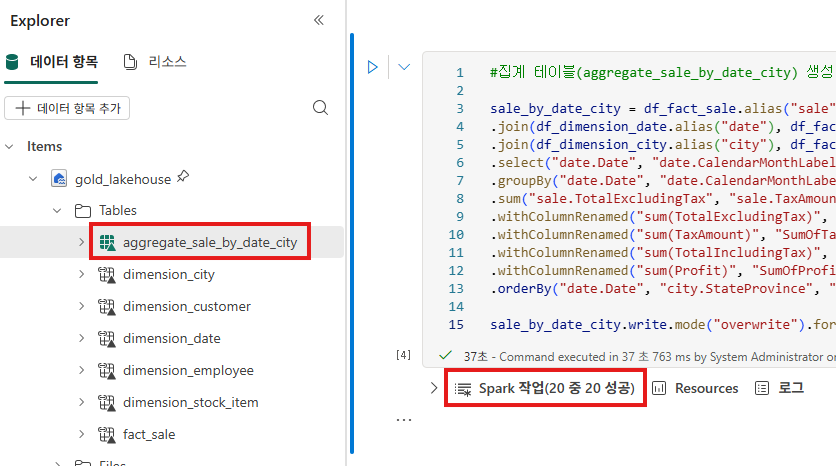

앞서 실행한 셀 아래에 있는 **코드 셀 추가** 버튼을 클릭하여 새로운 코드 셀을 추가합니다.
다음의 코드를 복사하여 붙여넣기 하고 실행하여, 집계 테이블의 데이터를 확인합니다.

```sql
%%sql
SELECT * 
FROM aggregate_sale_by_date_city;
```

결과는 다음과 같이 보여지게 됩니다.

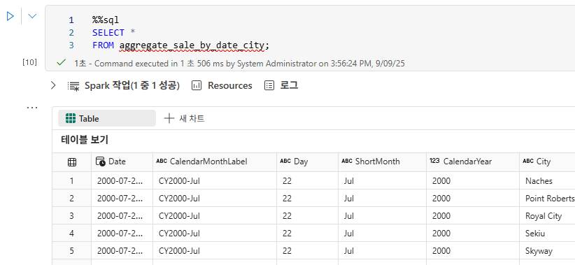

### 2.5.4.2 SparkSQL을 이용한 집계 테이블 생성
이번에는 SparkSQL을 사용하여 데이터를 조인하고 집계하여 집계 테이블을 생성하는 방법에 대해서 살펴보겠습니다.

앞서 실행한 셀 아래에 있는 **코드 셀 추가** 버튼을 클릭하여 새로운 코드 셀을 추가합니다.
다음의 코드를 복사하여 붙여넣기 합니다.
해당 코드는 다음의 기준으로 데이터를 쿼리하여, sale_by_date_employee라는 이름의 **임시 Spark 뷰**를 생성합니다.

- 집계 컬럼(SUM) : TotalExcludingTax, TaxAmount, TotalIncludingTax, Profit
- 집계 기준 컬럼(GROUP BY) : date.Date, date.CalendarMonthLabel, date.Day, date.ShortMonth, date.CalendarYear, employee.PreferredName, employee.Employee
- 정렬 기준 : date.Date, employee.PreferredName, employee.Employee

```sql
%%sql
CREATE OR REPLACE TEMPORARY VIEW sale_by_date_employee
AS
SELECT
	DD.Date, DD.CalendarMonthLabel
    , DD.Day, DD.ShortMonth Month, CalendarYear Year
	,DE.PreferredName, DE.Employee
	,SUM(FS.TotalExcludingTax) SumOfTotalExcludingTax
	,SUM(FS.TaxAmount) SumOfTaxAmount
	,SUM(FS.TotalIncludingTax) SumOfTotalIncludingTax
	,SUM(Profit) SumOfProfit 
FROM gold_lakehouse.fact_sale FS
INNER JOIN gold_lakehouse.dimension_date DD ON FS.InvoiceDateKey = DD.Date
INNER JOIN gold_lakehouse.dimension_Employee DE ON FS.SalespersonKey = DE.EmployeeKey
GROUP BY DD.Date, DD.CalendarMonthLabel, DD.Day, DD.ShortMonth, DD.CalendarYear, DE.PreferredName, DE.Employee
ORDER BY DD.Date ASC, DE.PreferredName ASC, DE.Employee ASC
```

셀 좌측에 있는 **셀 실행** 버튼을 클릭하여, 붙여넣기한 코드를 실행합니다.

**코드 셀 추가** 버튼을 클릭하여 새로운 코드 셀을 추가합니다.
다음의 코드를 복사하여 붙여넣기하고, 실행합니다.
해당 코드는 **sale_by_date_employee**라는 임시 뷰를 읽어서, **aggregate_sale_by_date_employee**라는 테이블에 저장하는 작업을 수행합니다.

```python
sale_by_date_employee = spark.sql("SELECT * FROM sale_by_date_employee")
sale_by_date_employee.write.mode("overwrite").format("delta").option("overwriteSchema", "true").save("Tables/aggregate_sale_by_date_employee")
```

좌측의 탐색기에서 **Tables > 점 3개(...) > 새로 고침** 메뉴를 클릭하고, **aggregate_sale_by_date_employee** 테이블이 정상적으로 생성되었는지 확인합니다.

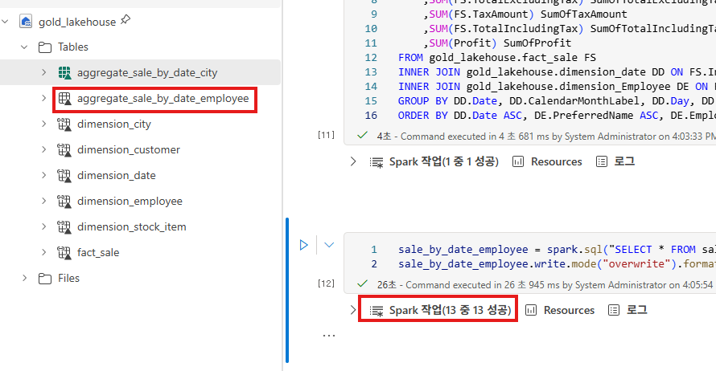

**코드 셀 추가** 버튼을 클릭하여 새로운 코드 셀을 추가합니다.
다음의 코드를 복사하여 붙여넣기하고, 실행하여 aggregate_sale_by_date_employee 테이블의 데이터를 확읺합니다.

```sql
%%sql
SELECT *
FROM aggregate_sale_by_date_employee;
```

실행한 결과는 다음과 같습니다.

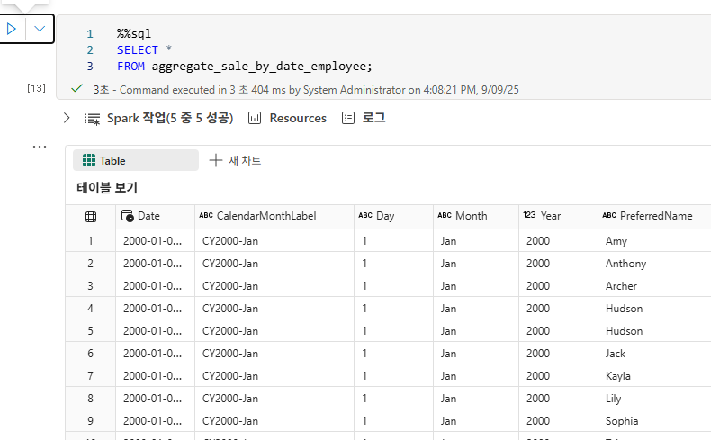


## 다음

[Lab2 Microosft Fabric Lakehouse - 실버(Silver)](Lab2%20Microosft%20Fabric%20Lakehouse3.md) 단계 << Lab2 Microosft Fabric Lakehouse - 골드(Gold) 단계 >> [Lab2 Microosft Fabric Lakehouse - 분석 단계](Lab2%20Microosft%20Fabric%20Lakehouse5.md)