# 2.6 분석 단계
이제 데이터를 **레이크하우스**에 통합하고 보고를 위한 준비를 마쳤습니다.
다음에는 데이터를 분석하여, 인사이트를 도출해보도록 하겠습니다.

전체 아키텍처에서 다음에 해당하는 작업을 수행합니다.

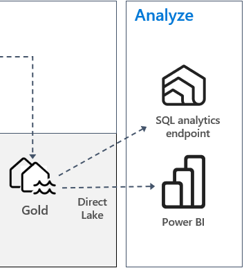

아키텍처에서 도식화된 것처럼, 이번 lab에서는 두 가지 방법에 대해서 살펴보게 됩니다.

1. SQL analytics endpoint
2. Power BI

# 2.6.1 SQL analytics endpoint
레이크하우스에는 테이블의 데이터에 연결하여 쿼리할 수 있도록 SQL enpoint가 기본적으로 생성되어 제공됩니다.

레이크하우스를 생성하면, 동일한 이름의 SQL endpoint가 만들어 집니다. 이를 통해서 사용자는 SQL Server Management Studio(통칭 SSMS)과 같은 클라이언트 도구를 통하여 데이터를 사용할 수 있습니다.

⚠️ 레이크하우스 테이블의 데이터는 보고 및 분석 목적의 읽기 전용임을 유의하시기 바랍니다.

작업 영역에서 **gold_lakehouse**라는 **SQL 분석 엔드포인트**를 클릭합니다.

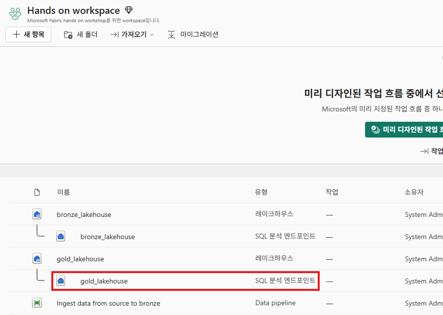

탐색기가 열리면, 상단의 메뉴 중에서 **새 SQL 쿼리**를 클릭합니다.

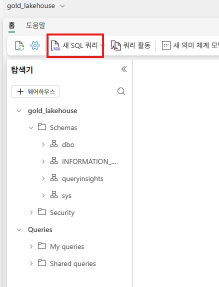

새 SQL 쿼리 창이 열리면, 아래의 SQL 구문을 복사하여 붙여넣기 합니다.

```sql
SELECT [date].FiscalYear, sales.SalesTerritory, FORMAT(SUM(sales.SumOfProfit), 'N0') AS SumOfProfit
FROM dbo.aggregate_sale_by_date_city AS sales INNER JOIN dbo.dimension_date AS [date] ON sales.Date = [date].Date
GROUP BY [date].FiscalYear, sales.SalesTerritory
ORDER BY [date].FiscalYear, SUM(sales.SumOfProfit) DESC
```

상단의 **실행** 버튼을 클릭하여 쿼리를 실행합니다.

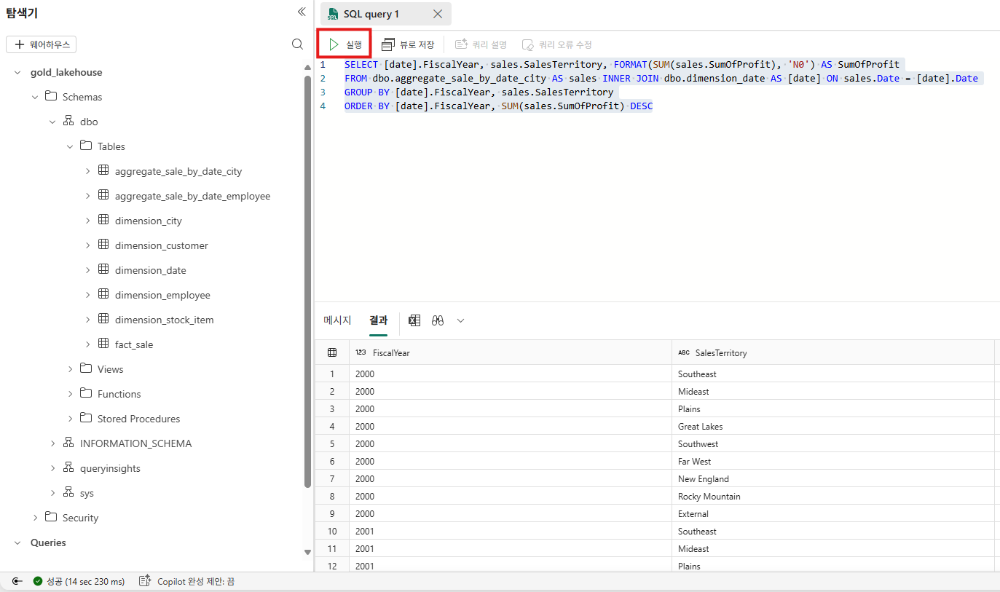

화면에서 볼 수 있는 것처럼, SQL 구문을 이용하여 레이크하우스의 데이터를 쿼리하여 확인할 수 있습니다.

# 2.6.2 Power BI
Power BI는 Microsoft Fabric 환경에 기본적으로 통합되어 있습니다.

Power BI를 이용한 보고서를 작성해보도록 하겠습니다.
먼저, 화면 상단의 **새 의미 체계 모델** 메뉴를 클릭합니다.

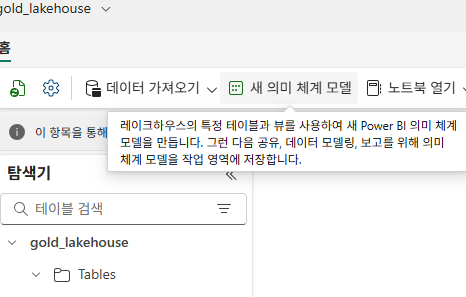

**새 의미 체계 모델" 화면에서는 **Direct Lake 의미 체계 모델 이름**에는 **"gold_lakehouse_semantic_model**을 입력하고, 
아래의 그림과 같이, 
차원 테이블들과 팩트 테이블을 선택하고 **확인** 버튼을 클릭합니다.

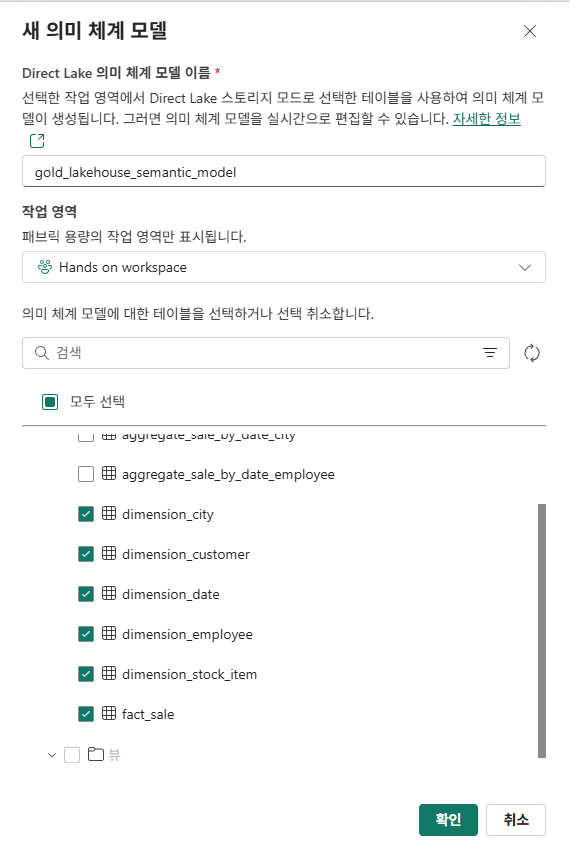

생성이 완료되면, **의미 체계 모델** 화면에서 **의미 체계 모델 열기**를 클릭합니다.

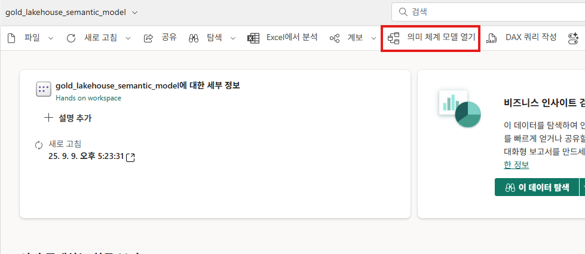

여기서 모델 간의 관계를 정의해야 합니다. 

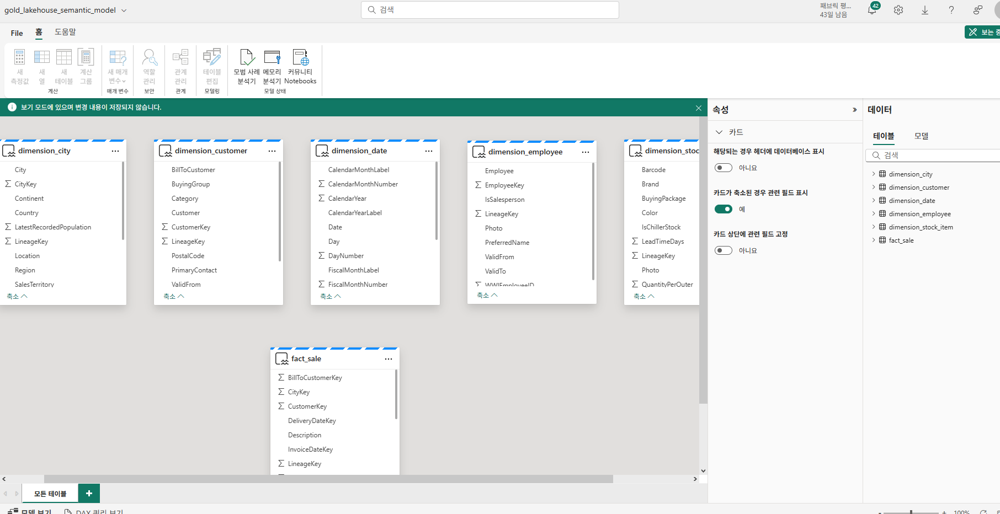

화면 우측 상단의 **보는 중** 메뉴를 클릭하여, **편집 중**으로 변경합니다.

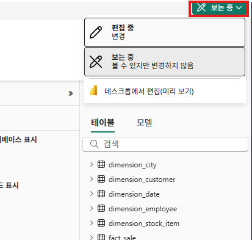

**fact_sale 테이블**의 **CityKey** 필드를 끌어서, **dimension_city** 테이블의 **CityKey** 필드에 가져다 놓기하여 관계를 생성합니다.

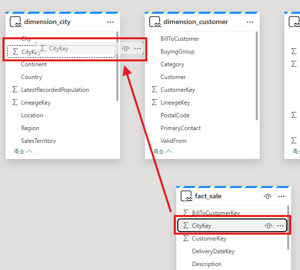


**새 관계** 창이 보여지면, 다음과 같이 설정을 하고, **저장** 버튼을 클릭합니다.

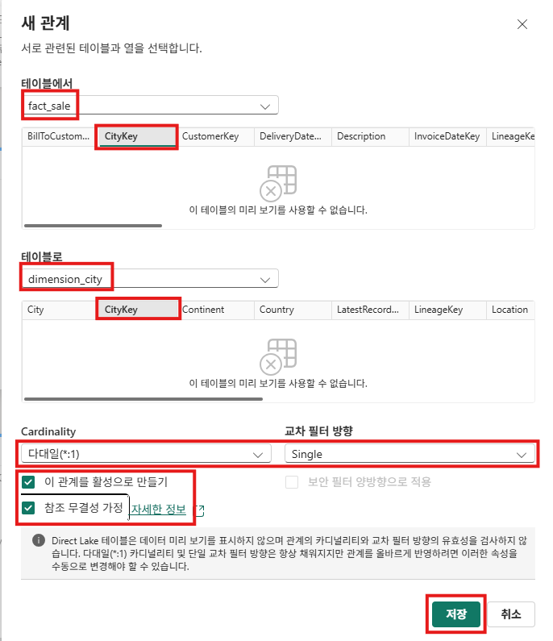

이어서, 다음 관계들에 대해서 동일한 설정값으로 관계를 생성합니다.

- CustomerKey(fact_sale) :CustomerKey(dimension_customer)
- InvoiceDateKey(fact_sale) :Date(dimension_date)
- SalespersonKey(fact_sale) :EmployeeKey(dimension_employee)
- StockItemKey(fact_sale) :StockItemKey(dimension_stock_item)

관계 설정이 완료되면, 다음과 같이 보여지게 됩니다.

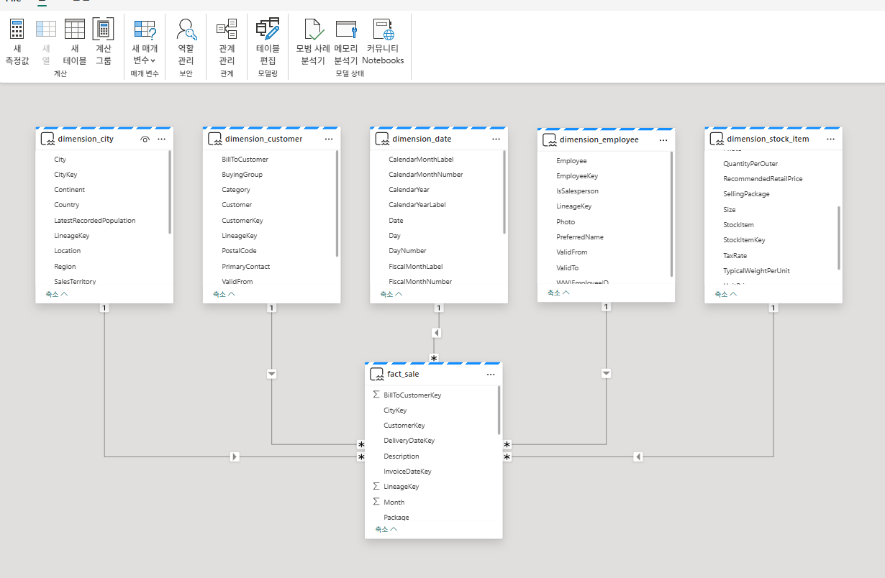

좌측 상단의 **File > 새 보고서 만들기**를 클릭합니다.

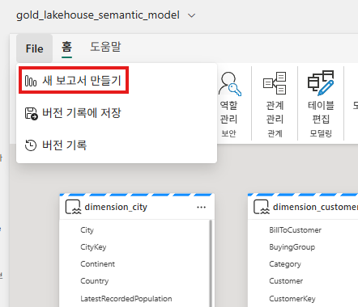

또는 작업 영역으로 이동하여, 생성한 의미 체계 모델의 점 3개(...)를 클릭하고, **보고서 만들기** 메뉴를 클릭합니다.

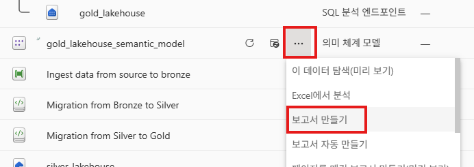

또는 **의미 체계 모델** 화면에서 ""탐색 > 빈 보고서 만들기**를 클릭합니다.

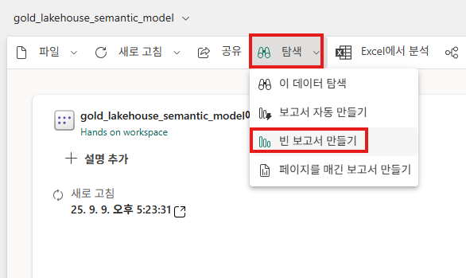

메뉴 상단에서 **텍스트 상자** 버튼을 클릭합니다.

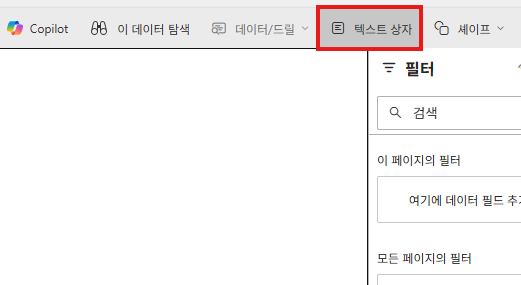

입력 창에 "WW Importers Profit Reporting"를 입력하고, 폰트 크기와 텍스트 상자의 크기도 적절하게 늘립니다.

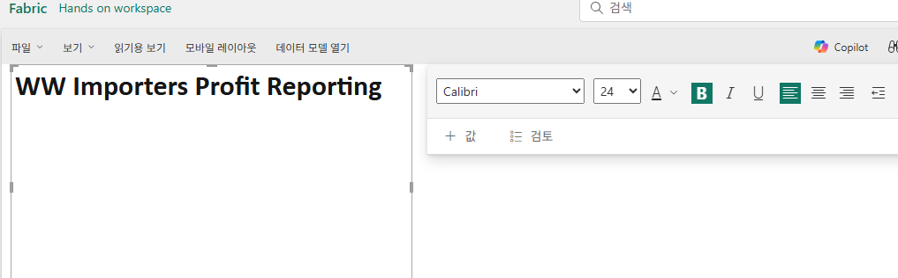

보고서에 **팩트 테이블(fact table)의 행 수**를 추가해보도록 하겠습니다.

**데이터** 창에서 fact_sale을 확장하고, fact_sale의 CustomerKey를 캔버스로 끌어 놓습니다.
그다음, **시각적 개체 빌드**를 **카드(Card)**로 변경합니다.

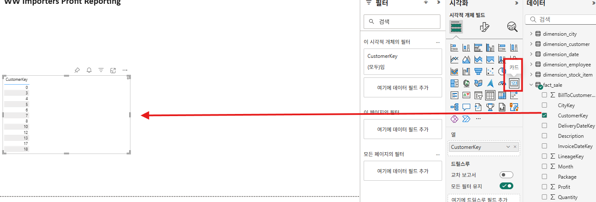

**필드**에서 이 측정값(measure)의 이름을 보고서에 맞게 변경할 수 있으며, **집계 방식**이 **개수**로 선택되어 있는지 확인합니다.

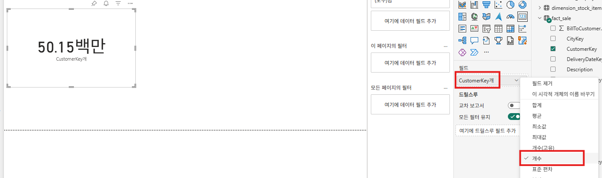

캔버스의 빈 영역을 클릭하여 시각화 선택을 해제합니다.

**데이터** 창에서 fact_sale을 확장하고, fact_sale의 **Profit**을 캔버스로 끌어 놓습니다.
시각화 개체 빌드를 **묶은 가로 막대형 차트**로 변경합니다.
**데이터** 창에서 dimension_city를 확장하고, **SalesTerritory**를 시각화의 **범례**로 끌어 놓습니다.

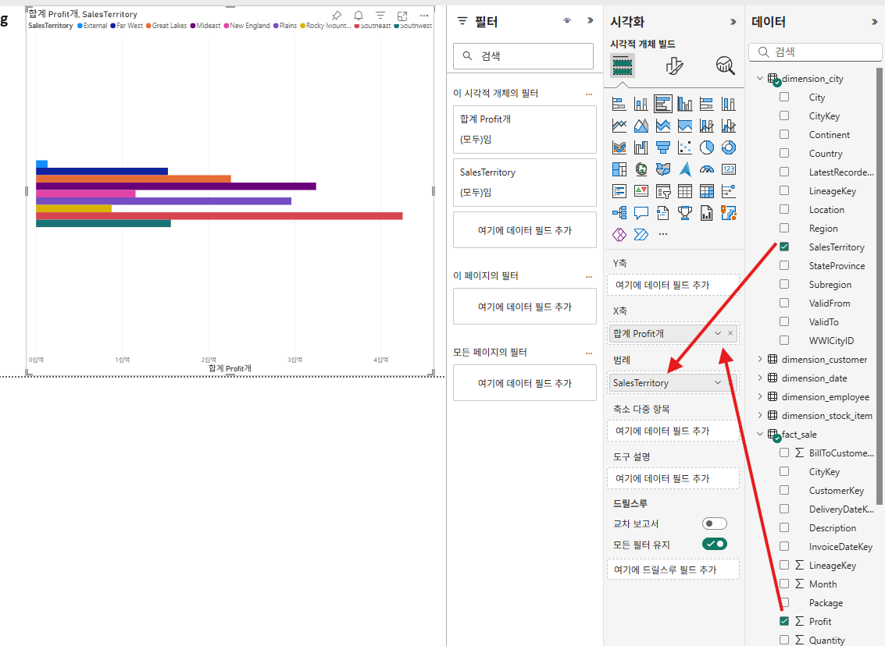

상단 메뉴에서 **파일> 저장**을 눌러서 보고서를 저장합니다.

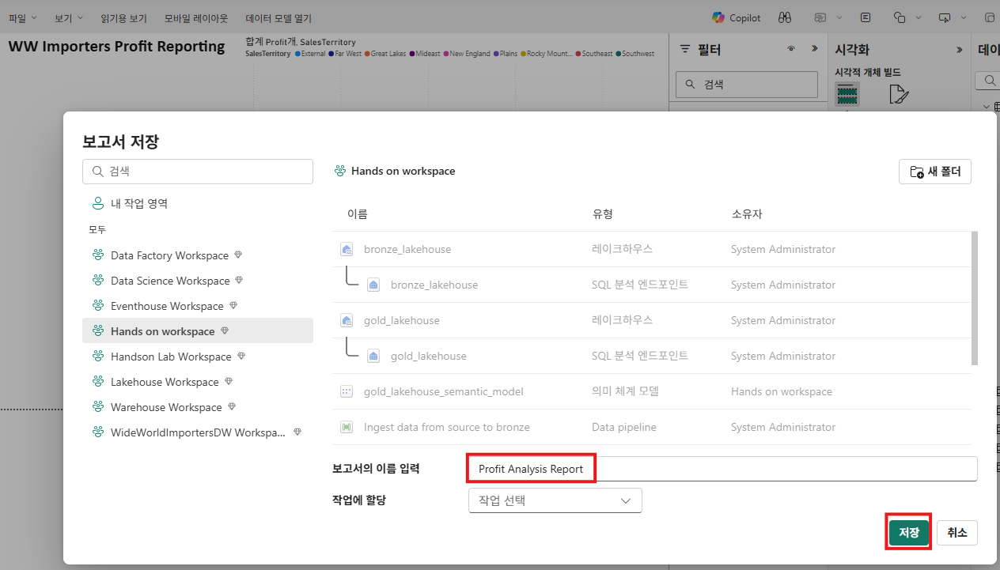

# 2.7 요약
메달리온 아키텍처 기반의 **레이크하우스**는 데이터 사일로(Silos)를 해체하고 데이터 중복을 제거함으로써 **데이터 레이크**와 **데이터 웨어하우스**의 장점을 결합하여 취합니다.

이로 인해 레이크하우스는 **데이터 플랫폼 아키텍처를 구축하기 위한 사실상의 표준**으로 점점 더 인기를 얻고 있습니다.

Microsoft Fabric은 기본 제공 기능을 통해 레이크하우스를 기반으로 하는 **데이터 분석 시스템**을 쉽게 구축할 수 있도록 지원합니다.

이번 lab에서는 Microsoft Fabric을 이용하여 메달리온 아키텍처 기반의 레이크하우스를 구현하는 기본적인 단계들을 살펴보았습니다.


## 다음

[Lab2 Microosft Fabric Lakehouse - 골드(Gold) 단계](Lab2%20Microosft%20Fabric%20Lakehouse4.md) << Lab2 Microosft Fabric Lakehouse - 분석 단계