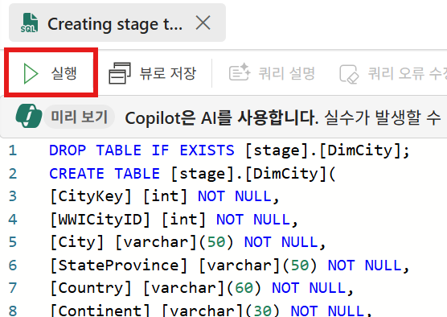

Lab 3에서는 다음과 같은 내용들을 살펴봅니다.

- [3.0 Microsoft Fabric의 Data Warehouse란?](#30-microsoft-fabric의-data-warehouse란)
- [3.1 데이터 흐름](#31-데이터-흐름)
    - [Ingestion](#ingestion)
    - [Transform](#transform)
    - [Analyze](#analyze)
- [3.2 데이터 웨어하우스 만들기](#32-데이터-웨어하우스-만들기)
- [3.3 테이블 생성](#33-테이블-생성)
    - [3.3.1 stage 스키마에 테이블 생성](#331-stage-스키마에-테이블-생성)
    - [3.3.2 dbo 스키마에 테이블 생성](#332-dbo-스키마에-테이블-생성)
- [3.4 데이터 채우기](#34-데이터-채우기)
    - [3.4.1 Data Factory 복사 작업을 이용한 데이터 채워넣기](#341-data-factory-복사-작업을-이용한-데이터-채워넣기)
    - [3.4.2 T-SQL을 이용한 데이터 채워넣기](#342-t-sql을-이용한-데이터-채워넣기)
- [3.5 데이터 변환](#35-데이터-변환)
- [3.6 분석](#36-분석)

# 3.0 Microsoft Fabric의 Data Warehouse란?
데이터 분석은 lab2에서 살펴본 레이크 중심의 접근 방식으로 전환되고 있지만. 여전히 전통적인 데이터 웨어하우스(Data Warehouse)가 적합한 시나리오가 여전히 다수 존재합니다.

오래 기간 축적된 SQL 기술을 보유하고 있다면, 데이터 웨어하우스 개발에 쉽게 적용될 수 있으며,
기업용의 데이터 레이크나 레이크하우스가 다양한 부서에서 구축한 다운스트림 데이터 웨어하우스로 데이터를 제공하기도 합니다. 
이 웨어하우스들은 메달리온 아키텍처에서 **골드 레이어** 역할을 합니다.

반면, 일부 소규모 조직에서는 데이터가 대부분 관계형 데이터 소스에서 중앙 집중화되기 때문에, 레이크하우스를 도입하는 추가적인 복잡성이 필요하지 않을 때도 있습니다.

⚠️ 해당 lab은 [Data warehouse tutorial introduction](https://learn.microsoft.com/en-us/fabric/data-warehouse/tutorial-introduction)의 내용을 기반으로 하였습니다.

# 3.1 데이터 흐름
이번 lab3에서는 **데이터 수집(Ingestion)**, **변환(Transformation)**, **보고(Reporting)**를 포함하는 솔루션을 구축하면서 **Fabric 데이터 웨어하우스의 핵심 기능**에 대해서 살펴봅니다.

이번 lab에서는 Wide World Importers(WWI) 예제 데이터베이스를 사용합니다. 데이터 모델에 대한 자세한 설명은 [여기](../Lab2%20Microsoft%20Fabric%20Lakehouse/Lab2%20Microsoft%20Fabric%20Lakehouse1.md#22-예제-데이터-개요)를 참고하시기 바랍니다.

데이터의 흐름은 다음과 같습니다.


## Ingestion
해당 단계에서는 데이터 원본에 있는 3개의 테이블의 데이터를 가져오기 하게 됩니다. 
- 하나는 Data Factory에서 제공하는 예제 데이터셋을
- 나머지 두 개는 다른 Azure Data Lake Storage(ADLS) 계정에 저장되어 있는 Parquet 파일로부터 데이터셋을 
가져오기 하게 됩니다.

Data Factory copy activity와 T-SQL을 이용하여 데이터를 가져오기 하게 됩니다.

실제 환경에서는 데이터가 다양한 소스에서 공통 데이터 레이크로 들어온 후, T-SQL을 사용하여 웨어하우스로 로드되는 경우가 일반적입니다. 그러나 일부 소규모 솔루션이나 부서별 웨어하우스 솔루션의 경우에는, Data Factory 복사 작업(copy activity)을 이용하여 웨어하우스로 직접 가져오는 경우도 있습니다.

## Transform
데이터 웨어하우스에서 데이터를 변환하는 작업은 변환 시점에 따라서 나눌 수 있습니다.

- 수집 후 : 이미 메달리온 아키텍처의 절차를 통해서 데이터가 정리되어 있다면, 일반적으로 **T-SQL Copy 명령이나 저장 프로시저** 등을 활용하여 추가 데이터 변환을 수행
- 수집 시 : 데이터 레이크가 없이 데이터가 바로 데이터 웨어하우스로 들어오면서 일부 변환이 필요한 경우에는 **Dataflow Gen2**를 이용하여 데이터 변환을 수행

## Analyze
Lab3에서도 분석 단계는 Power BI를 이용하게 됩니다.

# 3.2 데이터 웨어하우스 만들기
Microsoft Fabric 포털에서 좌측 메뉴에서 **작업 영역**을 클릭하고, 화면에서 앞서 생성한 **Hands on workspace**를 선택합니다.


작업 영역 화면에서, 좌측 상단에 있는 **+ 새 항목** 버튼을 클릭하여, **새 항목 > 데이터 저장 > 레이크하우스**를 클릭합니다.


**새 웨어하우스** 화면에서는 웨어하우스 이름을 "wwi_dw"라고 입력하고, **만들기** 버튼을 클릭하여 새로운 웨어하우스를 생성합니다.


생성이 완료되면, 웨어하우스 랜딩 페이지가 보여지게 됩니다.


# 3.3 테이블 생성
이번 lab에서는 다음의 4개 테이블을 이용하게 됩니다.

- stage.DimCity (Dimension table)
- stage.DimDate (Dimension table)
- stage.FactSale (Fact Table)

- dbo.aggregate_sale_by_date_city

## 3.3.1 stage 스키마에 테이블 생성
랜딩 페이지 상단의 메뉴에서 **새 SQL 쿼리** 메뉴를 눌러서, 새로운 SQL 쿼리 창을 생성합니다.


새로운 SQL 쿼리 창에 다음의 SQL 구문을 복사하여 붙여넣기 합니다.

```sql
CREATE SCHEMA [stage];
GO

DROP TABLE IF EXISTS [stage].[DimCity]; 
CREATE TABLE [stage].[DimCity]( 
[CityKey] [int] NOT NULL, 
[WWICityID] [int] NOT NULL, 
[City] [varchar](50) NOT NULL, 
[StateProvince] [varchar](50) NOT NULL, 
[Country] [varchar](60) NOT NULL, 
[Continent] [varchar](30) NOT NULL, 
[SalesTerritory] [varchar](50) NOT NULL, 
[Region] [varchar](30) NOT NULL, 
[Subregion] [varchar](30) NOT NULL, 
[Location] [varchar](50) NULL, 
[LatestRecordedPopulation] [bigint] NOT NULL, 
[ValidFrom] [datetime2](6) NOT NULL, 
[ValidTo] [datetime2](6) NOT NULL, 
[LineageKey] [int] NOT NULL); 

DROP TABLE IF EXISTS [stage].[DimDate]; 
CREATE TABLE [stage].[DimDate]( 
    [Date] [date] NOT NULL, 
    [DayNumber] [int] NOT NULL, 
    [Day] [varchar](10) NOT NULL, 
    [Month] [varchar](10) NOT NULL, 
    [ShortMonth] [varchar](3) NOT NULL, 
    [CalendarMonthNumber] [int] NOT NULL, 
    [CalendarMonthLabel] [varchar](20) NOT NULL, 
    [CalendarYear] [int] NOT NULL, 
    [CalendarYearLabel] [varchar](10) NOT NULL, 
    [FiscalMonthNumber] [int] NOT NULL, 
    [FiscalMonthLabel] [varchar](20) NOT NULL, 
    [FiscalYear] [int] NOT NULL, 
    [FiscalYearLabel] [varchar](10) NOT NULL, 
    [ISOWeekNumber] [int] NOT NULL);

DROP TABLE IF EXISTS [stage].[FactSale]; 
CREATE TABLE [stage].[FactSale]( 
    [SaleKey] [bigint] NOT NULL, 
    [CityKey] [int] NOT NULL, 
    [CustomerKey] [int] NOT NULL, 
    [BillToCustomerKey] [int] NOT NULL, 
    [StockItemKey] [int] NOT NULL, 
    [InvoiceDateKey] [date] NOT NULL, 
    [DeliveryDateKey] [date] NULL, 
    [SalespersonKey] [int] NOT NULL, 
    [WWIInvoiceID] [int] NOT NULL, 
    [Description] [varchar](8000) NOT NULL, 
    [Package] [varchar](50) NOT NULL, 
    [Quantity] [int] NOT NULL, 
    [UnitPrice] [decimal](18, 2) NOT NULL, 
    [TaxRate] [decimal](18, 3) NOT NULL, 
    [TotalExcludingTax] [decimal](18, 2) NOT NULL, 
    [TaxAmount] [decimal](18, 2) NOT NULL, 
    [Profit] [decimal](18, 2) NOT NULL, 
    [TotalIncludingTax] [decimal](18, 2) NOT NULL, 
    [TotalDryItems] [int] NOT NULL, 
    [TotalChillerItems] [int] NOT NULL, 
    [LineageKey] [int] NOT NULL); 
```

좌측 탐색기에서 **Queries > My queires > SQL query 1**에서 오른쪽 마우스를 클릭하고, **이름 바꾸기**를 클릭합니다.


**이름 바꾸기** 창에서 "Creating stage tables"를 입력하고 **이름 바꾸기** 버튼을 클릭합니다.


**Creating stage tables** 쿼리 창 상단의 **실행** 버튼을 클릭하여, stage 스키마에 3개의 테이블을 생성합니다.



실행이 완료되면, 화면 좌측의 탐색기에서 **wwi_dw > Schemas > stage > Tables**를 열어서 다음과 같이 3개의 테이블이 생성되었는지 확인합니다.


## 3.3.2 dbo 스키마에 테이블 생성
이번에는 dbo 스키마에 테이블들을 생성하겠습니다. 

상단의 메뉴에서 **새 SQL 쿼리** 메뉴를 눌러서, 새로운 SQL 쿼리 창을 생성합니다.


새로운 SQL 쿼리 창에 다음의 SQL 구문을 복사하여 붙여넣기 합니다.

```sql
DROP TABLE IF EXISTS [dbo].[aggregate_sale_by_date_city];
CREATE TABLE [dbo].[aggregate_sale_by_date_city]
(
    [Date] [DATETIME2](6),
    [City] [VARCHAR](8000),
    [StateProvince] [VARCHAR](8000),
    [SalesTerritory] [VARCHAR](8000),
    [SumOfTotalExcludingTax] [DECIMAL](38,2),
    [SumOfTaxAmount] [DECIMAL](38,6),
    [SumOfTotalIncludingTax] [DECIMAL](38,6),
    [SumOfProfit] [DECIMAL](38,2)
);

```

좌측 탐색기에서 **Queries > My queires > SQL query 1**에서 오른쪽 마우스를 클릭하고, **이름 바꾸기**를 클릭합니다.


**이름 바꾸기** 창에서 "Creating dbo table"을 입력하고 **이름 바꾸기** 버튼을 클릭합니다.


**Creating dbo table** 쿼리 창 상단의 **실행** 버튼을 클릭하여, dbo 스키마에 테이블을 생성합니다.

실행이 완료되면, 화면 좌측의 탐색기에서 **wwi_dw > Schemas > dbo > Tables**를 열어서 다음과 같이 테이블이 생성되었는지 확인합니다.


# 3.4 데이터 채우기
앞서 생성한 stage 스키마의 테이블들에 데이터를 채워넣도록 하겠습니다.

웨어하우스로 데이터를 가져오는 방법에는 여러 가지가 있습니다.
이번 lab에서는 Data Factory 복사 작업과 T-SQL을 이용합니다.

**데이터 웨어하우스 전문가**는 일반적으로 T-SQL 작성에 능숙하므로, **COPY 명령**을 사용하는 코드 기반(code-based) 접근 방식을 선호할 가능성이 큽니다. 반면, **분석가**는 T-SQL에 대한 숙련도가 낮을 수 있어, Data Factory를 활용한 **GUI 기반의 접근 방식**을 선택할 수 있습니다. 

## 3.4.1 Data Factory 복사 작업을 이용한 데이터 채워넣기
Data Factory 복사 작업은 코드를 작성하지 않고도 수십 여개의 데이터 원본에서 데이터를 직접 데이터 웨어하우스로 가져올 수 있는 기능을 제공합니다.

복사 작업에는 매우 제한적인 데이터 변환 기능이 내장되어 있지만, 자동 테이블 생성, 열 매핑, 로드 전후 스크립트 실행과 같은 기능들을 제공합니다. 특히, 사전 로드 스크립트는 스테이징 테이블(staging tables)에 데이터를 로드할 때 유용하게 사용될 수 있습니다. 특히, 다음 배치에 의해서 데이터가 추가되기 전에 앞선 실행에서 생성된 데이터를 제거해야 하는 경우에 자주 사용됩니다.

화면 상단의 메뉴에서 **데이터 가져오기 > 새 파이프라인**을 클릭합니다.


"Loading Dimension City"라고 입력하고 **만들기** 버튼을 클릭하여 파이프라인을 생성합니다.


데이터 복사 도우미가 시작되면, 상단 **샘플 데이터**를 클릭하고, **Retail Data Model from Wide World Importers**를 클릭합니다.


**데이터 원본에 연결** 화면에서는 **dimension_city**를 선택하고, **다음** 버튼을 클릭합니다.


다음의 설정을 구성하고, **다음** 버튼을 클릭합니다.

- 로드 설정 : 기본 테이블에 로드
- 테이블 : stage.DimCity
- 열 매핑 : 기본 설정 유지


다음의 설정을 구성하고, **다음** 버튼을 클릭합니다.
- 스테이징 사용 : 체크
- 데이터 저장소 유형 : 작업 영역


설정이 다음과 같은지 확인한 뒤에, **저장 + 실행** 버튼을 클릭하여 실행합니다.


Output 탭에서 복사 작업(copy activity)의 상태가 대기(queuing) → 진행 중(in progress) → 완료(completed) 로 변경되는 과정을 확인할 수 있습니다


## 3.4.2 T-SQL을 이용한 데이터 채워넣기
T-SQL은 모든 Microsoft 1st-party 데이터베이스 엔진에서 폭넓게 사용되며, 데이터 웨어하우스 개발자에게는 익숙한 도구라고 할 수 있습니다.

T-SQL을 사용하여 데이터를 대량으로 로드하는 방법은 두 가지가 있습니다.

- 첫 번째는 **교차 데이터베이스 쿼리(cross-database query)** 를 사용하는 것입니다. 이 기능은 SQL Server에서 오래전부터 존재했지만, Fabric의 Synapse에서는 새롭게 도입되었습니다. database.schema.table 형식의 3부분 이름(three-part name)을 사용하면 동일한 작업 영역 내의 다른 웨어하우스나 레이크하우스에서 데이터를 select하고 insert할 수 있습니다.
- 두 번째는 **COPY 명령**을 사용하는 방법으로, 개별 파일이나 폴더를 지정하여 파일 저장소에서 데이터를 가져오도록 할 수 있습니다.

페이지 상단의 메뉴에서 **새 SQL 쿼리** 메뉴를 눌러서, 새로운 SQL 쿼리 창을 생성합니다.


다음의 SQL 구문들을 복사하여 붙여넣기 하고, 상단의 **실행** 버튼을 클릭하여 실행합니다.

```sql
 COPY INTO [stage].[DimDate]
 FROM 'https://fabrictutorialdata.blob.core.windows.net/sampledata/WideWorldImportersDW/tables/dimension_date.parquet'
 WITH (FILE_TYPE = 'PARQUET');

 COPY INTO [stage].[FactSale]
 FROM 'https://fabrictutorialdata.blob.core.windows.net/sampledata/WideWorldImportersDW/tables/fact_sale.parquet'
 WITH (FILE_TYPE = 'PARQUET');
```


좌측 탐색기에서 **Queries > My queires > SQL query 1**에서 오른쪽 마우스를 클릭하고, **이름 바꾸기**를 클릭합니다.


**이름 바꾸기** 창에서 "Loading DimDate and FactSale"를 입력하고 **이름 바꾸기** 버튼을 클릭합니다.

페이지 상단의 메뉴에서 **새 SQL 쿼리** 메뉴를 눌러서, 새로운 SQL 쿼리 창을 생성하고, 다음의 SQL 구문을 복사하여 붙여 넣기하고 실행합니다.
다음의 쿼리는 stage 스키마 테이블들의 행수(row counts)를 확인합니다.

```sql
SELECT COUNT(*) AS cnt, 'Stage.DimCity' AS TableName FROM stage.DimCity
UNION ALL
SELECT COUNT(*), 'Stage.DimDate' FROM stage.DimDate
UNION ALL
SELECT COUNT(*),  'Stage.FactSale' FROM stage.FactSale;
```

결과는 다음과 같습니다.


해당 SQL 파일의 이름을 "Counting stage tables"로 변경합니다.


# 3.5 데이터 변환
차원 모델(dimensional model)의 모든 테이블이 생성되고 로드되었으므로, 이제 보고서 작성을 위해 데이터를 준비하는 데이터 변환 단계를 수행해보도록 하겠습니다.

데이터 변환 단계에서는 stage table들을 이용하여, 보고용 집계 테이블을 생성하게 됩니다.

페이지 상단의 메뉴에서 **새 SQL 쿼리** 메뉴를 눌러서, 새로운 SQL 쿼리 창을 생성하고, 다음의 SQL 구문을 복사하여 붙여 넣기하고 실행합니다.
다음의 SQL 쿼리는 stage 테이블의 데이터를 읽어서 dbo.aggregate_sale_by_date_city 집계 테이블에 데이터를 입력합니다.


```sql
INSERT INTO [dbo].[aggregate_sale_by_date_city]
SELECT
    FS.[InvoiceDateKey] AS [Date], 
    DC.[City], 
    DC.[StateProvince], 
    DC.[SalesTerritory], 
    SUM(FS.[TotalExcludingTax]) AS [SumOfTotalExcludingTax], 
    SUM(FS.[TaxAmount]) AS [SumOfTaxAmount], 
    SUM(FS.[TotalIncludingTax]) AS [SumOfTotalIncludingTax], 
    SUM(FS.[Profit]) AS [SumOfProfit]
FROM [stage].[FactSale] AS FS INNER JOIN [stage].[DimCity] AS DC ON FS.[CityKey] = DC.[CityKey]
GROUP BY
    FS.[InvoiceDateKey],
    DC.[City], 
    DC.[StateProvince], 
    DC.[SalesTerritory]
ORDER BY 
    FS.[InvoiceDateKey], 
    DC.[StateProvince], 
    DC.[City];
```

해당 쿼리를 실행하여 집계 테이블에 데이터를 변환하여 입력하고, 해당 SQL 파일이름을 "Loading Aggregation table"로 변경합니다.


# 3.6 분석
데이터에서 파생되는 가치는 비즈니스 의사결정에 활용될 때 비로소 실현됩니다. 지금까지 우리는 Fabric 데이터 웨어하우스에서 웨어하우스를 생성하고, 테이블을 로드하며, 데이터를 변환하는 과정을 살펴보았습니다. 이제 보고(reporting)를 위해 Power BI 보고서에서 시각화를 생성해보도록 하겠습니다.

상단 리본 메뉴에서 **새 의미 모델 체계** 메뉴를 클릭합니다.
**새 의미 모델 체계** 창에서는 다음의 구성을 설정하고, **확인** 버튼을 클릭하여 의미 모델 체계를 생성합니다.

- Direct Lake 의미 쳬게 모델 이름 : wwi_dw semantic model
- 작업 영역 : hands on workspace
- dbo > 테이블 > aggregate_sale_by_date_city 체크


의미 모델 체계가 만들어지면, 작업 영역 목록에서 **wwi_dw semantic model** 의미 모델 체계의 우측 점 3개(...)을 클릭하고, **보고서 만들기** 메뉴를 클릭합니다.


새로운 보고서 화면이 열리면, 시각화 메뉴에서 **묶은 세로 막대형 차트**를 클릭합니다.


데이터 창에서 **SalesTerritory 컬럼**을 **X축**에, **SumOfProfit 컬럼**은 **Y축**에 가져다 놓습니다. Y축의 값은 **합계**인지 확인합니다.


보고서 캔버스의 빈 공간을 클릭하고, 시각화 창에서 **테이블**을 클릭하여 캔버스로 가져옵니다.


다음의 그림과 같이 표에 컬럼들을 가져다 놓기 합니다.


**파일 > 저장** 버튼을 눌러서 보고서를 저장합니다.


"Sales Analysis"를 입력하고, **저장** 버튼을 클릭합니다. 


