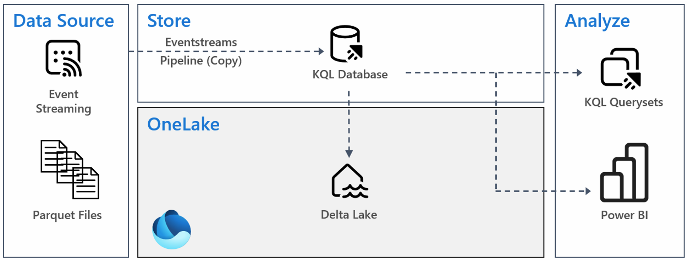
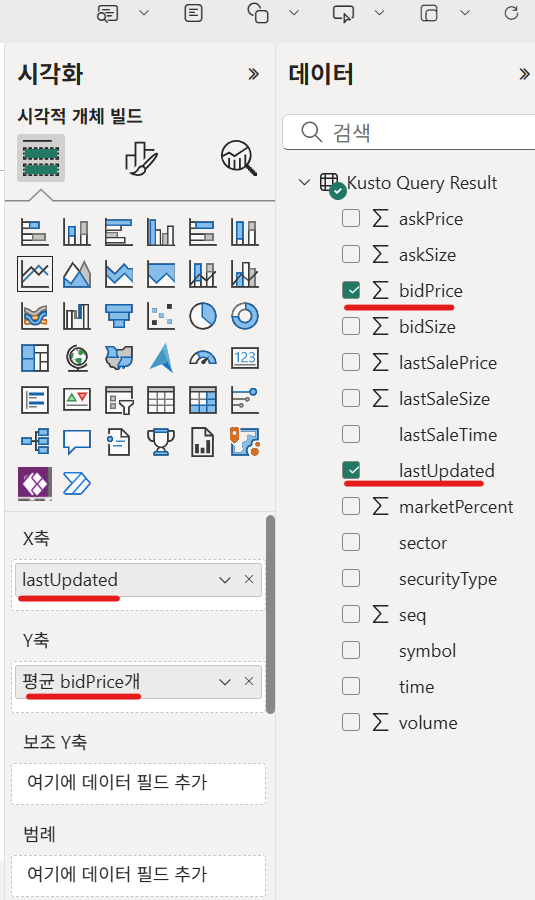

Lab 4에서는 다음과 같은 내용들을 살펴봅니다.

# 4.0 Microsoft Fabric의 실시간 분석
이번 lab에서는 **Microsoft Fabric의 실시간 분석(Real-Time Analytics)** 기능이 어떻게 구성되고 동작하는지 살펴보게 됩니다.

실시간 분석 솔루션의 기능은 크게 네 가지 역할로 나눌 수 있습니다:

1. **수신기(Receiver)**  
   - 다양한 소스에서 들어오는 **스트리밍 데이터**나 **대용량 배치 데이터**를 실시간으로 받아들입니다.

2. **처리기(Processor)**  
   - 수신된 데이터를 **정제, 변환, 집계**하는 과정을 자동으로 수행합니다.  
   - 예를 들어, 이벤트 데이터를 시간 단위로 그룹화하거나, 불필요한 필드를 제거하는 작업을 처리합니다.

3. **저장소(Storage)**  
   - 처리된 데이터를 **고성능 스토리지**에 저장합니다.  
   - 이때 **파티셔닝(partitioning)** 과 **인덱싱(indexing)** 이 자동으로 적용되어, 데이터 검색과 조회 속도가 빨라집니다.

4. **분석 엔진(Analytics Engine)**  
   - 저장된 데이터를 기반으로 **실시간 쿼리**와 **대화형 분석**을 지원합니다.  
   - 대규모 **시계열 데이터셋(time-series datasets)** 분석에 특히 적합하며, **확장성(scaling)** 도 자동으로 관리됩니다.

# 4.2 아키텍처
이번 lab에서 살펴보게 되는 아키텍처는 다음의 그림과 같습니다.



실제 시나리오에서는 다양한 데이터 원본과 다운스트림 소비자가 포함되는 것이 일반적이지만, 이번 lab에서는 단순화된 아키텍처를 구축하는데 중점을 두도록 하겠습니다.

# 4.3 KQL 데이터베이스 생성
먼저 실시간 데이터를 저장할 데이터베이스를 생성하도록 하겠습니다.

Microsoft Fabric 포털에서 좌측 메뉴에서 **작업 영역**을 클릭하고, 화면에서 앞서 생성한 **Hands on workspace**를 선택합니다.


작업 영역 화면에서, 좌측 상단에 있는 **+ 새 항목** 버튼을 클릭하여, **새 항목 > 데이터 저장 > Eventhouse**를 클릭합니다.


**New Eventhouse** 창에서 Eventhouse name에 "StockMarket"을 입력하고, **Create** 버튼을 클릭합니다.


생성이 완료되면, 동일한 이름의 KQL 데이터베이스가 생성되어 있는 것을 확인할 수 있습니다.


해당 데이터베이스를 클릭하면 데이터베이스의 세부 정보가 보여집니다.
화면 우측의 Database details(데이터베이스 세부 정보)) 섹션에서 OneLake 사용 가능(Availability) 옵션 옆에 있는 토글 버튼을 enabled로 변경합니다.


**Enable OneLake Availability** 화면이 나타나면, **Enable** 버튼을 클릭하여 활성화 합니다.


# 4.4 이벤트스트림 생성
이벤트스트림은 Azure Event Hubs나 Kafka clients와 같은 다양한 소스로부터 이벤트를 캡처하도록 설계되어 있습니다.

KQL 데이터베이스 화면에서 **Get data > Eventstream > 새 Eventstram**을 클릭하거나,


작업 영역 화면에서, 좌측 상단에 있는 **+ 새 항목** 버튼을 클릭하여, **새 항목 > 데이터 가져오기 > Eventstream**를 클릭합니다.


**New Eventstream** 창에서는 **Name** 항목에 "StockMarket-Stream"을 입력하고, **Create** 버튼을 클릭합니다.


이벤트스트림 생성이 완료되면, 화면 좌측 상단에서 **Add source > Sample data**를 클릭합니다.


**Sample data**는 **Stock Market (high data-rate)**을 선택하고, **Source name**에는 "StockMarket-Source"를 입력하고, **Add** 버튼을 클릭합니다.


다음의 화면에서 화면 우측 상단의 **Publish** 버튼을 클릭합니다.


다시, KQL 데이터베이스 화면으로 돌아와서 **Get data > Eventstream > 기존 Eventstram**을 클릭합니다.


**데이터 원본 선택** 화면에서는 다음과 같이, 앞서 생성한 **StockMarket-Stream**을 선택합니다.


**대상 테이블을 선택하고 원본 구성** 화면에서는 "TB_StockMarket"이라는 이름으로 테이블을 생성하고, **다음** 버튼을 클릭합니다.


**데이터 검사** 화면에서는 화면 중앙 우측에 있는 연필 모양의 버튼을 클릭하여 테이블의 스키마를 확인합니다.


**lastUpdated** 컬럼과 **lastSaleTime** 컬럼은 Microsoft Fabric에 의해서 자동으로 데이터 타입이 설정된 것을 볼 수 있습니다.
**적용 > 마침** 버튼을 눌러서 스키마를 확정하고 작업을 완료합니다.


Microsoft Fabric은 테이블, 매핑, 데이터 연결 등을 생성합니다. **닫기** 버튼을 클릭합니다.


화면에서는 설정된 시간에 따른 데이터 입력과 쿼리 정보(상단의 그래프)와 테이블에 입력된 데이터의 크기, 행수(하단) 등의 정보를 한눈에 볼 수 있게 제공합니다.


앞서 생성한 이벤트스트림에서도 캔버스 중앙에 있는 StockMarket-Stream 이벤트스트림을 클릭하면 들어오는 데이터의 미리보기(Data preview)와 Data insight 등을 확인할 수 있습니다.


# 4.5 데이터 분석
SQL 서버에서는 T-SQL을 사용하여 데이터와 상호작용하고, 스파크에서는 스칼라(Scala), 파이스파크(PySpark), 스파크SQL(SparkSQL)을 사용합니다. KQL 데이터베이스에서는 KQL을 사용합니다. KQL은 매우 강력하면서도 직관적이고 배우기 쉬운 언어로, 데이터를 탐색하는 데 유용합니다. 다른 쿼리 언어들과 마찬가지로, KQL은 데이터베이스 컨텍스트, 테이블, 열을 활용하여 쿼리할 데이터를 식별합니다.

KQL 쿼리의 구조는 일반적인 SQL 언어들과는 약간 다릅니다. 쿼리는 테이블로 시작하며, 이후 연산자가 이어집니다. 이 연산자들은 테이블 형식의 입력을 받아 테이블 형식으로 출력합니다. 이 출력은 사용자에게 반환되거나 다음 연산자에 전달되어 추가적인 정제 작업을 수행할 수 있습니다. 대표적인 연산자로는 where, summarize, union, join 등이 있습니다.

KQL을 활용하여 본격적으로 주식 거래소 데이터를 분석해보도록 하겠습니다.

작업 영역 화면에서, 좌측 상단에 있는 **+ 새 항목** 버튼을 클릭하여, **새 항목 > 데이터 추적 > KQL 쿼리 집합**을 클릭합니다.


**New KQL Queryset** 창에서는 "Stock Market Analysis"라고 이름을 입력하고 **Create** 버튼을 클릭하여 생성합니다.


화면 좌측 상단의 **Add data source > Eventhouse / KQL Database**를 선택합니다.


**조직의 데이터베이스를 찾아 데이터 탐색** 창에서, 앞서 생성한 StockMarket을 선택하고 **연결** 버튼을 클릭합니다.


잠시 뒤, 새로운 KQL 쿼리 집합 창이 보여지게 됩니다.


쿼리 편집기에 미리 입력되어 있던, 코드 예제를 지우고 다음의 쿼리를 복사하여 붙여넣기 합니다. (*해당 쿼리는 테이블의 전체 행의 수를 반환하게 됩니다*)
쿼리창 좌측 상단의 **실행** 버튼을 클릭하여 쿼리를 실행합니다.

**주의 : KQL은 대소문자를 구분합니다**

```kql
TB_StockMarket
| count
```

데이터는 지속적으로 스트림 되므로, 결과 값은 아래의 그림과 다를 것입니다.


다음의 코드를 복사하여 붙여넣고 실행합니다.

```kql
TB_StockMarket
| limit 10
```

*해당 쿼리는 테이블에서 임의의 레코드 10개를 반환하게 됩니다.*


테이블의 데이터가 어떤 정보를 담고 있는지, 개략적으로 살펴보았으니 본격적으로 데이터를 분석하여 보도록 하겠습니다.

다음의 쿼리를 복사하여 붙여넣기 하고, 실행합니다.

```kql
TB_StockMarket
| where symbol == "NSFT"
| where ['time'] > ago(1h)
| summarize avg(bidPrice) by lastUpdated
| render timechart 
```

*해당 쿼리는 지난 1시간 동안의  NSFT 주식 평균 입찰가를 선형 차트 형식으로 보여줍니다*


다음에는 SQL을 이용하여 주식별, 전체 입찰 수량과 평균 입찰 가격을 살펴보겠습니다.

```sql
SELECT symbol, SUM(bidSize) AS TotalBidSize, AVG(bidPrice) AS AverageBidPrice
FROM TB_StockMarket
GROUP BY symbol
```

KQL 엔진은 해당 SQL 코드를 자동으로 KQL로 변환하여 실행하고 결과를 반환하게 됩니다.


좌측 상당의 리본 메뉴에서 **저장** 버튼을 클릭하여, 쿼리를 저장합니다.

지금까지 살펴본 쿼리들은 KQL과 이벤트 스트림으로 할 수 있는 작업의 극히 일부에 불과합니다. 지리 공간 분석, 윈도우 함수, 누락 데이터 추론, 그래프, 함수 등 수많은 분석이 가능합니다.
지금까지 몇 개의 쿼리 탐색을 통하여 데이터셋에 대해 조금 알게 되었으니, 실시간 데이터셋을 사용해 Power BI 보고서를 만드는 방법에 대해서 살펴보도록 하겠습니다.

# 4.6 보고서 만들기
Fabric의 다른 기능들과 마찬가지로, 실시간 분석은 Power BI와 통합되어 놀라운 시각화와 실행 가능한 보고서를 생성할 수 있습니다. KQL 데이터베이스나 KQL 쿼리 집합에서 직접 Power BI 보고서 만들기를 시작할 수 있습니다. 이렇게 하면 자동으로 데이터셋이 생성되어 보고서를 빠르게 작성할 수 있습니다.

이번 lab에서는 MSFT Fabric 포털을 통하여 보고서를 작성하지만, Power BI Desktop에서도 보고서 작성이 가능합니다.

Hands on workspace 탐색창에서 **StockMarket KQL 데이터베이스** 클릭하여 엽니다.

좌측 탐색기에서 **Tables > TB_StockMarket**을 클릭하고, 리본 메뉴에서 **Create Power BI Report**를 클릭합니다.


## 4.6.1 제목 작성
리본 메뉴에서 **텍스트 상자**를 클릭합니다.


다음과 같이 텍스트 상자를 조정합니다.

- 텍스트 입력: Stock Market – Bid Analysis
- 글꼴 크기: 44로 변경
- 텍스트를 가운데 정렬
- 텍스트 상자의 크기를 조정하여 보고서 캔버스의 전체 너비를 차지하도록 설정
- 텍스트 상자를 보고서 캔버스의 상단 가장자리로 이동


## 4.6.2 레코드 수

시각화 창에서 **카드** 시각화를 클릭합니다.


다음과 같이 카드를 조정합니다.

- 너비를 보고서 캔버스의 절반 정도로 조정하고, 캔버스의 왼쪽에 둡니다. 
- 앞서 생성한 텍스트 상자 바로 아래로 카드를 이동시킵니다.
- 데이터 창에서 symbol 필드 옆의 체크박스를 클릭합니다.

   


- 시각화 창에서 필드 섹션에 있는 symbol 필드를 찾습니다. 필드 오른쪽의 드롭다운을 클릭하고 **개수**를 선택하여 테이블의 레코드 수가 표시되도록 변경합니다.

   

## 4.6.3 최신 업데이트 시각

보고서 캔버스의 빈 영역을 클립합니다.

- 다시 한 번 시각화 창에서 **카드** 시각화를 선택합니다.

   

- 카드의 크기를 조정하고 위치를 변경하여, 방금 만든 symbol 레코드 수 카드의 오른쪽으로 옮깁니다.
- 데이터 창에서 **lastUpdated 필드** 옆의 체크박스를 선택합니다.
- 시각화 창에서 lastUpdated 필드 오른쪽의 드롭다운을 클릭하고, 집계를 **가장 늦은 날짜**로 변경하여 카드에 가장 최근 레코드 업데이트 날짜가 표시되도록 합니다.

   

## 4.6.3 챠트 - sum of bidSize(last 5 minutes)

보고서 캔버스의 빈 영역을 클릭합니다.

- 시각화 창에서 **꺽은선형 차트**를 클릭합니다.
   

다음과 같이 꺾은선형 차트를 설정합니다.

- 시각화의 크기를 조정하고 위치를 변경하여 보고서 캔버스 왼쪽 절반의 남은 빈 공간을 차지하도록 합니다. 
- 데이터 창에서 **bidSize 옆의 체크박스**를 선택하여 Y축에 추가합니다. 
- 데이터 창에서 **lastUpdated 옆의 체크박스**를 선택하여 X축에 추가합니다. 
- 데이터 창에서 **symbol 옆의 체크박스**를 선택하여 범례에 추가합니다. 
- 필터 창에서 이 시각화의 필터 섹션에 있는 **lastUpdated 필드**를 확장합니다. 
- 필터 유형을 기본 필터링에서 **상대 시간**으로 변경합니다. 
- 값이 최근에 있는 경우 항목 표시 설정 아래의 입력란에 **5**를 입력합니다. 
- 시간 설정을 **분**으로 변경합니다.
- **필터 적용**을 클릭합니다.

   

## 4.6.4 챠트 - average of bidSize (last 5 minutes)

보고서 캔버스의 빈 영역을 클릭합니다.

- 시각화(Visualizations) 창에서 **꺽은선형 차트**를 클릭합니다.
   

- 시각화의 크기와 위치를 조정하여 보고서 캔버스의 남은 빈 공간을 차지하도록 합니다.
- 데이터 창에서 **lastUpdated 옆의 체크박스**를 선택하여 X축에 추가합니다.
- 데이터 창에서 **bidPrice 옆의 체크박스**를 선택하여 Y축에 추가합니다.
- 시각화 창에서 **합계 bidPrice개** 필드를 찾아 필드 이름 오른쪽의 드롭다운을 클릭하고, 집계를 **평균** 으로 변경합니다.

   

- bidSize 꺽은선형 차트에서 사용한 동일한 날짜 필터를 적용합니다. 이를 위해 필터 창에서 lastUpdated 필드를 찾고, 필터 유형을 상대 시간으로 변경하여 최근 5분의 값을 표시하도록 설정한 후, 필터 적용을 클릭합니다.

   

## 4.6.5 새로 고침 구성

보고서 캔버스의 빈 영역을 클릭합니다.

- 시각화 창에서 **보고서 페이지 서식 지정** 페이지로 전환합니다.

   

- **페이지 새로 고침** 설정을 켜기로 전환합니다.
- 페이지 새로 고침 설정을 확장하고, **새로 고침 간격**을 **10초**로 설정합니다.

   

## 4.6.6 보고서 저장

상단 리본 메뉴에서 **파일 > 저장**을 누르고, 

- 파일 이름에는 "Bid Analysis Real-time"를 입력하고, 
- 작업 영역은 "Hands on workspace"를 선택하고

**계속** 버튼을 클릭합니다.


저장이 완료되면 다음과 같은 화면이 보여지게 됩니다.


**Power BI에서 파일을 열어 공유 가능한 링크를 보고 편집하고 가져옵니다.** 링크를 클릭하여 보고서 파일을 엽니다.


